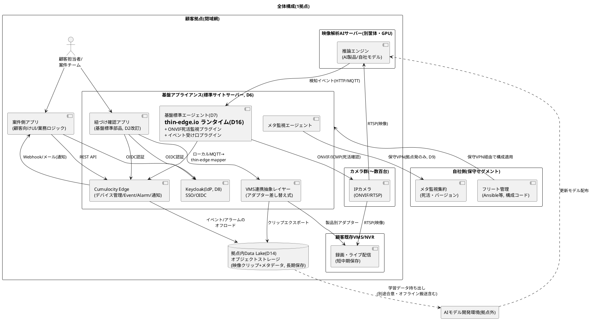
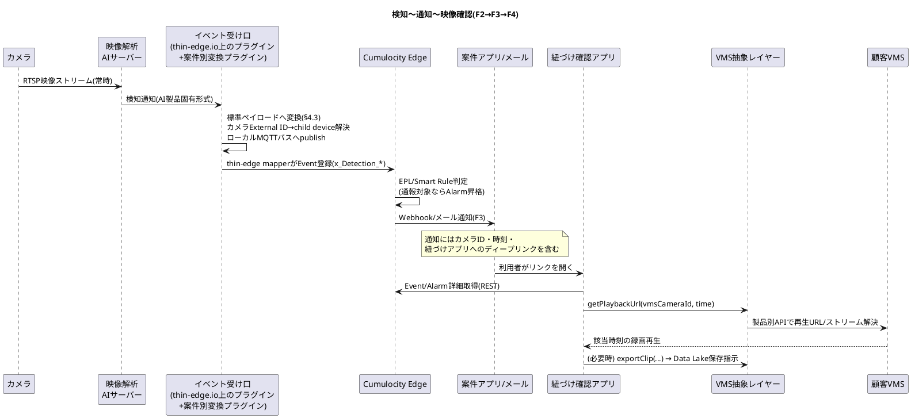
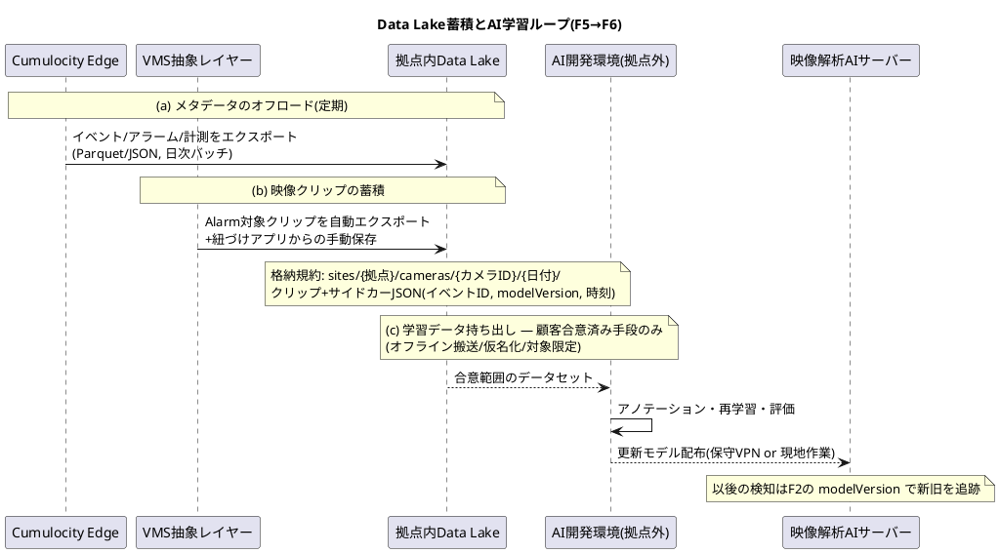
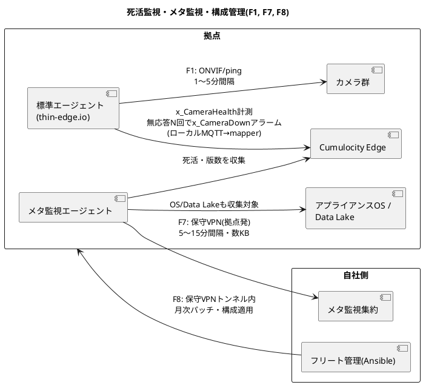

# 監視カメラ向けIoT基盤 構成・データフロー設計(Cumulocityベース)

- 作成日: 2026-07-06(同日更新: thin-edge.io採用(D16)を反映、図をPlantUML化)
- ステータス: 初版ドラフト。Cumulocity採用前提の設計(TCO比較資料ではない)
- 前提文書: [design-decisions.md](design-decisions.md)(設計判断記録。本書はその判断群の上に構成を具体化する)

---

## 1. 位置づけ・前提

本書は**1拠点分の標準構成**(=アプライアンスに載せる標準サイトサーバー像、D6)を定義する。全拠点はこの構成の複製であり、拠点間の差分は「構成バージョン」(D10)としてのみ許容する。フリート全体(10〜50インスタンス)はメタ監視(F7)と構成管理(F8)の接点としてのみ本書に登場する。

前提条件(design-decisions.mdより):

- 顧客閉域網内で完結。拠点発アウトバウンドのみ、外部への業務データ送信なし。保守VPNのみ(D9)
- デプロイ形態は **Cumulocity Edge**(拠点内シングルノード)。最小構成スタート(D5)
- 映像ストリームの録画・ライブ視聴・保存・配信はVMS/NVRの領域であり基盤責務外(D1)
- カメラ規模は1拠点あたり数十〜数百台、全体で1000台オーダー

本書で新たに確定した前提(ユーザー確認済み):

| 項目 | 決定 |
|------|------|
| 映像解析AI | Cumulocity Edgeが動くアプライアンスとは**別の拠点内サーバー**(GPU筐体等)で動作 |
| Data Lake | **拠点内に設置**。学習データの拠点外持ち出しは顧客と別途合意(オフライン搬送含む) |
| イベント×映像紐づけ確認アプリ | **基盤の標準部品に格上げ**(D2の改訂。§2参照) |
| VMS | **顧客既存VMSに合わせる**。製品中立の連携抽象レイヤーを基盤が定義(§6) |
| 標準エージェント実装基盤 | **thin-edge.io**(Cumulocity開発元のOSS)をランタイムとする(D16)。カメラはCumulocityに直接接続せず、thin-edgeゲートウェイのchild deviceとして代理登録 |

## 2. 設計判断の更新

本書の設計にあたり、design-decisions.mdの判断を以下のとおり更新する(詳細は同文書側に記録)。

### D2改訂: 紐づけ確認アプリの標準部品化

「顧客向け画面は基盤責務外」の原則のうち、**イベント/アラームと映像を紐づけて確認する画面**に限り基盤標準部品に格上げする。監視カメラ案件では「検知→映像確認」が全案件共通の中核動線であり、案件ごとの再実装はコストダウン目的に反するため。

ただしD2の本来の狙い(要求膨張・下請け化の防止)を守るため、カスタマイズ境界を明文化する:

- 標準部品が提供するもの: アラーム/イベント一覧、カメラ・時刻による絞り込み、該当映像の再生(VMS抽象レイヤー経由)、クリップのData Lake保存指示
- 提供しないもの: 顧客業務フロー(点検帳票、通報連携等)、レイアウト・ブランディングのカスタム、VMS固有機能の露出。これらは従来どおり案件側アプリがAPI経由で構築する

### D1補足: 映像の「持ち込み口」は基盤が規定

映像ストリーム自体は引き続き基盤責務外だが、以下2点のインターフェースは基盤が規定・提供する:

1. **VMS連携抽象レイヤー**(§6): 再生URL解決・クリップエクスポートの製品中立API
2. **Data Lakeへの映像持ち込み規約**(F5): クリップ+メタデータの格納形式・紐づけキー

### D16(D7の実装具体化): 標準エージェントのランタイムはthin-edge.io

標準エージェント(D7)はゼロから作らず、**thin-edge.io**(Cumulocity開発元がメンテナンスするOSS, Apache 2.0)をランタイム基盤とする。

- thin-edge.ioが担うもの: Cumulocityへの接続配管(証明書ベースのデバイス認証、ローカルMQTTバス、Cumulocityデータモデルへのmapper)、**オフライン時のストア&フォワード**、child device管理、設定/SW更新の標準オペレーション(フェーズ2の足場)
- 自前実装が残るもの: **カメラ側を向いたロジック**。ONVIF死活監視プラグイン、イベント受け口プラグイン(AI製品別変換は案件側, D7)。thin-edge.ioはONVIFを話さない
- カメラはCumulocityに直接接続しない。thin-edgeゲートウェイの**child device**として代理登録され、カメラ側に要求されるのはONVIF応答(最低限ping応答)のみ
- リスク: child device数百台規模の実績確認が必要(→§8 A7)

## 3. 全体構成図(1拠点)



責務境界の要点:

| コンポーネント | 責務を持つ側 | 備考 |
|---|---|---|
| カメラ・VMS/NVR | 顧客/案件側 | 既存資産。基盤はONVIF/抽象レイヤー経由で触るのみ |
| 映像解析AIサーバー | 案件側(AI製品選定・運用) | イベント送出形式のみ基盤規約(F2)に従う |
| 基盤アプライアンス一式 | 基盤チーム | 単一イメージ/構成コードで全拠点同一(D6/D10) |
| VMSアダプター実装 | 原則案件側(§6参照) | 抽象レイヤーのインターフェース定義は基盤 |
| Data Lake | 基盤チーム(器の標準構成)+案件側(データ利用) | アプライアンスとは別筐体も可。§7サイジング参照 |
| 案件側アプリ | 案件側 | 基盤APIの利用者(D2) |

## 4. Cumulocity Edge内の論理構成

### 4.1 デバイスモデル

Cumulocityの Managed Object 階層でカメラ群を表現する。**カメラはCumulocityに直接接続しない**(カメラ側にCumulocity対応は不要)。標準エージェント(thin-edge.ioゲートウェイ, D16)がカメラをchild deviceとして代理登録し、以後の計測・イベントはローカルMQTTバス経由でthin-edge mapperが投入する。

```text
拠点(Edgeテナント = 1拠点1テナント)
├── 基盤標準エージェント(thin-edge.io ゲートウェイ, device Managed Object)
│   └── カメラ (child device Managed Object) ← 接続階層。エージェントが代理登録
│       ├── External ID: c8y_Serial = カメラのシリアル番号(主キー)
│       │                camera_ip  = 管理用IPアドレス(補助キー)
│       ├── フラグメント例:
│       │   c8y_Hardware(型番/FW版数)、c8y_Network(IP/MAC)
│       │   x_Camera(設置場所名、画角メモ、VMS上のカメラID ← 紐づけの要)
│       └── 子デバイス: なし(カメラ単体で完結)
├── エリア/建屋 (group) ← 資産階層。上記カメラMOをグループから参照(接続階層とは独立)
└── 映像解析AIサーバー(device Managed Object)
    └── 死活・リソース監視の対象。検知イベントのソースは「カメラ」に付ける(下記)
```

**重要規約: AI検知イベントのソースは、AIサーバーではなく「対象カメラ」のManaged Objectに付ける。** これにより「このカメラで何が起きたか」の時系列が一元化され、紐づけアプリ(F4)がカメラ×時刻だけで映像を引ける。AIサーバー自体の障害はAIサーバーのデバイスとしてアラーム化し、カメラのイベントとは混ぜない。

`x_Camera.vmsCameraId`(VMS側のカメラ識別子)をカメラのManaged Objectに保持することが、イベント→映像の紐づけを成立させる唯一の結合点。カメラ登録時にこの値の設定を必須とする(登録手順で強制)。

### 4.2 Event / Alarm / Measurement の使い分けと命名規約

| 種別 | 用途 | 型命名規約(例) |
|------|------|------|
| Measurement | カメラ死活の定期記録(応答時間等)、AIサーバーのリソース | `x_CameraHealth`(rtt, 応答可否) |
| Event | AI検知のうち**記録すべき事象**(人物検知、置き去り等)。大量発生前提 | `x_Detection_<種別>` 例: `x_Detection_Intrusion` |
| Alarm | **人の対応を要する状態**。死活断、AI検知のうち通報対象、機器異常 | `x_CameraDown`, `x_Alarm_<種別>` |

- Event→Alarmの昇格判定(例: 夜間の侵入検知のみアラーム化)は Edge内のストリーミング解析(Apama EPL / Smart Rules)で行う。**この判定ルールは案件固有ロジックであり、ルール定義は案件側が保守する**(D7の原則)。基盤はルールの置き場所と雛形を提供する
- Alarmの重要度(CRITICAL/MAJOR/MINOR/WARNING)の割当基準を基盤規約として1枚で定義する(全案件共通の運用言語にする)

### 4.3 検知イベント標準ペイロード(F2規約)

イベント受け口プラグイン(D7)がAI製品ごとの形式差を吸収し、以下の標準形式でCumulocityに投入する:

```json
{
  "type": "x_Detection_Intrusion",
  "time": "2026-07-06T10:23:45.000+09:00",
  "source": { "id": "<カメラのManaged Object ID>" },
  "text": "侵入検知: 東門エリア",
  "x_Detection": {
    "aiProduct": "vendorA-v2.1",
    "modelVersion": "2026.06-r3",
    "confidence": 0.92,
    "boundingBoxes": [ { "x": 0.1, "y": 0.2, "w": 0.3, "h": 0.4 } ],
    "clipHint": { "preSec": 10, "postSec": 20 }
  }
}
```

- `modelVersion` は必須。AIモデル改善ループ(F6)で「どのモデルの検知か」を追跡する鍵
- `clipHint` は紐づけアプリ/Data Lake蓄積がクリップ切り出し範囲を決めるためのヒント(省略時は基盤デフォルト: 前10秒/後20秒)

### 4.4 通知経路

- Cumulocity Smart Rules: Alarm発生 → メール(拠点内SMTP)/ Webhook(案件アプリのエンドポイント)
- 案件アプリ向けのプッシュはWebhookを基本とし、案件アプリ側でのポーリング(REST API)も許容
- 通知先設定は「構成バージョン」(D10)の一部として構成コードで管理し、拠点での手作業設定を禁止する

### 4.5 基盤マイクロサービス/アプリの配置

Cumulocity Edgeのマイクロサービスホスティング上、またはアプライアンス内の別コンテナとして以下を配置する:

| 部品 | 形態 | 内容 |
|---|---|---|
| 標準エージェント本体 | thin-edge.io ランタイム(D16) | Cumulocity接続(証明書認証・mapper・オフラインバッファ)・child device管理はthin-edge.ioが担う |
| ONVIF死活監視プラグイン | thin-edge.io上のプラグイン(基盤標準) | F1の実装。カメラ探索・ポーリング・child device登録 |
| イベント受け口 | thin-edge.io上のプラグイン(受け口本体は基盤標準) | 受信(HTTP/MQTT)→標準ペイロード変換→ローカルMQTTバスへpublish。AI製品別変換プラグインは案件リポジトリ側(D7) |
| 紐づけ確認アプリ | Webアプリ(Cumulocityプラグイン or 独立コンテナ) | §2のスコープ。認証はKeycloak OIDC |
| VMSアダプター | 独立コンテナ(拠点ごとに使用アダプターを構成で選択) | §6のインターフェースを実装 |
| メタ監視エージェント | 軽量デーモン | Edge自身・アプライアンスOS・Data Lakeの死活/版数を自社側へ送信 |

## 5. データフロー

### 5.1 フロー一覧

| # | フロー | 経路(→の左がイニシエーター) | プロトコル | 頻度/量 |
|---|--------|------|-----------|---------|
| F1 | カメラ死活監視 | 標準エージェント(thin-edge.io) → カメラ、結果を → Cumulocity | ONVIF(GetSystemDateAndTime等)/ICMP、結果はローカルMQTT→thin-edge mapper | 1〜5分間隔 × 台数 |
| F2 | AI検知イベント | AIサーバー → イベント受け口 → Cumulocity | HTTP POST or MQTT(受け口が吸収) → ローカルMQTT→thin-edge mapper | 検知都度(バースト有) |
| F3 | 通知 | Cumulocity(Smart Rule) → 案件アプリ/メール | Webhook(HTTPS)/SMTP | Alarm発生都度 |
| F4 | 映像紐づけ確認 | 利用者 → 紐づけアプリ → Cumulocity(イベント取得)+ VMS抽象レイヤー(映像取得) | REST / 製品別アダプター | 利用都度 |
| F5 | Data Lake蓄積 | (a) Cumulocity → Data Lake(イベント/アラーム/計測のオフロード) (b) VMS抽象レイヤー → Data Lake(クリップ) | (a) バッチエクスポート (b) アダプター経由エクスポート → S3互換API | (a) 日次等の定期 (b) アラーム都度+手動指示 |
| F6 | AI学習ループ | Data Lake → (合意済み手段で持ち出し) → AI開発環境 →(モデル)→ AIサーバー | オフライン搬送/合意済み経路。配布は保守VPN or 現地作業 | 不定期(数ヶ月単位) |
| F7 | メタ監視 | メタ監視エージェント → 自社集約基盤 | 保守VPN経由 HTTPS(拠点発のみ, D9) | 5〜15分間隔、数KB |
| F8 | フリート構成管理 | 自社Ansible等 → アプライアンス | 保守VPN経由 SSH(※) | 月次パッチ+随時 |

※ F8はD9(着信接続なし)の唯一の例外であり、**保守VPNトンネル内に限定**される。VPN自体の接続確立は拠点発(サイト側からトンネルを張る)とし、原則との整合を保つ。将来的にpull型(拠点側が構成リポジトリを取得)への移行を検討課題とする。

### 5.2 検知〜通知〜映像確認(F2→F3→F4)

監視カメラ案件の中核動線。



### 5.3 Data Lake蓄積とAI学習ループ(F5→F6)



設計上の要点:

- **Cumulocity内は短期、Data Lakeが長期**。Cumulocity Edgeのデータ保持は運用に必要な期間(例: 90日)に絞り、DBの肥大化を防ぐ。長期参照・分析はData Lake側で行う
- クリップと必ず**サイドカーJSON**(イベントID・カメラID・時刻・modelVersion)を対で置く。これが後からの学習データセット構築と、契約上の持ち出し範囲判定(どのカメラ・どの期間か)の根拠になる
- 全クリップ保存はしない。**Alarm昇格分の自動保存+手動指示分**のみ(全量録画はVMSの責務であり、Data Lakeは「価値のある切片」だけを持つ)

### 5.4 死活監視・メタ監視(F1, F7)



- F1の判定規約: 無応答N回連続(既定3回)で `x_CameraDown` アラーム。復旧で自動クリア。フラッピング対策のヒステリシスを既定値として持つ
- F7で送るのは**メタデータのみ**(死活・版数・ディスク残量等)。イベント内容・映像等の業務データは含めない(D4の初号案件例外に整合)

## 6. VMS連携抽象レイヤー

顧客既存VMSは案件ごとに異なるため、基盤は製品中立のインターフェースを定義し、製品差はアダプターに閉じ込める。

### 6.1 インターフェース定義(v1)

| 操作 | シグネチャ(概念) | 用途 |
|------|------|------|
| カメラ解決 | `resolveCamera(vmsCameraId) → CameraInfo` | 存在確認・名称・能力(再生/エクスポート可否)取得 |
| 再生URL取得 | `getPlaybackUrl(vmsCameraId, time, {preSec, postSec}) → PlaybackRef` | 紐づけアプリでの録画再生(F4)。URL/埋め込み/ネイティブクライアント起動の別を`PlaybackRef.kind`で表現 |
| ライブURL取得 | `getLiveUrl(vmsCameraId) → PlaybackRef` | 現況確認 |
| クリップエクスポート | `exportClip(vmsCameraId, from, to, destination) → ExportJob` | Data Lakeへの切片保存(F5)。非同期ジョブ |
| ヘルス | `health() → VMS接続状態` | VMS自体の死活をCumulocityのアラームに接続 |

- 実装レベルの規約(REST/gRPC等の具体化、エラー体系、認可)は実装フェーズで確定する。v1では**この5操作を最小契約**とする
- 再生方式はVMS製品により大きく異なる(署名付きURL/専用クライアント起動/RTSPプロキシ)。抽象レイヤーは「再生手段の参照」を返すに留め、**映像バイト列を中継しない**(D1: 帯域・ストレージを基盤に持ち込まない)。例外はexportClipのみで、これもVMS→Data Lake直行を基本としアダプターは指示役に徹する

### 6.2 アダプターの責務分担

| 項目 | 担当 |
|------|------|
| インターフェース定義・準拠テストキット | 基盤チーム |
| ONVIF Profile G(録画再生標準)汎用アダプター | 基盤チーム(標準同梱。VMSがProfile G対応なら追加開発ゼロ) |
| 顧客VMS製品固有アダプター(Milestone/Genetec等) | **案件側**(D7の原則: 案件固有は案件側。2件目以降で共通化価値が実証されたものは基盤に還流) |

## 7. 非機能・制約整理

| 観点 | 方針 |
|------|------|
| ライセンス | Cumulocity Edgeの閉域(オフライン)ライセンス運用が可能なことを契約前に確証を取る(製品選定基準§3-2)。年次更新がオンライン認証前提でないこと |
| サイジング | 1拠点あたりカメラ数百台 × F1計測(1〜5分間隔)+F2イベントがCumulocity Edge公式シングルノード上限に収まるかをPoCで実測。**映像はEdgeを通らない**ためデータ量の支配項はイベント頻度 |
| Data Lake容量 | 全量録画はVMS側。Data Lakeは「Alarm分クリップ+手動保存」のみのため、概算=平均クリップサイズ×日次Alarm件数×保持年数で拠点ごとに見積る。アプライアンスと同居可能な規模を超える拠点は別筐体(構成バージョンの分岐として管理, D10) |
| 認証・認可 | 人: Keycloak OIDC(基盤UI・紐づけアプリ・案件アプリのSSO, D8)。マシン: Cumulocity APIトークン/デバイス証明書。AIサーバー→受け口はトークン認証 |
| データ保持 | Cumulocity Edge内: 90日目安(運用参照用)。Data Lake: 案件契約に従う長期。保持設定も構成コード管理(D10) |
| 時刻同期 | 拠点内NTPを必須構成に含める。**イベント×映像の紐づけ精度は時刻同期精度に直結**(カメラ・VMS・AIサーバー・アプライアンス全てが同一時刻源を参照) |
| 可用性 | シングルノード前提(D5)のため、基盤停止中も**録画(VMS)と検知(AIサーバー)は継続する**構成であることを案件側に明示。基盤停止=通知と記録の停止であり、復旧目標は「翌営業日」基本線(D11)。Cumulocity Edge停止中のイベントはthin-edge.ioローカルブローカーのストア&フォワードで保持し、復旧後に再送(D16) |

## 8. 未確定事項(本書起点の宿題)

| # | 項目 | なぜ必要か |
|---|------|-----------|
| A1 | 顧客既存VMSの製品名・バージョン・API/SDK提供状況・ONVIF Profile G対応有無 | アダプター開発規模とF4/F5の実現方式を左右。初号案件で最初に調査すべき項目 |
| A2 | Data Lake実装の製品選定(MinIO等のS3互換を第一候補として比較) | 閉域・アプライアンス同梱・運用の軽さ(製品選定基準§3-1)で評価 |
| A3 | 映像持ち出し合意の契約文言(仮名化・マスキング要否、対象範囲、搬送手段) | F6の成立条件。design-decisions.md H5と連動 |
| A4 | AI製品のイベント出力仕様(プッシュ形式・認証方式) | F2受け口プラグインの設計前提 |
| A5 | Cumulocity Edgeのシングルノード性能上限値(公式値+PoC実測) | §7サイジングの裏付け |
| A6 | 紐づけアプリの再生方式(ブラウザ内再生可否はVMS依存) | A1の結果次第でUX設計が変わる |
| A7 | thin-edge.ioのchild device数百台規模での性能・運用実績(登録数上限、mapperスループット、ストア&フォワード容量) | D16採用の裏付け。A5のCumulocity Edge性能PoCと合わせて実測する |
