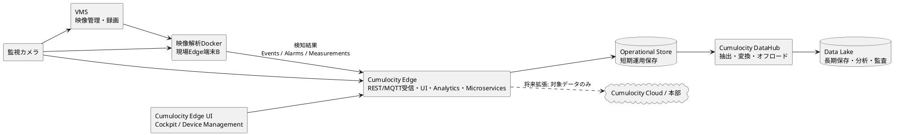

# Cumulocity Edge監視カメラIoT基盤 概念設計書

## 1. 目的

本書は、Cumulocity Edgeを利用して監視カメラを中心としたIoT基盤を構築するための概念設計を整理する。

監視カメラの映像本体はVMSで管理し、Cumulocity Edgeではカメラのデバイス管理、状態監視、イベント、アラーム、メトリクスを扱う。映像解析機能は別の現場Edge端末上のDockerコンテナとして配置し、禁止区域への侵入などの検知結果をCumulocity Edgeへ送信する。

また、Cumulocity Edge内部のOperational Storeを短期運用保存層として利用し、長期保存・分析・監査用途には、Cumulocity DataHubを利用可能な場合にData Lakeへオフロードする。

## 2. 設計方針

- 映像本体の正本はVMSとし、Cumulocityには映像を大量保存しない。
- Cumulocity Edgeは現場のデバイス管理、イベント、アラーム、メトリクス管理の中心とする。
- Operational Storeは、Cumulocity Edge内の短期運用保存層として明示する。
- Data Lakeは、長期保存、分析、監査、AI再学習、横断集計のための保存先とする。
- 長期保存の候補フローは、Cumulocity Edge / Operational StoreからCumulocity DataHubを経由してData Lakeへオフロードする構成とする。
- Cumulocity DataHubをEdge構成で利用できない場合は、外部ETL、REST APIによる定期抽出、Data Brokerによる本部側Cumulocity tenant連携等を代替案とする。
- Cumulocity Cloudまたは本部側テナントとの連携は将来拡張とし、初期構成では現場完結を基本とする。

## 3. 機能構成



### 3.1 監視カメラ

監視カメラは、Cumulocity Inventory上のManaged Object、またはGateway配下のChild Deviceとして管理する。

主な管理対象は以下とする。

- カメラID、名称、設置場所、設置エリア
- VMS上のカメラ識別子
- 接続状態、死活状態
- 録画状態、異常状態
- ファームウェア、機種、IPアドレスなどの属性

### 3.2 VMS

VMSは映像のライブ表示、録画、再生、録画保持を担当する。

Cumulocityには映像本体を保存せず、イベントやアラームからVMS上の該当映像へ追跡できるよう、録画ID、イベント時刻、再生URI、スナップショットURIなどの参照情報のみを保持する。

### 3.3 映像解析Docker

映像解析機能は、別の現場Edge端末上にDockerコンテナとして配置する。

映像取得元は、VMSまたはカメラのRTSP/ONVIF等を候補とする。どちらを正とするかは、VMS製品仕様、ネットワーク帯域、認証方式、録画との突合要件により決定する。

映像解析Dockerは、禁止区域への侵入、滞留、転倒、置き去りなどの検知結果をCumulocity Edgeへ送信する。

送信データには、少なくとも以下を含める。

- `siteId`
- `cameraId`
- `vmsRecordingId`
- `eventTime`
- `receivedTime`
- `detectedType`
- `confidence`
- `zoneId`
- `analyticModelId`
- `detectionId`
- `deduplicationKey`
- `snapshotUri`

### 3.4 Cumulocity Edge

Cumulocity Edgeは現場のIoT運用基盤として配置する。

主な役割は以下とする。

- 監視カメラ、Edge端末、VMS、映像解析アプリ、将来追加する自前実装機能のInventory管理
- REST API、MQTT、SmartREST、thin-edge.io等によるデータ受信
- Measurements、Events、Alarmsの登録
- Cumulocity Edge UIによる現場監視
- Smart Rulesによる単純なしきい値判定、通知、自動アクション
- Streaming Analytics / Analytics Builder / EPLによる複雑な相関、抑止、集約、状態遷移

ここでいうCumulocity Edge UIは、Cumulocity Edge上で利用するCumulocity標準UIを指す。具体的にはCockpit、Device Management、Alarms、Events、Dashboards等の画面を想定する。

### 3.5 Operational Store

Operational Storeは、Cumulocity Edge内でInventory、Measurements、Events、Alarmsを短期的に保存し、現場運用で参照する保存層である。

主な用途は以下とする。

- 直近のカメラ状態確認
- アラーム対応
- ダッシュボード表示
- イベント履歴確認
- DataHubによる長期保存向け抽出元

Operational StoreはData Lakeの代替ではなく、短期運用のための保存層として扱う。保持期間、容量上限、容量逼迫時の挙動、削除ポリシー、バックアップ可否は詳細設計で確認する。

### 3.6 Cumulocity DataHub

Cumulocity DataHubは、利用可能な場合にOperational Storeのデータを分析・長期保存向けにData Lakeへオフロードする候補コンポーネントとして位置づける。

主な役割は以下とする。

- Operational Storeからのデータ抽出
- リレーショナル形式への変換
- Parquet等の分析向け形式での保存
- Data Lakeへのオフロード
- 長期分析クエリのためのデータ提供

DataHub Edgeの利用可否、機能制約、Inventory viewsの対応状況、必要リソース、ライセンス条件は採用バージョン、契約、Professional Servicesの提供範囲に依存するため、ベンダー確認事項とする。DataHubをEdge構成で利用できない場合は、外部ETL、REST APIによる定期抽出、Data Brokerによる本部側Cumulocity tenant連携、またはOperational Storeからの別手段による抽出を代替案として検討する。

### 3.7 Data Lake

Data Lakeは長期保存、分析、監査、AI再学習、拠点横断集計のための保存先とする。

Cumulocity DataHubを利用する場合のData Lake接続先は、2026年時点ではADLS Gen2 / Azure Storage、S3、NASを基本候補とする。Google Cloud Storage等のその他Object Storageは、現時点ではDataHubの標準サポート外となる可能性があるため、採用前にベンダー確認事項として扱う。

保存層は以下に分ける。

- Raw層: Cumulocityから取得した原文データ
- Curated層: 分析しやすい形に正規化したEvents、Alarms、Measurements、Inventory
- Audit層: 取込ログ、チェックポイント、再送履歴、欠損検知結果、改ざん検知用メタデータ

## 4. 将来追加する自前実装機能

本章では、映像解析Dockerとは別に、将来的にEdge環境へ追加する自前実装機能の作成、配置、Cumulocity上での管理、Cumulocityデータとの連携、認証・SSOの考え方を整理する。

自前実装機能とは、例えば以下のような機能を指す。

- 現場設備や業務システムとの連携アダプタ
- カメラ、VMS、センサー、入退室管理などをまたぐ状態集約処理
- 独自ルール判定、通知、チケット起票、帳票作成
- Cumulocity上のInventory、Measurements、Events、Alarmsを参照した補正、集計、保存処理
- 現場Edge端末上で動作する運用支援API、バッチ、常駐プロセス

映像本体の解析やAI推論処理は3.3の映像解析Dockerで扱い、本章の自前実装機能はそれ以外の将来拡張機能として扱う。

### 4.1 配置方式の選択肢

2026年時点のCumulocity Edgeは、Cumulocity platform release 2026をベースにしたオンサイト向け単一サーバ構成であり、Kubernetes Operatorにより管理される。EdgeにはMicroservice Hosting、REST、MQTT、Cockpit、Device Management、Streaming Analytics、Edge databaseが含まれる。本書では、このEdge databaseに保存されるInventory、Measurements、Events、Alarms等の短期運用データ保存層をOperational Storeとして扱う。

自前実装機能の配置方式は、以下の3方式を基本候補とする。

| 方式 | 配置場所 | 主な用途 | Cumulocityでの管理 |
| --- | --- | --- | --- |
| Cumulocity Microservice方式 | Cumulocity EdgeのMicroservice Hosting上 | Cumulocity API、認証、UI、テナント設定と密に連携する業務ロジック | AdministrationのMicroservices、アプリ購読、ログ、メトリクス、ヘルスチェック |
| 独立Docker/Kubernetes方式 | Edge端末上のCumulocity外コンテナ、または同一Kubernetes上の別ワークロード | GPU、特殊デバイス、OS制御、重い依存、独自プロセス管理が必要な機能 | Managed Object、Device Service、Alarms、Events、Measurementsで監視 |
| 外部サービス方式 | 別Edge端末、オンプレサーバ、本部側システム、クラウド | 既存業務システム連携、拠点横断処理、Cumulocity外で管理するサービス | REST、MQTT、SmartREST等で連携し、状態をInventoryに反映 |

基本方針は以下とする。

- Cumulocityの権限、テナント、UI、API Gateway、ログ、メトリクスと統合したい機能は、Cumulocity Microservice方式を第一候補とする。
- GPU、映像処理、特殊OS権限、永続ボリューム、複数ポート、長時間処理などCumulocity Microserviceの制約に合わない機能は、独立Docker/Kubernetes方式を採用する。
- Cumulocity Edgeと疎結合にしたい業務システム連携や本部連携は、外部サービス方式を採用する。

映像解析Dockerと将来追加する自前実装機能の責務境界は以下を基本とする。

| 項目 | 映像解析Docker | 将来追加する自前実装機能 |
| --- | --- | --- |
| 映像フレーム取得、推論、モデル実行 | 担当する | 原則担当しない |
| 検知結果の生成 | 担当する | 原則担当しない |
| 検知結果の補正、集計、通知、チケット連携 | 必要最小限 | 必要に応じて担当する |
| Cumulocityデータの横断参照、業務ルール処理 | 必要最小限 | 主担当 |
| CumulocityへのEvents、Alarms、Measurements保存 | 担当する | 担当する |
| GPU、映像SDK、特殊デバイス利用 | 映像解析用途で担当する | 映像解析以外の用途で必要な場合のみ担当する |

### 4.2 Cumulocity Microservice方式

Cumulocity Microserviceは、Cumulocityのホスティング、セキュリティ、API管理に統合されるサーバサイドアプリケーションである。技術的にはDockerコンテナとして動作し、Cumulocity上では`/service/<microservice-name>/...`のRESTエンドポイントとして公開される。

作成時の基本要件は以下とする。

- Linux amd64のDockerイメージとして作成する。
- HTTPサーバとしてポート80で待ち受ける。
- `cumulocity.json`を用意し、アプリ名、バージョン、必要権限、リソース、ヘルスチェックを定義する。
- Dockerイメージを`image.tar`として出力し、`cumulocity.json`と合わせてZIP化する。
- Cumulocity EdgeへMicroserviceアプリケーションとしてアップロードし、対象テナントに購読させる。

`cumulocity.json`では、少なくとも以下を定義する。

- `apiVersion`: 原則`v2`
- `name`: 小文字、数字、ハイフンで構成するMicroservice名
- `version`: SemVer。正式版では既存バージョンを上書きしない
- `isolation`: `MULTI_TENANT`または`PER_TENANT`
- `requiredRoles`: MicroserviceがCumulocity APIを使うために必要な最小権限(permission文字列)
- `resources`、`requestedResources`: CPU、メモリ
- `livenessProbe`、`readinessProbe`: 本番では必ず定義する
- `settingsCategory`、`settings`: 設定値をTenant Optionsとして管理する場合に利用する

Microservice方式の注意点は以下とする。

- Cumulocity Edgeは単一テナント構成であるため、Microservice manifest上の`MULTI_TENANT` / `PER_TENANT`の扱い、購読モデル、Cloud版との差異は実機またはベンダー確認で確定する。
- Microserviceはステートレスに設計し、永続状態はInventory、Tenant Options、Binaries、Measurements、Events、AlarmsなどCumulocity API経由で保存する。
- Cumulocityのデータベースへ直接アクセスしない。
- 永続ボリュームは前提にしない。
- 入力ポートは原則1つで、追加の inbound port は前提にしない。
- 長時間リクエストや大量データ処理は、非同期ジョブ化、ページング、再試行、チェックポイント管理を行う。

### 4.3 独立Docker/Kubernetes方式

独立Docker/Kubernetes方式では、自前実装機能をCumulocity Microserviceとしてではなく、Edge端末上の独立コンテナまたは別Kubernetesワークロードとして配置する。

この方式は以下の場合に適する。

- GPU、カメラSDK、特殊デバイスドライバ、OSコマンド、ローカルファイル、永続ボリュームを使う。
- Cumulocity Microserviceのリソース、ポート、ステートレス制約に収まらない。
- Cumulocity停止時にも単独で処理継続したい。
- Cumulocityと疎結合にし、別の運用ライフサイクルで更新したい。

Cumulocityで管理するため、自前実装機能をInventory上でManaged ObjectまたはDevice Serviceとして表現する。

管理対象の例は以下とする。

- サービス名、バージョン、コンテナイメージタグ
- 配置端末、ホスト名、IPアドレス
- 起動状態、ヘルスチェック結果、最終疎通時刻
- CPU、メモリ、ディスク、キュー滞留数、処理件数
- 設定バージョン、モデルバージョン、外部接続先
- Start、Stop、Restart、Reload、Flush cacheなどのサービスコマンド

Device ManagementのServicesタブで扱いやすくするため、サービス単位のManaged Objectを作成し、そのサービスをsourceとしてMeasurements、Events、Alarmsを送信する。コマンド操作を受け付けるサービスでは、`c8y_ServiceCommand`相当の考え方でStart、Stop、Restart、独自コマンドをOperationsとして扱う。

### 4.4 外部サービス方式

外部サービス方式では、Cumulocity Edgeの外にある業務システム、別Edge端末、オンプレサーバ、クラウドサービスがCumulocity Edge APIと連携する。

連携方式は以下を候補とする。

- REST API: Inventory、Measurements、Events、Alarms、Operations、Tenant Options、Binariesを汎用的に読み書きする。
- MQTT: デバイスやゲートウェイが軽量にデータ送信する。
- SmartREST: 低帯域、低性能デバイスや固定フォーマットの連携で利用する。
- thin-edge.io: Linux系Edge端末をCumulocity管理下に置き、ソフトウェア管理やデバイス管理を行う場合に利用する。
- Data Broker: EdgeとCloud/本部側Cumulocity tenant間で対象データを選択転送し、Cloud側からEdge側へOperationsを戻す場合に利用する。任意の外部サービス連携一般の手段としては扱わない。

外部サービスはCumulocity側のManaged Objectとして登録し、死活、処理件数、接続状態、エラー状態をMeasurements、Events、Alarmsとして送信する。

### 4.5 Cumulocityデータ参照・保存の方法

自前実装機能がCumulocityデータを参照して処理し、結果を保存する場合は、Cumulocity REST APIを基本とする。

主なAPI利用方針は以下とする。

| データ | 読み取り用途 | 書き込み用途 |
| --- | --- | --- |
| Inventory | カメラ、VMS、Edge端末、サービス、設置場所、属性、階層を取得 | サービスManaged Object、外部ID、状態属性、バージョンを登録・更新 |
| Measurements | メトリクス、処理件数、性能値、状態値を取得 | CPU、メモリ、処理件数、集計値、KPIを保存 |
| Events | 発生事実、履歴、設定変更、連携結果を取得 | 処理完了、設定変更、同期結果、外部システム通知履歴を保存 |
| Alarms | 対応が必要な異常状態を取得 | サービス停止、接続断、処理失敗、閾値超過を登録・更新 |
| Operations | デバイスやサービスへの指示を取得 | Start、Stop、Restart、設定反映などを発行 |
| Tenant Options | テナント別・サービス別の設定を取得 | 自前機能の設定値、接続先、閾値を保存 |
| Binaries | ファイル、設定、モデル、帳票を取得 | スナップショット、設定ファイル、エクスポート結果を保存 |

Microservice方式では、Cumulocityが実行時に注入する`C8Y_BASEURL`を使ってCumulocity REST APIへアクセスする。Multi-tenant Microserviceではbootstrap userで購読テナントごとのservice userを取得し、対象テナントのservice user権限でAPIを実行する。Inbound requestを受けて処理する場合は、必要に応じて元ユーザーの認証コンテキストでAPIを実行する。

独立Docker方式と外部サービス方式では、以下のいずれかの認証方式を利用する。

- 最小権限のCumulocity APIユーザーを作成し、Basic認証またはトークン方式でREST APIを利用する。
- Cumulocity側で外部Bearer token設定が有効であり、claimマッピング、署名検証、必要に応じたintrospection/userinfo検証を設定できる場合、外部IdPのOAuth2 access tokenをBearer tokenとしてCumulocityに渡す。
- デバイス/ゲートウェイとして登録し、MQTT、SmartREST、thin-edge.ioでデータ送信する。
- 証明書認証や閉域網、プロキシ、mTLSは採用環境に応じて詳細設計で確認する。

### 4.6 認証・SSO設計

2026年時点のCumulocity SSOは、OAuth2 Authorization Code Grantを前提とし、access tokenおよびID tokenはJWT形式を利用する。SAMLはサポートされない。

SSOで扱う主な要素は以下とする。

- 外部IdP: Azure AD、Keycloak、その他OAuth2/OIDC対応IdP
- JWT必須要素: 一意なユーザー識別子、`iss`、`aud`、`exp`
- 動的アクセスマッピング: JWT claimに基づき、Global role、Default application、Inventory role、Device groupを割り当てる
- ユーザーデータマッピング: first name、last name、email、phoneなどをJWT claimから反映する
- ログアウト連携: Keycloak等ではOpenID Connectベースのグローバルログアウトを検討する

SSO利用時の注意点は以下とする。

- SSOユーザーがログインできるよう、少なくともOwn user managementのREAD権限を持つロールを割り当てる。
- アクセスマッピングが一致しない場合、SSOログインは拒否される。
- 動的アクセスマッピングでロールを毎回上書きするか、初回作成時のみ使うかを運用方針として決める。
- ブラウザ利用ではCookieが必要である。
- On-premisesまたはEdge構成では、ドメインベースのテナント解決、Redirect URI、証明書、プロキシを事前確認する。

自前実装機能からCumulocity APIへアクセスする場合は、人間ユーザーのSSOとサービス間認証を分けて設計する。

- UI操作に紐づく処理は、可能な範囲でユーザーコンテキストを引き継ぎ、監査ログ上も操作主体が分かるようにする。
- バッチ、常駐処理、外部システム連携は、サービス専用ユーザー、またはCumulocity側の外部Bearer token設定が有効な場合に外部IdPのclient credentials grantで取得したaccess tokenを利用する。
- Microserviceの`requiredRoles`やAPIユーザー権限は、Inventory、Measurement、Event、Alarm、Operationごとに最小権限で設計する。
- パスワード、client secret、外部APIキーは平文設定に置かず、Tenant Optionsの暗号化対象キーや外部Secret管理の利用を検討する。

### 4.7 方式選定の目安

| 要件 | 推奨方式 |
| --- | --- |
| Cumulocity画面から呼び出す業務APIを作りたい | Cumulocity Microservice |
| Cumulocityデータを定期集計し、EventsやMeasurementsへ保存したい | Cumulocity Microservice |
| GPUや特殊デバイスを使いたい | 独立Docker/Kubernetes |
| OSレベル操作やローカルファイル永続化が必要 | 独立Docker/Kubernetes |
| Cumulocity停止中も処理を継続したい | 独立Docker/Kubernetes |
| 既存の業務システムと双方向連携したい | 外部サービス |
| 拠点から本部側Cumulocity tenantへ一部データだけ送信したい | Data Broker |
| Cumulocity以外の外部業務システムへ連携したい | REST API連携または外部サービス |
| 低帯域の端末から固定形式で送信したい | SmartRESTまたはMQTT |
| Linux Edge端末自体をCumulocity管理対象にしたい | thin-edge.io |

### 4.8 参考情報

- [Cumulocity Edge 2026 documentation](https://cumulocity.com/docs/2026/edge/edge-introduction/)
- [Cumulocity Microservices introduction](https://cumulocity.com/docs/microservice-sdk/microservice-sdk-introduction/)
- [Cumulocity Microservices general aspects](https://cumulocity.com/docs/microservice-sdk/general-aspects/)
- [Using the REST interface](https://cumulocity.com/docs/microservice-sdk/rest/)
- [Cumulocity Single sign-on](https://cumulocity.com/docs/authentication/sso/)
- [Managing device services](https://cumulocity.com/docs/device-management-application/managing-device-services/)
- [SmartREST introduction](https://cumulocity.com/docs/smartrest/smartrest-introduction/)
- [Cumulocity DataHub overview 2026](https://cumulocity.com/docs/2026/datahub/datahub-overview/)

## 5. Cumulocityデータ種別の使い分け

| データ種別 | 用途 | 例 |
| --- | --- | --- |
| Inventory | デバイス、アプリ、階層、属性の管理 | カメラ、Edge端末、VMS、映像解析アプリ、自前実装機能、設置場所 |
| Measurements | 数値時系列データ | CPU使用率、温度、録画率、解析件数、サービス処理件数、死活メトリクス |
| Events | 発生事実 | 侵入検知、録画開始、録画停止、設定変更、解析モデル更新、自前機能の処理完了 |
| Alarms | 対応が必要な状態 | カメラ切断、録画失敗、禁止区域侵入、解析コンテナ停止、自前機能の異常停止 |

Data Lakeへ永続保存したいデータは、Cumulocity側でDB保存されない処理モードにしない。保存要否、保持期間、転送対象はデータ種別ごとに定義する。

検知結果や自前実装機能の処理結果は、以下を目安に登録先を決める。

| 判断対象 | 登録先 | 判断基準 |
| --- | --- | --- |
| 発生事実の記録 | Events | 検知、処理完了、設定変更、外部連携実行など、履歴として残す事実 |
| 対応が必要な状態 | Alarms | 運用者の確認、対応、解消管理が必要な異常、警告、危険状態 |
| 数値時系列 | Measurements | 処理件数、信頼度、CPU、メモリ、遅延、キュー滞留数、稼働率 |
| 構成・状態 | Inventory | カメラ、VMS、サービス、機能、バージョン、設置場所、外部ID |

Alarmとして登録する場合は、source Managed Object、severity、status、発生条件、解消条件、再発条件を詳細設計で定義する。侵入検知のように発生事実と対応状態の両方が必要なケースでは、Eventで発生事実を残し、対応が必要なものだけAlarmとして登録する。

## 6. データフロー

```plantuml
@startuml
left to right direction

actor "監視カメラ" as Camera
participant "VMS" as VMS
participant "映像解析Docker" as Analytics
participant "Cumulocity Edge" as Edge
database "Operational Store" as Store
participant "Cumulocity Edge UI" as UI
participant "Cumulocity DataHub" as DataHub
database "Data Lake" as Lake

== カメラ状態・メトリクス ==
Camera -> Edge : 状態・メトリクス\nREST / MQTT / SmartREST / thin-edge.io
Edge -> Store : Measurements / Events / Alarmsを保存
UI -> Edge : 直近状態・アラームを参照
Store -> DataHub : 対象データを抽出\n利用可能な場合
DataHub -> Lake : 変換・オフロード\n利用可能な場合

== 映像 ==
Camera -> VMS : 映像ストリーム
VMS -> VMS : ライブ表示・録画・再生・保持
Edge -> Store : 録画ID・時刻・再生URI等の参照情報を保存

== 映像解析結果 ==
VMS -> Analytics : 映像取得
Camera -> Analytics : RTSP / ONVIF等での映像取得候補
Analytics -> Edge : 検知結果\nEvents / Alarms / Measurements
Edge -> Store : 解析結果を短期保存
UI -> Edge : アラーム確認・対応・解消
Store -> DataHub : 解析結果を抽出\n利用可能な場合
DataHub -> Lake : 長期保存\n利用可能な場合

== 長期保存・分析 ==
Lake -> Lake : Raw / Curated / Audit層で保存
@enduml
```

### 6.1 カメラ状態・メトリクス

1. 監視カメラまたはゲートウェイが、カメラ状態やメトリクスを収集する。
2. REST API、MQTT、SmartREST、thin-edge.io等でCumulocity Edgeへ送信する。
3. Cumulocity EdgeがMeasurements、Events、Alarmsとして登録する。
4. データはOperational Storeへ短期保存される。
5. Cumulocity Edge UIで現場監視、アラーム対応、ダッシュボード表示を行う。
6. DataHubを利用可能な場合、DataHubがOperational Storeからデータを抽出し、Data Lakeへオフロードする。利用できない場合は、外部ETL、REST APIによる定期抽出、Data Brokerによる本部側Cumulocity tenant連携等を代替案とする。

### 6.2 映像

1. 監視カメラの映像はVMSへ送信される。
2. VMSがライブ表示、録画、再生、録画保持を担当する。
3. Cumulocityには映像本体を保存しない。
4. Cumulocity上のイベントやアラームには、VMS録画ID、時刻、再生URI、スナップショットURI等の参照情報を保持する。

### 6.3 映像解析結果

1. 映像解析DockerがVMSまたはカメラから映像を取得する。
2. 禁止区域への侵入などを検知する。
3. 検知結果をEvents、Alarms、MeasurementsとしてCumulocity Edgeへ送信する。
4. Cumulocity EdgeはOperational Storeへ短期保存する。
5. Cumulocity Edge UIでアラーム確認、対応、解消を行う。
6. DataHubを利用可能な場合、DataHubがOperational Storeから解析結果を抽出し、Data Lakeへ長期保存する。利用できない場合は、外部ETL、REST APIによる定期抽出、Data Brokerによる本部側Cumulocity tenant連携等を代替案とする。

### 6.4 長期保存・分析

1. DataHubを利用可能な場合、DataHubがOperational Storeから対象データを抽出する。
2. DataHubが分析向け形式に変換し、Data Lakeへ保存する。
3. DataHubを利用できない場合は、外部ETL、REST APIによる定期抽出、Data Brokerによる本部側Cumulocity tenant連携等を代替案とする。
4. Data LakeのRaw層、Curated層、Audit層へ保存する。
5. Data Lake上で日次アラーム件数、カメラ稼働率、解析イベント件数、拠点別KPI、監査証跡を分析する。

## 7. 信頼性設計

### 7.1 再送・重複排除

映像解析Dockerや自前実装機能からCumulocity Edgeへの送信、およびOperational StoreからData Lakeへのオフロードでは、再送、重複、順序逆転を前提とする。

重複排除キーは以下を基本とする。

```text
siteId + sourceId + functionId/modelId + detectionId/eventTimeBucket
```

Cumulocity側で採番されるIDだけに依存せず、発生源側で一意性を担保できるキーを持たせる。映像解析では`sourceId`を`cameraId`、`functionId/modelId`を`analyticModelId`として扱う。

### 7.2 時刻同期

映像証跡とイベントを正しく突合するため、以下の時刻を分離して保持する。

- `eventTime`: 実際に検知・発生した時刻
- `receivedTime`: Cumulocity Edgeが受信した時刻
- `ingestedTime`: Data Lakeへ取り込んだ時刻

カメラ、VMS、映像解析端末、自前実装機能の実行端末、Cumulocity Edge、Data Lake連携基盤はNTPまたはPTPで時刻同期する。

### 7.3 障害時の考慮

以下の障害を前提に設計する。

- カメラ切断
- VMS停止
- 映像解析Docker停止
- 自前実装機能停止
- Cumulocity Edge停止
- Operational Store容量逼迫
- DataHub停止
- Data Lake接続断
- 外部ネットワーク断

Data Lake連携では、チェックポイント、失敗リトライ、冪等書き込み、未送信件数管理、DLQ相当の仕組みを設ける。

### 7.4 Edge停止時の蓄積・再送

Cumulocity Edge停止時は、発生源側で一時蓄積し、Edge復旧後に再送することを基本とする。

| 発生源 | 蓄積場所 | 再送主体 | 設計で決めること |
| --- | --- | --- | --- |
| 映像解析Docker | ローカルディスク、軽量DB、キュー | 映像解析Docker | 最大滞留件数、最大保持時間、ディスク逼迫時の破棄条件、再送順序 |
| 自前実装機能 | ローカルディスク、軽量DB、キュー | 自前実装機能 | チェックポイント、冪等キー、再送間隔、DLQ相当の隔離条件 |
| Data Lake連携基盤 | ジョブ管理DB、チェックポイント、未送信一覧 | DataHubまたは外部ETL | 失敗ジョブの再実行、重複排除、欠損検知、監査ログ |

詳細設計では、RTO、RPO、最大オフライン時間、ローカルキュー容量、データ破棄可否、復旧後の再送速度制限を定義する。

## 8. セキュリティ設計

ネットワークは以下の領域に分離する。

- カメラ/VMS系ネットワーク
- 映像解析系ネットワーク
- 自前実装機能系ネットワーク
- Cumulocity Edge管理系ネットワーク
- Data Lake向け外部通信ネットワーク

通信にはTLSを利用し、端末単位認証、証明書ローテーション、最小権限APIユーザーを前提とする。

Data Lakeには、暗号化、アクセス制御、監査ログ、必要に応じてWORM相当の保持ポリシーを適用する。

自前実装機能の認証では、ユーザーSSOとサービス間認証を分離し、最小権限APIユーザー、OAuth2/OIDCのaccess token、証明書認証、暗号化された設定値を用途に応じて使い分ける。

VMS再生URI、スナップショットURI、RTSP/ONVIF認証情報は、映像本体に近い機微情報として扱う。Cumulocityに保存するURIは、可能な限り有効期限付き、権限確認付き、またはVMS側の認可を必要とする参照URIとし、認証情報を直接含めない。スナップショット保存の可否、保持期間、アクセス監査、資格情報ローテーション、漏えい時の失効手順は詳細設計で定義する。

## 9. 運用監視

運用監視対象は以下とする。

- カメラ死活
- VMS死活
- 映像解析Docker死活
- 将来追加する自前実装機能の死活、サービス状態、バージョン、処理件数
- Cumulocity Edge死活
- Operational Store容量、保持余力
- DataHubジョブ状態
- Data Lake転送遅延
- 未送信件数
- 重複率
- 欠損検知件数
- 時刻同期状態
- アラーム発生、確認、解消、再発のライフサイクル

詳細設計では、主要メトリクスごとに正常、警告、重大、復旧条件、通知先、一次対応手順、エスカレーション条件を定義する。

## 10. テスト観点

- カメラ接続、切断、復旧がInventory、Measurements、Alarmsに正しく反映されること。
- 禁止区域侵入などの解析結果がEventsまたはAlarmsとしてCumulocity Edgeに登録されること。
- 将来追加する自前実装機能が、選定した配置方式に応じてCumulocity上で管理、監視、操作できること。
- 自前実装機能がCumulocity APIを参照し、処理結果をInventory、Measurements、Events、Alarmsの適切なデータ種別へ保存できること。
- SSO利用時に、JWT claimに基づくロール、アプリ、Inventory roleのマッピングが期待通りに行われること。
- Cumulocity上のイベント/アラームからVMS録画へ時刻と録画IDで突合できること。
- Operational Storeの保持期間、容量逼迫時の挙動、削除ポリシー、DataHub抽出範囲を確認できること。
- Cumulocity Edge停止、DataHub停止、Data Lake停止、ネットワーク断で、再送、重複排除、欠損検知が機能すること。
- Data LakeのRaw層、Curated層、Audit層から、日次アラーム件数、カメラ稼働率、解析イベント件数、監査証跡を再集計できること。
- カメラ、VMS、映像解析端末、Cumulocity Edge、Data Lake間の時刻差が許容範囲内に収まること。
- Cumulocity Edge停止中に映像解析Dockerまたは自前実装機能がローカル蓄積し、復旧後に重複なく再送できること。
- DataHubを利用できない場合でも、代替案により対象データを長期保存先へ抽出できること。
- 長時間連続運転、負荷、キュー逼迫、ディスク逼迫、権限不足、外部Bearer token無効化、URI期限切れ、時刻ずれ時の突合失敗を確認できること。
- Operational Store、DataHubまたは外部ETL、Data Lake連携基盤のバックアップ/リストア手順を確認できること。

## 11. ベンダー確認事項

以下は採用するCumulocity Edgeバージョン、ライセンス、契約条件、DataHub構成に依存するため、詳細設計前に確認する。

- Operational Storeの正式仕様、保持期間、容量上限、削除ポリシー
- Operational Storeのバックアップ可否、リストア方式
- DataHub Edgeの利用可否
- DataHub Edgeの機能制約
- DataHub EdgeでのInventory views対応状況
- DataHubの抽出周期、再送、重複排除、欠損検知の標準機能範囲
- Edge上でDataHubを同居させる場合のCPU、メモリ、ディスク要件
- Data Lake接続先として利用可能なStorage種別。2026年時点のDataHubではADLS Gen2 / Azure Storage、S3、NASを基本候補とし、GCS等は採用前に確認する
- Cumulocity EdgeからCumulocity Cloudへの標準同期機能、対象データ、双方向性
- 閉域網、プロキシ、証明書管理、認証方式への対応
- Cumulocity Edge 2026で利用可能なMicroservice Hostingのリソース上限、レプリカ数、永続化制約、ログ/メトリクス保持仕様
- Edge上で独立Docker/Kubernetesワークロードを同居させる場合のサポート範囲、リソース分離、運用責任境界
- OAuth2/OIDC SSO、外部Bearer token、client credentials grant、mTLSの採用可否とIdP側要件
- thin-edge.io、MQTT、SmartREST、Device Serviceによるサービス管理の適用範囲

## 12. 前提・自信度

- 本書は概念設計レベルであり、詳細設計では保持期間、容量見積、API、スキーマ、運用手順を具体化する。
- Data Lakeは、Cumulocity DataHubを利用する場合はADLS Gen2 / Azure Storage、S3、NASを基本候補とする。GCS等のその他Object Storageは現時点で標準サポート外となる可能性があるため、採用前にベンダー確認する。
- Operational StoreとDataHubを構成に入れるべき点の自信度は95%。
- DataHub Edgeの具体的な機能制約はバージョン・契約依存のため、自信度は75%。詳細はベンダー確認が必要。
- Cumulocity Edge 2026にMicroservice Hosting、REST、MQTT、Cockpit、Device Management、Edge databaseが含まれる点の自信度は95%。
- Cumulocity SSOがOAuth2/OIDC/JWTベースであり、SAMLをサポートしない点の自信度は95%。
- 独立Docker/Kubernetes方式のサポート境界、Edge同居時のリソース分離、DataHub Edgeの具体的制約は環境・契約依存のため、自信度は75%。詳細はベンダー確認が必要。
