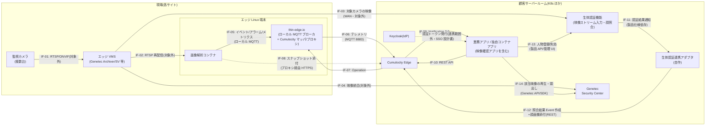
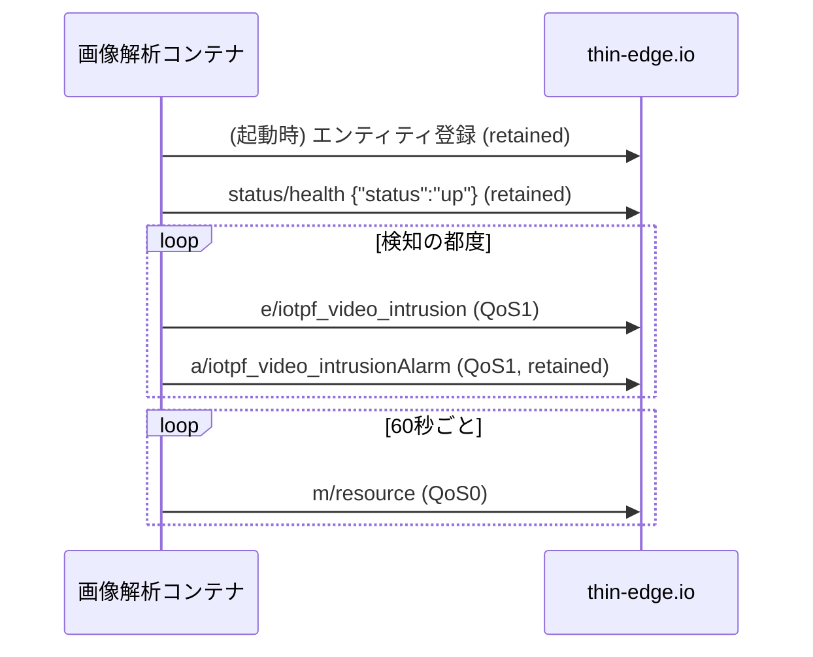
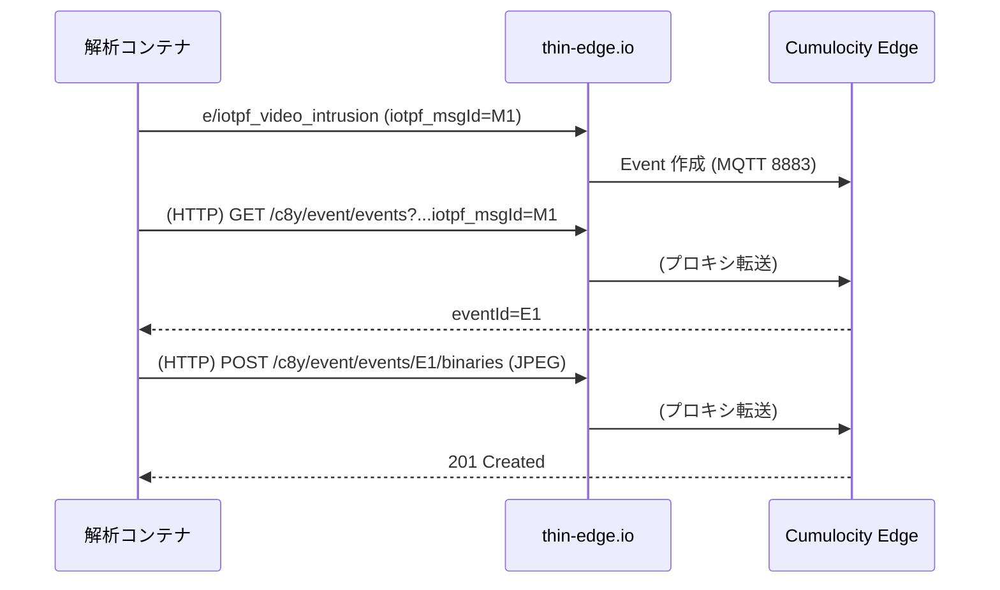
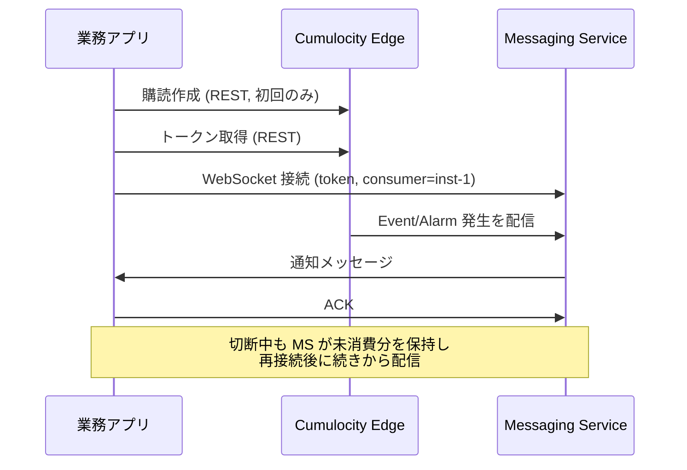
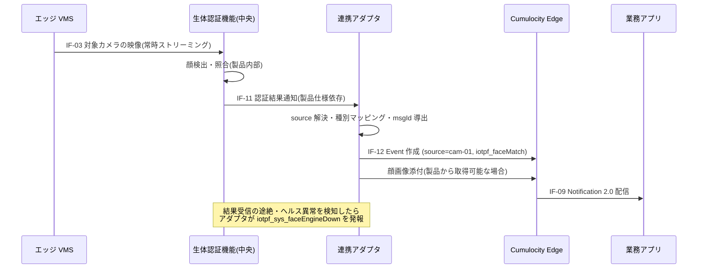

# データ連携仕様書

Cumulocity ベース IoT 基盤 — システム間データ連携仕様

| 項目 | 内容 |
|---|---|
| 版数 | 0.1(初版ドラフト) |
| 対象 | IoT 基盤(共通基盤)の全データ連携区間 |
| 関連文書 | API 設計書(別途作成予定)、全体アーキテクチャ設計書(今後作成予定) |

---

## 1. 目的・適用範囲・関連文書

### 1.1 目的

本書は、Cumulocity Edge を中核とする IoT 基盤において、システム間で授受されるデータの**連携区間・連携方式・データ項目・連携契機・異常時の振る舞い**を定義する。顧客案件の開発ベンダ、画像解析コンテナおよび生体認証連携アダプタの開発者は、本書に従って基盤と接続する。

### 1.2 適用範囲と分界

本書で定義する範囲:

- どの区間で、何のデータを、どの方式(プロトコル/トピック/チャネル)で、いつ、どのように連携するか
- 各連携データの論理データモデル(項目名・型・必須任意)とサンプル
- ID 体系・種別コード体系・タイムスタンプ等の共通規定
- 回線断・再送・重複到達など異常時の連携仕様

本書で定義しない範囲(分界):

- **REST API のエンドポイント単位の詳細仕様**(パス、HTTP メソッド、リクエスト/レスポンスの全フィールド、ステータスコード)→ **別紙: API 設計書**
- 認証・認可の詳細(Keycloak realm 設計、トークンクレーム定義)→ 認証・SSO 設計書
- ネットワーク物理構成・FW ルール詳細 → 全体アーキテクチャ設計書
- **映像プレーンの内部仕様**(エッジ VMS の録画・配信設計、Genetec Security Center への統合方式、Genetec の API 詳細)→ 映像システム(Genetec)側設計。本書ではデータプレーンとの**境界**(映像取得の前提、イベント⇔録画映像の相関キー)のみ定義する

### 1.3 前提条件

- Cumulocity Edge(k3s 上で稼働)を顧客サーバールームにオンプレ設置。ライセンスは Cumulocity GmbH との商用契約による
- エッジ Linux 端末には thin-edge.io を導入し、画像解析コンテナは Docker/Podman 上で稼働
- 映像プレーンは Genetec 系で構成する: 各現場に**エッジ VMS**(Genetec Archiver / Streamvault アプライアンス等)、サーバールームに **Genetec Security Center** を設置し、録画・映像統合は Genetec 側で行う
- **カメラへの接続はエッジ VMS に一本化**し、画像解析コンテナ(エッジ)および生体認証機能(中央)はエッジ VMS の RTSP 再配信を受ける(カメラの同時接続数制限の回避、録画映像と解析対象映像の一致)
- 顔認証は**中央・映像ストリーム照合方式**とする: 映像ストリームを入力として顔検出〜照合まで内部で行う**生体認証機能**(製品想定)をサーバールームに配置し、顔認証対象カメラの映像を「カメラ → エッジ VMS → 生体認証機能」の経路で WAN 越しに入力する。認証結果は自作の**生体認証連携アダプタ**が Cumulocity に登録する(§7)
- **映像ストリームは本書のデータ連携対象外**(IF-01〜IF-04 として存在のみ示す)。データプレーンで現場外に出るのはイベント/アラーム/メトリクス/スナップショット静止画のみだが、映像プレーンとして顔認証対象カメラの再配信(IF-03)と Genetec 映像統合(IF-04)が WAN を流れる(帯域は §10)
- エッジ端末・サーバー間は顧客ネットワーク(WAN/VPN)経由で接続され、一時的な回線断が発生しうる
- 全ノードは NTP により時刻同期されていること(§8.4 参照)

---

## 2. データ連携マトリクス

### 2.1 From/To マトリクス

行 = データ送信元(From)、列 = データ送信先(To)。セルの `IF-xx` が連携 ID(§2.2 の一覧および詳細節に対応)。`―` は連携なし。

> マトリクスは**データの流れ**の方向を表す(コネクション確立の方向とは区別する)。応答としての戻りデータ(ACK・照合応答等)は各詳細節に記載し、マトリクスには主たるデータの流れのみ記載する。

| From \ To | エッジ<br/>VMS | 画像解析<br/>コンテナ | thin-edge.io | Cumulocity<br/>Edge | 業務アプリ/<br/>独自アプリ | 生体認証機能<br/>(中央) | 生体認証<br/>連携アダプタ | Genetec<br/>Security Center |
|---|---|---|---|---|---|---|---|---|
| **監視カメラ** | IF-01 ※1 | ― | ― | ― | ― | ― | ― | ― |
| **エッジ VMS** | ― | IF-02 ※1 | ― | ― | ― | IF-03 ※1 | ― | IF-04 ※1 |
| **画像解析コンテナ** | ― | ― | **IF-05** | **IF-08** | ― | ― | ― | ― |
| **thin-edge.io** | ― | ― | ― | **IF-06** | ― | ― | ― | ― |
| **Cumulocity Edge** | ― | ― | **IF-07** | ― | **IF-09** | ― | ― | ― |
| **業務アプリ/独自アプリ** | ― | ― | ― | **IF-10** | ― | IF-13 ※2 | ― | IF-14 ※3 |
| **生体認証機能(中央)** | ― | ― | ― | ― | ― | ― | **IF-11** | ― |
| **生体認証連携アダプタ** | ― | ― | ― | **IF-12** | ― | ― | ― | ― |

- ※1 IF-01〜IF-04(映像プレーン: カメラ取り込み・RTSP 再配信・Genetec 統合)は**本書の連携対象外**。内部仕様は映像システム(Genetec)側設計に委ね、本書は存在と境界条件(§1.3、§6.6、§7.1)のみ示す。うち **IF-03(顔認証対象カメラの映像再配信)は WAN を流れる**ため、帯域前提を §10 に記載
- ※2 IF-13(人物登録・失効の管理操作)は生体認証機能(製品)の API/管理 UI によるものとし、詳細は**別紙: API 設計書・製品仕様**(概要のみ §7.1)
- ※3 IF-14(イベント発生時刻の録画映像の再生・頭出し)は別途開発予定の**映像確認アプリ**(業務アプリの一種、K8s 上)が使用する。方式詳細は Genetec 側設計に委ね、本書は**相関キー**(§3.4)と要件(§6.6)を定義
- Keycloak との認証連携(トークン発行・検証)は全コンポーネントに共通のため本マトリクスから除外し、認証・SSO 設計書で定義する

### 2.2 連携一覧

| ID | From | To | 連携内容 | 方式 | 契機 | 詳細 |
|---|---|---|---|---|---|---|
| IF-01 | 監視カメラ | エッジ VMS | 映像ストリーム(取り込み・録画) | RTSP/ONVIF | 常時 | 対象外(※1) |
| IF-02 | エッジ VMS | 画像解析コンテナ | 映像ストリーム(再配信) | RTSP | 常時 | 対象外(※1) |
| IF-03 | エッジ VMS | 生体認証機能(中央) | 顔認証対象カメラの映像ストリーム(再配信、WAN 越し) | RTSP(TLS/閉域網) | 常時(対象カメラのみ) | 対象外(※1)。前提 §7.1、帯域 §10 |
| IF-04 | エッジ VMS | Genetec Security Center | 映像統合(Genetec ネイティブ接続) | Genetec 独自(Federation / Archiver 接続) | 常時・オンデマンド | 対象外(※1)・映像側設計 |
| IF-05 | 画像解析コンテナ | thin-edge.io | イベント/アラーム/メトリクス/死活 | ローカル MQTT(te/) | 検知都度・定期 | §4 |
| IF-06 | thin-edge.io | Cumulocity Edge | テレメトリ転送(Event/Alarm/Measurement/サービス状態) | MQTT 8883(デバイス証明書) | IF-05 受信都度 | §5.2 |
| IF-07 | Cumulocity Edge | thin-edge.io | Operation(コンテナ更新・設定配布・再起動・ログ回収) | MQTT 8883 → cmd トピック | 操作作成都度 | §5.3 |
| IF-08 | 画像解析コンテナ | Cumulocity Edge | スナップショット画像の Event 添付 | HTTPS(thin-edge ローカルプロキシ経由) | 重要イベント発生時 | §5.4 |
| IF-09 | Cumulocity Edge | 業務アプリ/独自アプリ | Event/Alarm のリアルタイム通知 | Notification 2.0(WebSocket) | 発生都度(購読ベース) | §6 |
| IF-10 | 業務アプリ/独自アプリ | Cumulocity Edge | 履歴取得・インベントリ参照・Operation 作成 | REST API | アプリ都合(オンデマンド) | §6 |
| IF-11 | 生体認証機能(中央) | 生体認証連携アダプタ | 認証結果通知(照合結果・検出メタデータ・顔画像参照) | 製品仕様依存(Webhook / API 等) | 照合完了都度 | §7 |
| IF-12 | 生体認証連携アダプタ | Cumulocity Edge | 照合結果の Event/Alarm 作成・顔画像添付(取得可能な場合) | REST API | IF-11 受信都度 | §7 |
| IF-13 | 業務アプリ | 生体認証機能(中央) | 人物登録・変更・失効の管理操作 | 製品 API / 管理 UI | 業務操作時 | 別紙: API 設計書・製品仕様 |
| IF-14 | 映像確認アプリ(業務アプリ) | Genetec Security Center | イベント該当映像の再生・頭出し要求(カメラ・時刻指定。応答として映像) | Genetec API/SDK | オペレータ操作時 | §6.6(相関キーは §3.4) |

### 2.3 システム間連携全体図



以降の詳細節は、連携が密接に関連する区間(A〜D)単位でまとめて記載する。各節の見出しに対象の連携 ID を付す。

| 区間 | 対象連携 | 節 |
|---|---|---|
| A: エッジ内ローカル連携 | IF-05 | §4 |
| B: エッジ ⇔ Cumulocity | IF-06, IF-07, IF-08 | §5 |
| C: Cumulocity ⇔ アプリ | IF-09, IF-10、およびイベント⇔映像の紐づけ(IF-14) | §6 |
| D: 顔認証(中央・ストリーム照合) | IF-11, IF-12(IF-13 は別紙) | §7 |
| (映像プレーン) | IF-01〜IF-04 | 対象外(前提のみ §1.3・§7.1) |

---

## 3. 共通規定

### 3.1 ID 体系

| ID | 形式 | 例 | 説明 |
|---|---|---|---|
| 顧客コード | 英大文字 3〜8 桁 | `CUSTA` | 顧客ごとに採番。テナント名にも使用 |
| サイト ID | `site-<顧客コード小文字>-<3桁連番>` | `site-custa-001` | 現場(拠点)単位。Cumulocity のグループ(asset)として登録 |
| エッジ端末 ID | `edge-<サイトID連番部>-<2桁連番>` | `edge-001-01` | thin-edge.io のデバイス ID。Cumulocity には external ID(`c8y_Serial`)として登録 |
| カメラ ID | `cam-<2桁連番>` | `cam-01` | エッジ端末配下の子デバイス(childDevice)として登録。サイト内で一意 |
| サービス ID | 英小文字ケバブケース | `video-analytics` | エッジ端末上のコンテナ(thin-edge の service エンティティ) |
| メッセージ ID | UUID v4 | `9f1c...` | イベント/アラーム 1 件ごとに送信元が採番する冪等性キー(§8.2。連携アダプタは製品の結果 ID から決定的に導出) |
| 人物 ID | 製品採番の識別子 | `person-3fa8...`(形式は製品仕様依存) | 顔認証の登録人物。生体認証機能(製品)が採番・管理する識別子を不透明な文字列として扱い、氏名等の個人情報は含めない(§7.5) |

**Cumulocity デバイス階層へのマッピング**:

```
サイト(グループ/asset: site-custa-001)
└─ エッジ端末(device: edge-001-01)
   ├─ カメラ(childDevice: cam-01, cam-02, ...)
   └─ サービス(service: video-analytics, tedge-agent, ...)
```

イベント/アラームの**発生源(source)は原則カメラ(childDevice)**とし、端末自体の障害・リソース系は エッジ端末(device)を発生源とする。

### 3.2 表記・形式の共通規定

| 項目 | 規定 |
|---|---|
| 文字コード | UTF-8(BOM なし) |
| データ形式 | JSON(区間 A〜D 共通)。バイナリはスナップショット/顔画像(JPEG)のみ |
| タイムスタンプ | ISO 8601 拡張形式・ミリ秒・タイムゾーンオフセット付き。例: `2026-07-16T10:23:45.123+09:00`。エッジ内部処理は UTC 可だが、連携データはオフセット付きで表現する |
| 数値 | 座標・スコアは小数(倍精度)。スコアは 0.0〜1.0 |
| カスタムフラグメント接頭辞 | 基盤共通のカスタム項目は `iotpf_`(IoT PlatForm)を接頭辞とする。顧客案件固有の拡張は `x<顧客コード>_`(例: `xcusta_`)とし、`c8y_` や `iotpf_` と衝突させない |

### 3.3 イベント/アラーム種別コード体系

Cumulocity の `type` フィールドに設定する種別コードを次の形式で定義する。

```
iotpf_<ドメイン>_<種別名(lowerCamelCase)>
```

ドメイン: `video`(画像解析) / `face`(顔認証) / `sys`(端末・システム)

**イベント種別(代表例)** — 顧客案件で追加する場合も同形式に従う:

| 種別コード | 意味 | 発生源 |
|---|---|---|
| `iotpf_video_intrusion` | 侵入検知(警戒ゾーンへの進入) | カメラ |
| `iotpf_video_objectDetected` | 物体検知(検知クラスは付帯情報で表現) | カメラ |
| `iotpf_video_loitering` | うろつき・滞留検知 | カメラ |
| `iotpf_video_abandonedObject` | 置き去り検知 | カメラ |
| `iotpf_face_match` | 顔認証一致(登録人物を検知) | カメラ |
| `iotpf_face_noMatch` | 顔検出したが登録人物と不一致(閾値未満) | カメラ |
| `iotpf_face_unknownPerson` | 未登録者検知(監視リスト運用時) | カメラ |
| `iotpf_sys_analyticsStarted` | 解析コンテナ起動 | エッジ端末 |

> `iotpf_face_*` のイベント/アラームは**生体認証連携アダプタが生成**し(IF-12)、`source` には検出元カメラの managedObject を設定する(§7)。エッジ側でイベントは生成しない。

**アラーム種別(代表例)**:

| 種別コード | 標準重要度 | 意味 |
|---|---|---|
| `iotpf_video_intrusionAlarm` | CRITICAL | 侵入検知の即時対処要求(イベントと併発可) |
| `iotpf_face_watchlistAlarm` | MAJOR | 監視リスト該当者の検知 |
| `iotpf_sys_cameraOffline` | MAJOR | カメラ映像取得不能(RTSP 断) |
| `iotpf_sys_analyticsStopped` | MAJOR | 画像解析コンテナの異常停止 |
| `iotpf_sys_faceEngineDown` | MAJOR | 生体認証機能からの結果受信途絶・ヘルス異常(連携アダプタが発報。顔認証機能停止のおそれ) |
| `iotpf_sys_resourceShortage` | WARNING | エッジ端末リソース逼迫(CPU/メモリ/ディスク) |

重要度は Cumulocity 標準の `CRITICAL` / `MAJOR` / `MINOR` / `WARNING` を使用する。「イベント」は事実の記録(大量発生を許容)、「アラーム」は人の対処を要する状態(アクティブ→クリアのライフサイクルを持つ)として使い分ける。

### 3.4 イベント⇔録画映像の相関キー(Genetec 連携)

イベント発生時刻の録画映像を Genetec Security Center 上で特定するための相関情報を、次のとおり規定する(利用フローは §6.6)。

- **カメラ対応**: Cumulocity 上のカメラ(childDevice)の managedObject に、対応する Genetec カメラエンティティの識別子をカスタムフラグメント `iotpf_genetec` として保持する。対応表の投入・更新はカメラ増設/交換時の登録運用に含める(運用設計書)

```json
"iotpf_genetec": {
  "cameraGuid": "a1b2c3d4-....",   // Genetec エンティティ GUID
  "logicalId": "12034"             // Genetec 論理 ID(任意)
}
```

- **時刻相関**: 相関キーは(カメラ, イベント `time`)。全ノードの NTP 同期 ±1 秒(§8.4)を成立条件とし、頭出し再生にはイベント `time` に対し**前 10 秒/後 30 秒**(既定値)のバッファを付けることを推奨する
- イベント側には Genetec の識別子を**埋め込まない**(イベントは source のカメラ参照のみを持ち、解決は参照時に行う)。カメラ交換時に過去イベントとの対応が壊れないよう、`iotpf_genetec` の変更履歴の扱いは運用設計書で定める

---

## 4. 区間A: 画像解析コンテナ → thin-edge.io(エッジ内)【IF-05】

### 4.1 概要

| 項目 | 内容 |
|---|---|
| 方式 | MQTT(エッジ端末内ローカルブローカ、`localhost:1883`、平文・端末内限定) |
| トピック体系 | thin-edge.io 標準の `te/` スキーム |
| データ形式 | thin-edge JSON |
| QoS | 1(イベント/アラーム)、0(高頻度メトリクス) |
| 方向 | コンテナ → thin-edge.io(テレメトリ)、thin-edge.io → コンテナ(コマンド、将来拡張) |

### 4.2 エンティティ登録

コンテナは起動時に、自身(サービス)と担当カメラ(子デバイス)を**retained メッセージで登録**する(初回のみ必須。再送は冪等)。

```
トピック: te/device/cam-01//            (カメラ = 子デバイス)
ペイロード:
{
  "@type": "child-device",
  "name": "北側駐車場カメラ",
  "type": "iotpf_camera"
}

トピック: te/device/main/service/video-analytics   (解析コンテナ = サービス)
ペイロード:
{
  "@type": "service",
  "name": "video-analytics",
  "type": "iotpf_analytics"
}
```

### 4.3 イベント送信

```
トピック: te/device/<カメラID>///e/<種別コード>
QoS: 1
```

ペイロード(論理データモデルは §9.1):

```json
{
  "text": "侵入検知: 警戒ゾーン zone-1",
  "time": "2026-07-16T10:23:45.123+09:00",
  "iotpf_msgId": "9f1c2a34-....",
  "iotpf_detection": {
    "zoneId": "zone-1",
    "objectClass": "person",
    "score": 0.94,
    "bbox": { "x": 0.41, "y": 0.22, "w": 0.08, "h": 0.31 },
    "snapshotFile": "/data/snapshots/9f1c2a34.jpg"
  }
}
```

- `snapshotFile` はエッジ端末内の共有ボリューム上のパス。スナップショットのクラウド添付は区間 B(§5.4)で行い、添付後にローカルファイルは削除ポリシー(§8.5)に従い処理する
- 顔認証系イベント(`iotpf_face_*`)は区間 A を経由しない(中央の生体認証連携アダプタが生成する。§7)

### 4.4 アラーム送信・クリア

```
発報: te/device/<カメラID>///a/<種別コード>   (retained, QoS 1)
{
  "severity": "critical",
  "text": "侵入検知: 即時対応が必要です",
  "time": "2026-07-16T10:23:45.123+09:00",
  "iotpf_msgId": "..."
}

クリア: 同一トピックに空ペイロードの retained メッセージを発行
```

同一トピック(=同一発生源・同一種別)のアラームは Cumulocity 側で 1 件のアクティブアラームに集約(deduplication)される。発生回数は Cumulocity の count で把握する。

### 4.5 メトリクス(メジャーメント)送信

```
トピック: te/device/main/service/<サービスID>/m/<メジャーメント種別>
QoS: 0、送信間隔: 60 秒(既定)
```

```json
{
  "time": "2026-07-16T10:23:00.000+09:00",
  "fps": { "cam-01": 14.8, "cam-02": 15.0 },
  "inferenceLatencyMs": 45.2,
  "pendingUploads": 0
}
```

### 4.6 死活(ヘルスステータス)

```
トピック: te/device/main/service/<サービスID>/status/health   (retained)
ペイロード: {"status": "up"}  /  {"status": "down"}
```

MQTT Last Will に `{"status":"down"}` を設定し、コンテナ異常終了時に自動発報する。thin-edge.io がサービス状態として Cumulocity に反映する。

### 4.7 シーケンス(正常系)



---

## 5. 区間B: thin-edge.io ⇔ Cumulocity Edge【IF-06 / IF-07 / IF-08】

### 5.1 概要

| 項目 | 内容 |
|---|---|
| 方式 | MQTT over TLS(ポート 8883)。thin-edge.io の Cumulocity マッパが `te/` メッセージを Cumulocity 形式(SmartREST 2.0 / JSON via MQTT)に変換して送信 |
| 認証 | デバイス証明書(X.509)。証明書の発行・更新運用は運用設計書で定義 |
| バイナリ転送 | thin-edge.io のローカル HTTP プロキシ(`127.0.0.1:8001/c8y`)経由の Cumulocity REST 呼び出し(HTTPS 443)。スナップショット添付に使用 |
| 方向 | 上り: イベント/アラーム/メジャーメント/インベントリ。下り: Operation(コマンド) |

コンテナ開発者は区間 A のローカル MQTT のみ意識すればよく、Cumulocity への変換・再送は thin-edge.io が担う。**本区間で開発者が直接実装するのはスナップショット添付(§5.4)のみ**。

### 5.2 上り: テレメトリの変換マッピング【IF-06】

| 区間 A(te/ トピック) | Cumulocity 上の表現 |
|---|---|
| `te/device/cam-01///e/<type>` | カメラ(childDevice)を source とする Event。`type` = 種別コード、カスタムフラグメント(`iotpf_*`)はそのまま透過 |
| `te/device/cam-01///a/<type>` | 同 source の Alarm(severity 変換、同一 type はアクティブ集約) |
| `te/.../m/<type>` | Measurement |
| `te/.../status/health` | サービス可用性(Service status) |

### 5.3 下り: Operation(コマンド)受信【IF-07】

Cumulocity からエッジ端末への操作は thin-edge.io 標準のコマンドチャネル `te/device/main///cmd/<コマンド種別>/<コマンドID>` で受信する。本基盤で使用する標準コマンド:

| コマンド種別 | 用途 |
|---|---|
| `software_update` | 画像解析コンテナのイメージ更新(コンテナ管理プラグイン経由) |
| `config_update` / `config_snapshot` | 解析設定(検知ゾーン定義、閾値等)の配布・吸い上げ |
| `restart` | 端末再起動 |
| `log_upload` | ログ回収 |

コマンドは `init → executing → successful / failed` のステータス遷移を同一トピックへの retained メッセージで報告する。

### 5.4 スナップショット画像の添付【IF-08】

イベントに紐づく静止画(JPEG)は、次の 2 段階で Cumulocity に添付する。実行主体は画像解析コンテナ(または端末上のアップローダ補助プロセス)。顔認証イベントへの顔画像添付は生体認証連携アダプタが行うため本連携の対象外(§7)。

1. 区間 A のイベントが Cumulocity 上の Event として作成されたことを確認(ローカルプロキシ経由で `iotpf_msgId` により検索。エンドポイント詳細は API 設計書参照)
2. ローカルプロキシ(`127.0.0.1:8001/c8y`)経由で当該 Event へバイナリを添付(`event/events/<eventId>/binaries`)

**運用規定**:

| 項目 | 規定 |
|---|---|
| 形式 | JPEG、長辺 1280px 以下に縮小 |
| サイズ | **1 ファイル 300 KB 以下を目標、最大 1 MB**。プラットフォーム側の添付上限はテナントオプションに依存するため構築時に確認し、本書を更新する |
| 添付対象 | アラーム相当の重要イベントのみ(全イベント添付は帯域・容量の観点で禁止)。対象種別は設定で制御 |
| 回線断時 | ローカルに退避し、復旧後に再送(§8.1) |

### 5.5 シーケンス(イベント+スナップショット)



### 5.6 回線断時の動作

- thin-edge.io の MQTT ブリッジはローカルブローカにメッセージを蓄積し、再接続後に QoS 1 で再送する
- スナップショットのアップロード待ちはコンテナ側でローカルキュー管理する(§8.1)
- 蓄積上限・保持期間は §8.5 に従う

---

## 6. 区間C: Cumulocity Edge ⇔ 業務アプリ/独自アプリ【IF-09 / IF-10 / IF-14】

### 6.1 概要

| 項目 | 内容 |
|---|---|
| 取得系 | Cumulocity REST API(HTTPS 443)。履歴検索・集計・インベントリ参照 |
| 購読系 | **Notification 2.0**(購読登録 REST + トークン取得 + WebSocket 消費)。イベント/アラームのリアルタイム受信 |
| 認証 | Keycloak 発行の OIDC トークン(OAI-Secure)。サービス間はテクニカルユーザー/サービスアカウント。詳細は認証・SSO 設計書 |
| 方向 | アプリ → Cumulocity(取得・購読・操作作成)。Cumulocity → アプリ(通知配信) |

エンドポイント・パラメータの詳細は **API 設計書**に委ねる。本書では「何をどちらの方式で受け取るか」と通知メッセージの内容を規定する。

### 6.2 使い分け方針

| ユースケース | 方式 |
|---|---|
| 監視ダッシュボードへの即時反映、業務ワークフロー起動(検知→通知→対応) | Notification 2.0 購読 |
| 帳票・日次集計・過去検索 | REST API(ページング取得) |
| 欠落補完(購読の再接続後に取りこぼしがないことの確認) | Notification 2.0 は購読者ごとに未消費分を永続化・保証配信するため原則不要。監査目的の突合のみ REST で実施 |
| エッジ端末への操作(設定配布・コンテナ更新・再起動等) | REST API で Operation 作成(§5.3 のコマンドに変換される) |

> **構築時確認事項**: Notification 2.0 は Cumulocity Edge のバージョン・構成(messaging service の有効化)に依存する。利用不可の場合は暫定としてリアルタイム通知(`/notification/realtime`)を代替とし、その場合は §8.1 の欠落補完(REST ポーリング併用)を必須とする。

### 6.3 購読設計

| 項目 | 規定 |
|---|---|
| 購読単位 | アプリケーションごとに 1 購読(subscription)を基本とし、`context: tenant` + API フィルタ(events / alarms)で対象を絞る |
| 購読名 | `sub<顧客コード><アプリ名>`(英数字のみ、例: `subCustaGuardApp`) |
| フィルタ | 種別コード接頭辞(`iotpf_video_*`、`iotpf_face_*`)による typeFilter を推奨。全量購読は禁止 |
| 消費 | アプリのレプリカ数に応じ shared consumer(consumer 名をインスタンスごとに付与)。ACK(メッセージ確認)必須 |
| 未消費データ | messaging service が TTL まで永続保持。TTL・容量は非機能(§10)に従い構築時に設定 |

### 6.4 通知メッセージ

通知はヘッダ(通知 URL、ACK 用トークン等)+ ボディ(Cumulocity の Event / Alarm JSON 表現)で構成される。ボディの論理データモデルは §9.2(Event)/ §9.3(Alarm)と同一であり、アプリは `iotpf_msgId` を用いて冪等に処理する(§8.2)。

### 6.5 シーケンス(購読と消費)



### 6.6 イベントと録画映像の紐づけ(IF-14)

イベント発生時刻の録画映像確認は、別途開発予定の**映像確認アプリ**(K8s 上の業務アプリの一種)が行う。イベントは Cumulocity のみに集約し(Genetec へのイベント投入は行わない)、映像は Genetec Security Center から取得する分離構成とする。

**フロー**:

1. 映像確認アプリはイベントを IF-09(リアルタイム)または IF-10(検索)で取得
2. イベントの `source`(カメラ)から `iotpf_genetec` フラグメント(§3.4)を IF-10(インベントリ参照)で解決
3. IF-14 で Genetec Security Center に対しカメラ(GUID)+時刻範囲(`time` ±バッファ、§3.4)を指定して再生・頭出し(必要に応じエクスポート)を要求

**要件**(充足確認は構築時。付録 A):

| 項目 | 要件 |
|---|---|
| 録画参照性 | エッジ VMS の録画が IF-04 の統合を通じて Security Center から参照・再生できること(オンデマンド取得/中央アーカイブの別は映像側設計) |
| 保持期間の整合 | Genetec 側の録画保持期間が、イベントから遡って映像確認したい業務上の期間をカバーすること(Cumulocity のイベント保持 90 日〔§8.5〕との整合を含む) |
| 連携方式 | Genetec の提供する API/SDK(Web SDK、Media Gateway 等)によるものとし、方式確定は Genetec 側設計・API 設計書に委ねる |
| 認証 | 映像確認アプリ → Genetec の認証方式(専用アカウント / Keycloak SSO 統合の可否)は認証・SSO 設計書と併せて確定する |

---

## 7. 区間D: 生体認証機能(中央・ストリーム照合)⇔ 連携アダプタ【IF-11 / IF-12】

### 7.1 概要

| 項目 | 内容 |
|---|---|
| 生体認証機能 | **映像ストリームを入力として顔検出〜照合(認証)まで内部で行う製品**(想定)。サーバールーム(K8s または製品要件に応じた VM)に配置し、登録人物ギャラリーも製品内に保持する |
| 映像入力 | エッジ VMS の RTSP 再配信(IF-03、映像プレーン)。**顔認証対象カメラのみ**を WAN 越しに常時ストリーミングする。対象カメラの選定はサイトごとに設定し、帯域設計(§10)の制約内とする |
| IF-11(結果通知) | 生体認証機能 → 生体認証連携アダプタ。製品の結果出力(Webhook / API / イベントストリーム等、**製品仕様依存**。§9.4 の必要項目を満たすことを製品選定条件とする) |
| IF-12(結果登録) | 生体認証連携アダプタ(自作・K8s)→ Cumulocity Edge。検出元カメラを source とする Event/Alarm を作成し、顔画像が製品から取得可能な場合は添付する |
| IF-13(人物登録) | 業務アプリ → 生体認証機能(製品 API / 管理 UI)。**別紙: API 設計書・製品仕様** |

> **制約(重要)**: ①顔認証対象カメラの映像が WAN を常時流れるため、対象カメラ数は回線帯域から逆算して上限を規定する(§10)。②回線断中は対象カメラの顔認証が停止する(§8.1)。入退管理等で回線断時の代替運用が必要な場合は顧客案件側で規定する。

### 7.2 生体認証連携アダプタの変換仕様

連携アダプタは基盤側で開発し、製品の認証結果を次のとおり Cumulocity の Event/Alarm に変換する(製品差し替え時はアダプタのみ改修)。

- **source 解決**: 製品上のカメラ識別子と Cumulocity カメラ(childDevice)の対応を、カメラの managedObject のカスタムフラグメント `iotpf_faceEngine`(`{ "cameraRef": "<製品上のカメラ識別子>" }`)として保持し、参照時に解決する(§3.4 の `iotpf_genetec` と同じ方式)
- **種別マッピング**: 製品の結果種別 → `iotpf_face_match` / `iotpf_face_noMatch` / `iotpf_face_unknownPerson`。監視リスト該当時はアラーム `iotpf_face_watchlistAlarm` を併せて発報
- **冪等性**: `iotpf_msgId` は製品の結果 ID から決定的に導出(UUID v5)し、製品からの重複通知を排除する(§8.2)
- **時刻**: イベント `time` には製品が付与する検出時刻を設定する(アダプタの受信時刻ではない)
- **顔画像**: 製品 API から取得可能な場合のみ Event に添付する(サイズ・形式は §5.4 の運用規定に準拠)
- **監視**: 結果受信の途絶・製品ヘルスチェック失敗を検知した場合、アラーム `iotpf_sys_faceEngineDown` を発報する

### 7.3 連携データ(論理モデルは §9.4)

| ID | データ | 方向 | 内容 |
|---|---|---|---|
| IF-11 | 認証結果通知 | 製品→アダプタ | 製品仕様依存。§9.4 の必要項目を満たすこと(製品選定条件) |
| IF-12 | 照合結果 | アダプタ→C8y | Event/Alarm(`iotpf_face_*`)+ `iotpf_faceMatch` フラグメント + 顔画像添付(取得可能な場合) |
| IF-13 | 人物登録・失効 | 業務アプリ→製品 | 別紙: API 設計書・製品仕様。失効は製品ギャラリー更新のみで即時反映 |

### 7.4 シーケンス



### 7.5 個人情報保護(顔画像・特徴量の取り扱い)

顔特徴量は個人情報保護法上の**個人識別符号**に該当し、顔画像もこれに準じて扱う。以下を連携仕様として規定する。

| 項目 | 規定 |
|---|---|
| 現場外送信の最小化 | WAN を流れる映像は**顔認証対象として明示指定されたカメラのみ**とする(IF-03)。伝送は TLS または閉域網/VPN で保護する(映像プレーン設計) |
| ギャラリー・顔画像の保持 | 登録人物の顔画像・特徴量・照合履歴は生体認証機能(製品)内に閉じる。暗号化・保持期間は製品の設定に従い、要件は運用・セキュリティ設計書で定める |
| エッジ側の保持 | エッジ端末・エッジ VMS は顔認証に関するデータ(ギャラリー・特徴量・照合結果)を保持しない(VMS の録画は映像プレーンの規定による) |
| 失効 | 失効・削除は中央(製品)ギャラリーの更新のみで**即時反映**(エッジ配信が存在しないため配信遅延・回収漏れのリスクがない) |
| 照合結果の表現 | Event には `personId`(製品採番の人物識別子)のみ含め、氏名解決は業務アプリが製品 API(IF-13 系)に照会して行う(表示時解決) |

---

## 8. 異常時の連携仕様

### 8.1 回線断・再送

| 区間 | 挙動 |
|---|---|
| A | ローカル MQTT(QoS 1)。ブローカ停止時はコンテナ側で送信リトライ(接続回復まで指数バックオフ、最大間隔 60 秒) |
| B(テレメトリ) | thin-edge.io がローカルに蓄積し復旧後に再送(QoS 1)。順序はトピック内で維持されるがトピック間の順序保証はない |
| B(スナップショット) | コンテナ側のローカルキューに退避し、復旧後に古い順に再送。§8.5 の上限超過時は**古いものから破棄**し、破棄件数をメトリクスで報告 |
| C | Notification 2.0 が購読者単位で未消費分を保証配信(TTL 内)。アプリ再接続のみで欠落なし。TTL 超過時は REST で期間指定リカバリ |
| D(映像入力) | **回線断中は対象カメラの顔認証が停止する**(IF-03 の映像ストリーム途絶。§7.1)。復旧後の遡り照合は行わない(ライブ照合のみ。録画からの事後照合の可否は製品仕様を確認)。映像途絶の検知・アラームは生体認証機能側の監視または連携アダプタの結果途絶検知(`iotpf_sys_faceEngineDown`)による |
| D(結果登録) | 生体認証機能・連携アダプタ・Cumulocity は同一サーバールーム内の通信であり WAN 回線断の影響を受けない。アダプタは未送達の結果をローカルキューに保持し、Cumulocity 復旧後に再送(§8.5) |

### 8.2 重複到達と冪等性

- QoS 1 再送・購読リトライにより**同一データの重複到達が起こりうる**前提で設計する
- 送信元コンテナはイベント/アラーム 1 件ごとに `iotpf_msgId`(UUID)を必ず付与する
- 受信側(業務アプリ等)は `iotpf_msgId` をキーに重複排除する。Cumulocity 内では Event が重複作成されうるが、`iotpf_msgId` により後段で同一視できることを保証する
- アラームは Cumulocity の同一 type 集約により重複の影響を受けない

### 8.3 順序性

- 順序保証は**同一発生源・同一トピック内のみ**。異なるカメラ・異なる種別間の順序は保証しない
- 業務判断は受信順ではなく **`time`(発生時刻)** に基づいて行うこと

### 8.4 時刻同期

- 全エッジ端末・サーバーは NTP 同期必須(許容ずれ ±1 秒)
- `time` は発生源(コンテナ)が付与する。thin-edge.io・Cumulocity の受信時刻(`creationTime`)とは区別する

### 8.5 蓄積上限・保持期間

| データ | 場所 | 規定(初期値。サイジングで見直し) |
|---|---|---|
| 未送信テレメトリ | エッジ(thin-edge ローカルブローカ) | 最大 72 時間分または 1 GB。超過時は古い順に破棄 |
| 未送信スナップショット | エッジ(コンテナのローカルキュー) | 最大 72 時間分または 5 GB。超過時は古い順に破棄+破棄メトリクス |
| アダプタの未送達結果キュー | 生体認証連携アダプタ(K8s) | 最大 24 時間分または 1 GB。超過時は古い順に破棄+破棄メトリクス |
| Cumulocity 上の Event/Measurement | Cumulocity Edge | 保持ポリシー(retention rule)90 日(初期値、顧客要件で調整) |
| Cumulocity 上の添付バイナリ | Cumulocity Edge | 30 日(初期値)。長期保全が必要な画像は業務アプリ側が API で取得し業務側ストレージへ退避 |
| Notification 2.0 未消費分 | messaging service | TTL 24 時間(初期値) |

---

## 9. データ項目定義(論理データモデル)

API のリクエスト/レスポンス構造(HTTP レベル)は API 設計書で定義する。本章は連携データそのものの項目を定義する。

### 9.1 イベント(区間 A: thin-edge JSON)

| 項目 | 型 | 必須 | 説明 |
|---|---|---|---|
| `text` | string | ○ | 人間可読の要約(日本語可) |
| `time` | string(ISO 8601) | ○ | 発生時刻(発生源が付与) |
| `iotpf_msgId` | string(UUID) | ○ | 冪等性キー(§8.2) |
| `iotpf_detection` | object | 条件付 | 画像解析系イベント(`iotpf_video_*`)で必須 |

> 顔認証系イベント(`iotpf_face_*`)は区間 A を経由せず、生体認証連携アダプタが Cumulocity REST API で直接作成する(§7、モデルは §9.4)。

`iotpf_detection`:

| 項目 | 型 | 必須 | 説明 |
|---|---|---|---|
| `zoneId` | string | △ | 検知ゾーン ID(設定で定義。ゾーン検知系のみ) |
| `objectClass` | string | ○ | 検知クラス(`person` / `vehicle` / `bag` 等、拡張可) |
| `score` | number | ○ | 検知信頼度 0.0〜1.0 |
| `bbox` | object | △ | 正規化座標 `{x, y, w, h}`(0.0〜1.0、左上原点) |
| `snapshotFile` | string | △ | エッジ内スナップショットパス(区間 A のみ。クラウド側には出ない) |

### 9.2 イベント(区間 B/C: Cumulocity Event 表現)

区間 A のペイロードに対し、次が Cumulocity 側で付与・変換される。顔認証イベント(生体認証連携アダプタが REST で直接作成)も同一の表現に従う(`source` = 検出元カメラ、`iotpf_faceMatch` フラグメントは §9.4)。

| 項目 | 型 | 説明 |
|---|---|---|
| `id` | string | Cumulocity 採番のイベント ID |
| `type` | string | 種別コード(§3.3) |
| `source` | object | 発生源 managedObject(カメラ or エッジ端末)の参照 |
| `creationTime` | string | プラットフォーム受信時刻(`time` とは別) |
| `iotpf_msgId` / `iotpf_detection` | — | 区間 A の値が透過される(`snapshotFile` を除く) |
| (添付) | binary | §5.4(スナップショット)または §7(顔画像)で添付された JPEG(ある場合) |

サンプル(区間 C で業務アプリが受信する形):

```json
{
  "id": "412345",
  "type": "iotpf_video_intrusion",
  "time": "2026-07-16T10:23:45.123+09:00",
  "creationTime": "2026-07-16T10:23:46.501+09:00",
  "text": "侵入検知: 警戒ゾーン zone-1",
  "source": { "id": "10201", "name": "cam-01" },
  "iotpf_msgId": "9f1c2a34-....",
  "iotpf_detection": {
    "zoneId": "zone-1", "objectClass": "person", "score": 0.94,
    "bbox": { "x": 0.41, "y": 0.22, "w": 0.08, "h": 0.31 }
  }
}
```

### 9.3 アラーム(区間 B/C: Cumulocity Alarm 表現)

| 項目 | 型 | 必須 | 説明 |
|---|---|---|---|
| `id` | string | ○ | Cumulocity 採番 |
| `type` | string | ○ | 種別コード(§3.3) |
| `severity` | string | ○ | `CRITICAL` / `MAJOR` / `MINOR` / `WARNING` |
| `status` | string | ○ | `ACTIVE` / `ACKNOWLEDGED` / `CLEARED` |
| `text` / `time` / `source` / `count` | — | ○ | Event と同様。`count` は集約された発生回数 |
| `iotpf_msgId` | string | ○ | 初回発報時の冪等性キー |

### 9.4 認証結果(区間 D)

**認証結果通知(IF-11)** の形式は製品仕様に依存するため、本書では基盤連携に最低限必要な論理項目を定義する(**製品選定およびアダプタ設計の条件**。転送形式は製品仕様・API 設計書):

| 項目 | 必須 | 説明 |
|---|---|---|
| 結果 ID | ○ | 製品内で一意。`iotpf_msgId` の導出元(§7.2、§8.2) |
| カメラ識別子 | ○ | `iotpf_faceEngine.cameraRef` と対応付け可能であること(§7.2) |
| 検出時刻 | ○ | ミリ秒精度を推奨。イベント `time` に設定 |
| 照合結果種別 | ○ | 一致/不一致/未登録 相当の区別が可能であること |
| 人物識別子(personId) | 条件付 | 一致時。製品採番(§3.1) |
| 照合スコア | △ | 取得可能な場合 |
| 顔画像(参照) | △ | 取得可能な場合、Event 添付(IF-12)に使用 |

**照合結果フラグメント `iotpf_faceMatch`**(IF-12 で連携アダプタが Event に付与):

| 項目 | 型 | 必須 | 説明 |
|---|---|---|---|
| `personId` | string | 条件付 | 一致時必須。`iotpf_face_noMatch` / `unknownPerson` では省略 |
| `score` | number | △ | 照合スコア 0.0〜1.0(製品から取得可能な場合) |
| `engineEventId` | string | ○ | 製品の結果 ID(製品側照合履歴とのトレーサビリティ) |

### 9.5 メトリクス(区間 A/B: Measurement)

§4.5 のとおり。項目はサービスごとに定義可能だが、`fps` / `inferenceLatencyMs` / `pendingUploads` / `droppedMessages`(破棄件数、§8.1)を共通推奨項目とする。

---

## 10. 非機能要件(連携観点)

サイジングの基準値。顧客案件ごとに現場条件(カメラ台数・検知頻度)で再計算する。

| 項目 | 基準値・考え方 |
|---|---|
| モデルケース | 1 サイト = エッジ端末 1 台 + カメラ 16 台 |
| イベント頻度 | 通常: 1 カメラあたり 1〜10 件/時。ピーク(繁忙・誤検知多発): 60 件/時/カメラ → サイトピーク約 1,000 件/時 |
| イベントサイズ | JSON 約 1 KB/件 → ピーク帯域(テレメトリ)は数 kbps 程度で軽微 |
| スナップショット | 添付対象をアラーム相当に限定し 10 件/時/サイト想定 × 300 KB = 約 3 MB/時/サイト。上限帯域は回線設計で確認 |
| 顔認証対象カメラ映像(IF-03) | 1 ストリームあたり 2〜4 Mbps(H.264 1080p 目安)× 対象カメラ数が**常時** WAN を流れる。WAN 帯域の最大要因であり、対象カメラ数の上限は回線帯域から逆算して顧客案件ごとに規定する(映像統合 IF-04 と合算) |
| 通知遅延目標 | 検知発生 → 業務アプリ受信まで **5 秒以内**(回線正常時、スナップショット除く) |
| 顔照合遅延目標 | 映像入力 → Cumulocity 照合結果イベント発行まで **3 秒以内**(回線正常時。製品の処理性能に依存するため製品選定時に確認)。人物の登録・失効は中央ギャラリー更新のみで即時反映 |
| Cumulocity Edge 容量 | 保持ポリシー(§8.5)前提で、イベント 90 日 ≒ 数百万件/サイト規模。Edge のディスクサイジングは全体アーキテクチャ設計書で算定 |
| 映像プレーン | 映像統合(IF-04)の WAN 帯域・録画容量は本書対象外(映像システム側設計で算定)。ただしデータプレーン(スナップショット+顔画像)と同一回線を共用する場合は帯域設計で合算すること |

---

## 付録 A: 構築時確認事項(本書の更新トリガ)

| # | 事項 | 影響箇所 |
|---|---|---|
| 1 | Cumulocity Edge の導入バージョンにおける Notification 2.0(messaging service)の可用性 | §6.2 |
| 2 | イベント添付バイナリのサイズ上限(テナントオプション実値) | §5.4 |
| 3 | thin-edge.io 導入バージョンのトピック仕様差分(本書は `te/` スキーム=現行安定版を前提) | §4, §5 |
| 4 | 生体認証製品の選定: 結果通知方式(Webhook/API 等)、§9.4 必須項目の充足、顔画像取得可否、RTSP 入力仕様、対象カメラ数上限・処理性能 | §7, §9.4, §10 |
| 5 | 顔画像・特徴量・照合履歴の製品内保持設定(暗号化・保持期間)の確定(運用・セキュリティ設計書と同時決定) | §7.5 |
| 6 | エッジ VMS → 生体認証機能の RTSP 再配信の WAN 帯域・QoS 設計(映像統合 IF-04 と合算) | §7.1, §10 |
| 7 | エッジ VMS ⇔ Security Center の統合方式(Federation / Archiver 直接接続)、録画保持期間とイベント保持期間(§8.5)の整合 | §1.3, §6.6 |
| 8 | Genetec への映像再生連携方式(Web SDK / Media Gateway 等)と映像確認アプリの認証方式(Keycloak SSO 統合の可否) | §6.6 |
