# IoT基盤 データ連携仕様書

- 作成日: 2026-07-27
- ステータス: 初版ドラフト。設計段階(構築前)
- 対象構成: [cumulocity-iot-architecture.drawio](cumulocity-iot-architecture.drawio) タブ「**全体構成(配置構成・レビュー反映)**」= 現場(顧客拠点×N) + 閉域網 + 本社サーバールーム(VM1/VM2) + AIモデル改善サービス(クラウド)
- 本書の位置づけ: **各連携インターフェース(IF)が「何を(What)」実現するか**を規定する。実装方式・処理手順・アルゴリズム(How)は設計文書の領分とし、本書には含めない
- 関係文書:
  - [design-decisions.md](design-decisions.md) — 設計判断記録(D1〜D17。Why)
  - [architecture-camera-monitoring.md](architecture-camera-monitoring.md) — 構成・データフロー設計(§4.3 標準ペイロード、§4.6 スナップショット、§4.7 特徴量/モデル配布、§6 VMS抽象レイヤー)
  - [data-integration-spec_new.md](data-integration-spec_new.md) — 実装方式・処理手順の詳細(処理フロー図・重複排除キー設計・再送機構等のHow)
  - API仕様書(IF単位・**未作成**。対象製品確定後に作成) — エンドポイント・スキーマ(型/桁/必須)・ステータスコード・エラー応答の物理仕様
- **節参照の表記規則**: 無修飾の `§X.Y` は**本書の節**を指す。他文書の節を参照する場合は文書を明示し、[architecture-camera-monitoring.md](architecture-camera-monitoring.md) は「**構成設計§X.Y**」、[design-decisions.md](design-decisions.md) は「**D番号**」と表記する(本書と構成設計は §4.2/§4.3/§4.6/§4.7 等が別内容のため、無修飾参照は禁止)

---

## 1. 位置づけ・前提

本書は配置構成図に現れる**全データ経路(エッジ)を連携インターフェース(IF)として採番し、各IFが実現すべき内容(連携相手・データ・保証水準・制約)を仕様化**する。あわせて図に現れないが存在すべき運用系経路(§3.20〜§3.24)も採番する。未確定のIFは「未確定」と明記し要決定条件を示す。

### 1.0 前提となる配置判断(D17)と成立条件

本書の前提配置は、全拠点→本社VM1の**単一Cumulocity Edge・単一テナントへの集約**(D17、[design-decisions.md](design-decisions.md))。1顧客に閉じるためマルチテナントは不要であり、拠点単位のデータ・権限区分は**グループ(資産階層)+Inventoryロール**で実現する。

D17の成立条件(契約・PoC前の確認事項。§5 N6):

1. **多拠点合算性能**: 全拠点合算のスループット(§3.5の試算式)がPoCでの実測上限に収まること
2. **HA/バックアップ**: VM1の仮想化基盤HA+バックアップ/リストア(§3.24)が成立すること
3. **ライセンス/サポート**: Edgeの中央サーバー利用(1インスタンス全拠点収容)のライセンス・サポート可否をベンダーに確認すること

### 1.1 経路区分

| 区分 | 意味 | セキュリティ原則 |
|---|---|---|
| 拠点内 | 現場LAN内 or 本社サーバールーム内で完結 | セグメント分離+ローカル認証 |
| 閉域網 | 現場⇔本社を結ぶWAN(インターネット非経由) | 通信は**現場発**を原則(D9)。本社→現場方向のデータは既存の現場発MQTT接続上でのみ流す |
| 保守VPN | 基盤運用会社(保守拠点)→本社。人の操作経路 | 操作のみ。**業務データの中継禁止**(構成設計§4.7「承認は人、転送は機械」) |
| 限定アウトバウンド | 本社→クラウド。特定FQDNのみFW許可 | mTLS+監査ログ必須。現場からの直接アウトバウンドは存在しない |
| 保守拠点発アウトバウンド | 保守拠点→クラウド(改善モデル取得 IF-M03) | 保守端末のFWも特定FQDNのみ許可。流れるのはモデルバイナリのみ(業務データ禁止) |

### 1.2 IF-ID採番規則

`IF-<系統><連番>[<枝番>]`。系統: **S**=現場内 / **W**=現場→本社(閉域網) / **H**=本社内 / **D**=本社→現場(下り) / **M**=保守VPN・クラウド連携 / **P**=プロビジョニング・証明書(図外) / **F**=フリート運用・バックアップ(図外)。

**枝番(a/b/…)**: 1つの業務経路が**複数ホップに分かれ、ホップごとに送信元・プロトコル・保証水準が異なる**場合に付す(例: IF-H13a=通知の購読受信 / IF-H13b=通知の配信)。ホップが独立した業務目的を持つ場合は枝番ではなく別連番とする(例: IF-H14/H15)。

---

## 2. 連携IF一覧

### 2.1 送信元×送信先マトリクス

一覧の全IFを送信元(イニシエーター)×送信先で俯瞰する。セルの値=IF-ID(§2.2の一覧・§3の詳細と対応)。

**(a) 現場内・閉域網・下り(S/W/D系)**

| 送信元 \ 送信先 | サイトVMS | 画像解析パイプライン | 画像センシングBOX | thin-edge(現場) | フロントエンド | バックエンド | IPカメラ群 | Cumulocity Edge | ベクトルDB(VM1) | BOXアダプタ(VM1) | GSC(VM1) | Otelインフラ(VM1) | 紐づけ確認アプリ(VM2) |
|---|---|---|---|---|---|---|---|---|---|---|---|---|---|
| IPカメラ群 | S01 | | S03(映像分配) | | | | | | | | | | |
| サイトVMS | | S02 | | | | | | | | | W04 | | |
| 画像解析パイプライン | | | | S04 | | | | | W02 | | | | |
| thin-edge(現場) | | S07 | | | | | S08 | W01 | | | | | |
| 現場管理端末 | | | | | S05 | | | | | | | | W06 |
| フロントエンド | | | | | | S06 | | | | | | | |
| 画像センシングBOX | | | | | | | | | | W03 | | | |
| Grafana Alloy(現場) | | | | | | | | | | | | W05 | |
| Cumulocity(デバイス管理) | | | | D01 | | | | | | | | | |

**(b) 本社内(H系)**

| 送信元 \ 送信先 | thin-edge(外部GW) | Cumulocity(API/Web UI) | Operational Store | オブジェクトストレージ | ベクトルDB | GSC/VMS抽象レイヤー | 生体認証SA | Keycloak | 案件側アプリ/メール | Otelインフラ | 運用知識基盤(VM1) | 他アセット(VM2) |
|---|---|---|---|---|---|---|---|---|---|---|---|---|
| BOXアダプタ | H01 | | | | | | | | | | | |
| thin-edge(外部GW) | | H02 | | | | | | | | | | |
| Cumulocity | | | H03 | | | | | | | | | |
| 通知コンシューマ(基盤) | | H13a | | | | | | | H13b | | | |
| オフロードジョブ | | | | H04 | | | | | | | | |
| 特徴量エクスポートジョブ | | | | | H05 | | | | | | | |
| 紐づけ確認アプリ | | H06 | | | | H07, H14 | | H10 | | | | |
| GSC | | | | H15 | | | H08 | | | | | |
| 生体認証SA | | | | | | | | H09 | | | | |
| 他アセット(案件側アプリ等) | | | | H11 | | | | H10 | | | | |
| VM1/VM2各コンポーネント | | | | | | | | | | H12 | | |
| 業務端末(本社・ブラウザ) | | H16 | | | | | | | | | | |
| Otelインフラ | | | | | | | | | | | H17(△) | |
| 運用知識基盤 | | | | | | | | | | | | H18(△) |

**(c) 保守VPN・クラウド・図外運用(M/P/F系)**

| 送信元 \ 送信先 | Cumulocity(UI/API・CA) | 特徴量エクスポートジョブ | AIモデル改善サービス | NTP(拠点内→本社階層) | Keycloak | 現場装置/VM群 | VM1/VM2主要コンポーネント | バックアップ先 |
|---|---|---|---|---|---|---|---|---|
| 保守端末 | M01 | M02 | M03 | | | | | |
| 特徴量エクスポートジョブ | | | M04 | | | | | |
| 現場thin-edge | P01 | | | | | | | |
| 構成コード/登録ツール | P02 | | | | | | | |
| 拠点内全機器 | | | | P03 | | | | |
| Cumulocity(OIDC RP) | | | | | P04 | | | |
| 保守拠点(Ansible/監視系) | | | | | | F01 | F02 | |
| VM1/VM2各データストア | | | | | | | | F03 |

### 2.2 IF一覧

凡例(状態): ◎=確定(既存文書に根拠) ○=本書で仕様化(要レビュー) △=未確定(要決定条件あり)

凡例(同期/非同期):

| 分類 | 意味 |
|---|---|
| 同期 | 要求→応答で1回のやりとりが完結する呼び出し型(REST/HTTPS/SSH/OIDC/ポーリング等) |
| 非同期 | 送達と処理が分離される型(メッセージング・通知・Operation配信・バッチ・キュー経由) |
| ストリーム | 常時継続する配信(RTSP等) |

#### 現場内(S)

| IF-ID | 名称 | 送信元(イニシエーター) | 送信先 | プロトコル | 同期/非同期 | 頻度/量 | 状態 |
|---|---|---|---|---|---|---|---|
| IF-S01 | カメラ映像(VMS録画) | IPカメラ | サイトVMS(Genetec) | RTSP | ストリーム | 常時 | ◎(基盤責務外, D1) |
| IF-S02 | カメラ映像(解析用) | サイトVMS | 画像解析パイプライン | RTSP | ストリーム | 常時 | ◎ |
| IF-S03 | カメラ映像(BOX用) | (映像分配) | 画像センシングBOX | 既存映像入力 | ストリーム | 常時 | ◎(既存・改造不可) |
| IF-S04 | 検知イベント/アラーム投入 | 画像解析パイプライン | thin-edge.io(ローカルMQTTバス) | MQTT+REST(添付) | 非同期(MQTT)+同期(REST) | 検知都度(バースト有) | ○ |
| IF-S05 | 現場UI閲覧・操作 | 現場管理端末(ブラウザ) | フロントエンド | HTTPS | 同期 | 利用都度 | ○ |
| IF-S06 | 現場UI API | フロントエンド | バックエンド | HTTP(REST) | 同期 | 利用都度 | ○ |
| IF-S07 | モデル適用 | thin-edge.io(sm-plugin) | 画像解析パイプライン | ローカル(ファイル差し替え+コンテナ再起動) | 非同期(配布契機) | モデル配布都度 | ○ |
| IF-S08 | カメラ死活ポーリング *(§3.20)* | thin-edge.io(ONVIF死活監視プラグイン) | IPカメラ群 | ONVIF/ICMP | 同期(ポーリング) | 1〜5分間隔 × 台数 | ◎(旧F1) |

#### 現場→本社・閉域網(W)

| IF-ID | 名称 | 送信元 | 送信先 | プロトコル | 同期/非同期 | 頻度/量 | 状態 |
|---|---|---|---|---|---|---|---|
| IF-W01 | イベント/計測送信+スナップショット添付 | thin-edge.io(現場) | Cumulocity Edge(VM1) | MQTT(TLS)+REST(HTTPS) | 非同期(MQTT)+同期(REST) | 検知都度+死活1〜5分間隔 | ◎ |
| IF-W02 | 特徴量登録 | 画像解析パイプライン | ベクトルDB(VM1) | REST(HTTPS) | 同期(REST・非同期キュー経由) | イベント都度 | ○ |
| IF-W03 | BOX独自形式イベント | 画像センシングBOX | BOXアダプタ(VM1外部GW) | BOX独自(HTTP想定・要確認) | 同期(HTTP想定・N2) | 検知都度。網断時はBOXがバッファ+再送 | △ |
| IF-W04 | VMS中央統合連携 | サイトVMS(Genetec) | Genetec Security Center(VM1) | Genetec独自(Federation等) | ストリーム(製品仕様・要確認) | 常時 | △(接続方向・帯域のD9整合確認。§3.13補足) |
| IF-W05 | テレメトリ転送 | Grafana Alloy(現場) | Otelインフラ(VM1) | OTLP(gRPC/HTTP, TLS) | 非同期 | 定常(秒〜分オーダー) | ○ |
| IF-W06 | 現場アラーム閲覧 *(§3.25)* | 現場管理端末(ブラウザ) | 紐づけ確認アプリ(VM2) | HTTPS | 同期 | 利用都度 | ○ |

#### 本社内(H)

| IF-ID | 名称 | 送信元 | 送信先 | プロトコル | 同期/非同期 | 頻度/量 | 状態 |
|---|---|---|---|---|---|---|---|
| IF-H01 | 標準ペイロード投入 | BOXアダプタ | thin-edge.io(外部GW側) | MQTT(ローカル) | 非同期 | BOXイベント都度 | ○ |
| IF-H02 | 外部GWイベント登録 | thin-edge.io(外部GW側) | Cumulocity Edge | MQTT(ローカル) | 非同期 | 同上 | ◎(thin-edge標準) |
| IF-H03 | 運用データ格納 | Cumulocity(デバイス管理/イベント処理) | Operational Store | 内部(MongoDB) | -(製品内部) | 常時 | ◎(製品内部・仕様化対象外) |
| IF-H04 | イベント/アラームのオフロード | Operational Store → エクスポートジョブ | オブジェクトストレージ | Cumulocity REST→S3互換API | 非同期(日次バッチ) | 日次バッチ | ○ |
| IF-H05 | 特徴量抽出 | 特徴量エクスポートジョブ | ベクトルDB | ベクトルDB API | 同期 | エクスポート実行都度 | ○ |
| IF-H06 | イベント/アラーム参照 | 紐づけ確認アプリ | Cumulocity REST API | REST(HTTPS) | 同期 | 利用都度 | ◎ |
| IF-H07 | 該当映像の参照 | 紐づけ確認アプリ | GSC(VMS抽象レイヤー経由) | 抽象レイヤーAPI(構成設計§6.1) | 同期 | 利用都度 | ◎ |
| IF-H08 | 顔判定用映像ストリーム | GSC | 生体認証SA(VM2) | RTSP/Genetec SDK | ストリーム(未確定) | 常時 or 認証都度 | △(構成設計§4.8経路未確定) |
| IF-H09 | 顔認証結果のIdP連携 | 生体認証SA | Keycloak | OIDC/Keycloak API | 同期(SA仕様依存) | 認証都度 | △(SA仕様依存) |
| IF-H10 | ユーザー認証(共通) | 各アセット(紐づけアプリ・他アセット) | Keycloak | OIDC(HTTPS) | 同期 | ログイン都度 | ◎(D8) |
| IF-H11 | 長期データ利用 | 他アセット(案件側アプリ等) | オブジェクトストレージ | S3互換API | 同期 | 利用都度 | ○ |
| IF-H12 | テレメトリ収集(本社内) | VM1/VM2の各コンポーネント | Otelインフラ | OTLP | 非同期 | 定常 | ○ |
| IF-H13a | Alarm通知の購読・受信 *(§3.21)* | 通知コンシューマ(基盤) | Cumulocity(Notification 2.0) | REST(購読作成)+WebSocket(受信) | 非同期(購読・接続はコンシューマ発) | Alarm発生都度 | ○(旧F3前段) |
| IF-H13b | 通知配信(案件アプリ/メール) *(§3.21)* | 通知コンシューマ(基盤) | 案件側アプリ(Webhook)/SMTP | HTTPS(Webhook)/SMTP | 非同期(通知) | Alarm発生都度 | ○(旧F3後段) |
| IF-H14 | クリップ保存指示 *(§3.22)* | 紐づけ確認アプリ | VMS抽象レイヤー(`exportClip`) | 抽象レイヤーAPI(構成設計§6.1) | 同期(指示)+非同期(生成) | Alarm都度(自動)+手動指示 | ○(旧F5(b)) |
| IF-H15 | クリップ書き込み *(§3.22)* | GSC(VMS抽象レイヤーアダプタ) | オブジェクトストレージ | S3互換API | 非同期(ジョブ) | 同上 | ○ |
| IF-H16 | 本社業務利用者のWeb UI閲覧 *(§3.26)* | 業務端末(ブラウザ) | Cumulocity Web UI(Cockpit等) | HTTPS | 同期 | 利用都度 | ○ |
| IF-H17 | テレメトリの運用知識基盤への集約 *(§3.27)* | Otelインフラ | 運用知識基盤(VM1) | 未定(N10) | -(N10で確定) | 定常 | △ |
| IF-H18 | 運用知識の提供 *(§3.27)* | 運用知識基盤 | 他アセット(VM2) | 未定(N10) | -(N10で確定) | 利用都度 | △ |

#### 本社→現場・下り(D)

| IF-ID | 名称 | 送信元 | 送信先 | プロトコル | 同期/非同期 | 頻度/量 | 状態 |
|---|---|---|---|---|---|---|---|
| IF-D01 | ソフトウェア更新Operation(モデル配布) | Cumulocity(デバイス管理) | thin-edge.io(現場) | **既存の現場発MQTT接続上**でOperation配信+HTTPSでバイナリ取得 | 非同期(Operation配信+結果報告) | モデル更新都度(数ヶ月単位) | ◎(構成設計§4.7) |

#### 保守VPN・クラウド連携(M)

| IF-ID | 名称 | 送信元 | 送信先 | プロトコル | 同期/非同期 | 頻度/量 | 状態 |
|---|---|---|---|---|---|---|---|
| IF-M01 | モデル登録+更新オペレーション発行 | 保守端末(ブラウザ) | Cumulocity Web UI | HTTPS(保守VPN) | 同期 | モデル更新都度 | ◎(構成設計§4.7) |
| IF-M02 | 特徴量エクスポート承認・実行指示 | 保守端末 | 特徴量エクスポートジョブ | HTTPS(保守VPN) | 同期 | エクスポート都度 | ○ |
| IF-M03 | 改善モデル取得 | 保守端末 | AIモデル改善サービス(クラウド) | HTTPS | 同期(ダウンロード) | モデル更新都度 | ◎(構成設計§4.7) |
| IF-M04 | 特徴量データ送信 | 特徴量エクスポートジョブ | AIモデル改善サービス(クラウド) | HTTPS(mTLS)・限定アウトバウンド | 非同期(バッチ) | 承認都度(バッチ) | △(A11持ち出し合意) |

#### 図に現れない運用系経路(P/F)

図の運用に必須だが配置構成図にエッジとして描かれていない経路。詳細は§3.20〜§3.24。

| IF-ID | 名称 | 送信元 | 送信先 | プロトコル | 同期/非同期 | 頻度/量 | 状態 |
|---|---|---|---|---|---|---|---|
| IF-P01 | デバイス証明書ライフサイクル(enrollment/更新/失効) | 現場thin-edge | Cumulocity/CA | 証明書登録API(HTTPS) | 同期 | 拠点追加時+更新周期 | △(§3.23) |
| IF-P02 | 拠点プロビジョニング(child device登録・vmsCameraId設定) | 構成コード/登録ツール | Cumulocity | REST(HTTPS) | 同期 | 拠点追加・カメラ増設時 | ○(§3.23) |
| IF-P03 | NTP時刻同期 | 拠点内全機器 | 拠点内NTP→本社NTP(階層) | NTP | 同期(ポーリング) | 常時 | ○(§3.23) |
| IF-P04 | Keycloak⇔Cumulocity SSO連携 | Cumulocity(OIDC RP) | Keycloak | OIDC(HTTPS) | 同期 | ログイン都度(設定は静的) | △(§3.23) |
| IF-F01 | フリート構成管理(旧F8) | 保守拠点Ansible等 | 現場装置/VM群 | 保守VPNトンネル内SSH | 同期(SSH) | 月次パッチ+随時 | ◎(旧F8) |
| IF-F02 | メタ監視(旧F7・VM1外部からの死活監視) | 保守拠点の監視系 | VM1/VM2主要コンポーネント | 保守VPN経由HTTPS等 | 同期(ポーリング) | 5〜15分間隔 | ○(§3.24) |
| IF-F03 | バックアップ | VM1/VM2各データストア | バックアップ先(VM1外) | 製品別 | 非同期(バッチ) | 日次以上 | △(§3.24) |

---

## 3. 各IF詳細

各IFについて「連携する内容(データ・相手・プロトコル)」「満たすべき要件(信頼性・冪等性・セキュリティ・監査)」「制約・未確定条件」を規定する。実現方式(処理手順・アルゴリズム・内部機構)は [data-integration-spec_new.md](data-integration-spec_new.md) の該当節を参照。

**データ内容の記載レベル**: 本章のデータ内容は**論理レベル**(項目・意味・必須性)を規定する。物理仕様(エンドポイント・スキーマの型/桁・ステータスコード・エラー応答)はIFごとの**API仕様書**で定義する(製品未確定のIF(N2/N4等)は製品確定後に作成)。

**連携パラメータの記載規則**: 各IFの「連携パラメータ」表は、タイムアウト・リトライ・インターバル等の運用パラメータを定義する。**値の正は構成コード(D10)**とし、本書の値は設計初期値である(PoC・実装で見直す)。「初期値案」=本書で新規提案(要レビュー)、「要確定」=括弧内の未確定事項番号(N/A)の確定後に設定。

### 3.1 IF-S01/S02/S03: 映像ストリーム(参考記載)

映像ストリームはD1(映像は基盤責務外)によりVMS/カメラ/BOXの製品仕様に従う。基盤としての規定は以下のみ:

- **カメラの同時RTSPセッション数**: サイトVMS+画像解析パイプライン+BOXの3系統が既に取得している。追加の映像取得系統(生体認証SA直結案など)はカメラ負荷評価を必須とする(構成設計§4.8の前提認識)
- **時刻同期**: 拠点内NTPを必須構成とし、カメラ・VMS・解析装置・BOXが同一時刻源を参照すること。イベント×映像の紐づけ精度(IF-H07)は時刻同期精度に直結する

#### データフロー図

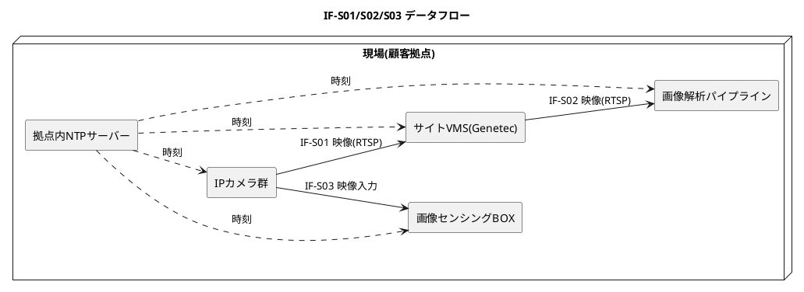
```plantuml
@startuml
title IF-S01/S02/S03 データフロー
left to right direction
node "現場(顧客拠点)" {
  rectangle "IPカメラ群" as CAM
  rectangle "サイトVMS(Genetec)" as VMS
  rectangle "画像解析パイプライン" as PIPE
  rectangle "画像センシングBOX" as BOX
  rectangle "拠点内NTPサーバー" as NTP
}
CAM --> VMS : IF-S01 映像(RTSP)
VMS --> PIPE : IF-S02 映像(RTSP)
CAM --> BOX : IF-S03 映像入力
NTP ..> CAM : 時刻
NTP ..> VMS : 時刻
NTP ..> PIPE : 時刻
NTP ..> BOX : 時刻
@enduml
```

### 3.2 IF-S04: 検知イベント/アラーム投入(パイプライン→thin-edge)

- **概要**: 画像解析パイプラインが映像解析から生成したイベント/アラーム/計測を、装置内のローカルMQTTバスに投入する。thin-edgeがCumulocity形式に変換して本社へ送信(IF-W01)する
- **プロトコル**: MQTT(Docker Compose内部ネットワーク。thin-edgeローカルブローカー)。スナップショット付きイベントのみHTTPプロキシ経由REST
- **トピック**(thin-edge.io標準に従う):
  - イベント: `te/device/<child-id>///e/<event-type>`
  - アラーム: `te/device/<child-id>///a/<alarm-type>`
  - 計測: `te/device/<child-id>///m/<measurement-type>`
- **ペイロード**: 構成設計§4.3 の検知イベント標準ペイロード(F2規約)に準拠。`modelVersion` 必須。ソースは**対象カメラのchild device**に付ける(§4.1の重要規約)
- **投入形式の使い分け**(データ契約):

| 項目 | (a) thin-edgeトピック投入(スナップショットなしイベント/計測/アラーム) | (b) HTTPプロキシ経由REST投入(スナップショット付きイベント) |
|---|---|---|
| source | トピックの `<child-id>` で決定 | ペイロードの `source.id`(Managed Object ID) |
| type | トピックの `<event-type>` で決定 | ペイロードの `type` |
| ペイロード | `text`, `time`, `x_Detection`(カスタムフラグメント) | 構成設計§4.3のREST形式全体 |
| 網断耐性 | thin-edgeストア&フォワードで保証 | 発行元側の永続化で保証(下記要件) |

- **要件**:
  - スナップショット付きイベントは「イベント作成→添付」の順で登録されること(REST経路に統一。イベント添付は**1イベント1バイナリ**・要バージョン確認)。この2段階は**アトミックではない**ため、再登録により添付有無の異なるコピーが並存し得る前提とし、下流の重複排除は「添付あり優先」(§4.5-3)に従うこと
  - 網断時もスナップショット付きイベント+画像を**欠落させないこと(遅延は許容)**。発行元はローカル永続化により復旧後の再登録を保証すること
  - 発行元で採番するイベントUUID(`x_Detection.eventUuid`, UUIDv7)を全イベントに付与し、下流での重複判定を可能にすること
  - 投入失敗が検知可能であること(失敗数・滞留の監視をIF-W05経由で行う)
  - ローカルMQTTバスは外部公開しないこと(Compose内部ネットワークに閉じる)
- **物理仕様**: フィールドの型・桁、イベント作成/添付APIの詳細はAPI仕様書で定義

#### 連携パラメータ

| パラメータ | 意味 | 初期値 | 確定条件・備考 |
|---|---|---|---|
| ローカル投入リトライ上限時間 | ローカルMQTT/HTTPプロキシ到達不可時に再試行を打ち切るまでの時間 | 60秒 | 既存設計値。超過時は記録+監視通知(IF-W05) |
| 添付スプール容量 | 網断中に保全するイベント+画像の最大量 | 要確定(A8) | スナップショットサイジングと連動 |

#### データフロー図

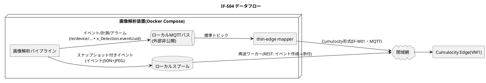
```plantuml
@startuml
title IF-S04 データフロー
left to right direction
node "画像解析装置(Docker Compose)" {
  rectangle "画像解析パイプライン" as PIPE
  queue "ローカルMQTTバス\n(外部非公開)" as MQ
  rectangle "thin-edge mapper" as MAP
  database "ローカルスプール" as SPOOL
}
cloud "閉域網" as WAN
rectangle "Cumulocity Edge(VM1)" as C8Y
PIPE --> MQ : イベント/計測/アラーム\n(te/device/... + x_Detection.eventUuid)
MQ --> MAP : 標準トピック
MAP --> WAN : Cumulocity形式(IF-W01・MQTT)
PIPE --> SPOOL : スナップショット付きイベント\n(イベントJSON+JPEG)
SPOOL --> WAN : 再送ワーカー(REST: イベント作成→添付)
WAN --> C8Y
@enduml
```

### 3.3 IF-S05/S06: 現場UI(管理端末→FE→BE)

- **概要**: 現場管理端末(ブラウザ)から画像解析装置の状態確認・設定操作を行うローカルUI
- **プロトコル**: S05=HTTPS(装置ローカル証明書)、S06=REST(Compose内部)
- **要件**:
  - **閉域網断時もローカルUIが利用可能であること**(本社Keycloakへの常時依存禁止)。認証はローカル認証を基本とし、方式は実装フェーズで確定 → 未確定事項N1
  - アクセスログ・監査ログが収集されること(Alloy経由・IF-W05)

#### 連携パラメータ

| パラメータ | 意味 | 初期値 | 確定条件・備考 |
|---|---|---|---|
| HTTPリクエストタイムアウト | S05/S06の応答待ち上限 | 30秒(初期値案) | — |
| UIセッションタイムアウト | ログインセッションの無操作失効時間 | 要確定(N1) | 認証方式と同時に確定 |

#### データフロー図

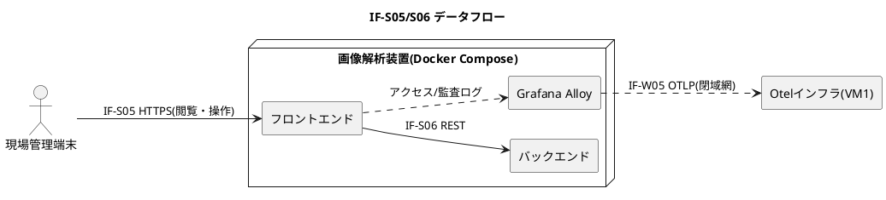
```plantuml
@startuml
title IF-S05/S06 データフロー
left to right direction
actor "現場管理端末" as U
node "画像解析装置(Docker Compose)" {
  rectangle "フロントエンド" as FE
  rectangle "バックエンド" as BE
  rectangle "Grafana Alloy" as AL
}
rectangle "Otelインフラ(VM1)" as OTEL
U --> FE : IF-S05 HTTPS(閲覧・操作)
FE --> BE : IF-S06 REST
FE ..> AL : アクセス/監査ログ
AL ..> OTEL : IF-W05 OTLP(閉域網)
@enduml
```

### 3.4 IF-S07: モデル適用(sm-plugin→パイプライン)

- **概要**: IF-D01で受領したモデルファイルを画像解析パイプラインに適用する装置内連携
- **要件**:
  - 適用前にモデルファイルのハッシュ/署名が検証されること(§3.18の配布完全性規約)。**検証不一致のモデルは適用されないこと**(即FAILED)
  - 適用失敗時(モデルロード失敗等)は**旧モデルで動作を継続すること**(ロールバック。詳細設計はA10)
  - 適用結果(SUCCESSFUL/FAILED)がOperationステータスとしてCumulocityに報告されること(IF-D01の結果報告)
  - 適用後の検知イベントが `modelVersion`(構成設計§4.3)で新旧判別できること。適用完了時点がイベントとして記録され、modelVersion切替時刻を追跡可能であること

#### 連携パラメータ

| パラメータ | 意味 | 初期値 | 確定条件・備考 |
|---|---|---|---|
| 起動ヘルスチェックタイムアウト | モデルロード成否の判定待ち上限 | 要確定(A10) | ロールバック設計と同時に確定 |
| 適用の再試行 | 失敗時の再試行方式 | -(IF-D01の再配布による) | 装置内では自動再試行しない。適用済みスキップで冪等 |

#### データフロー図

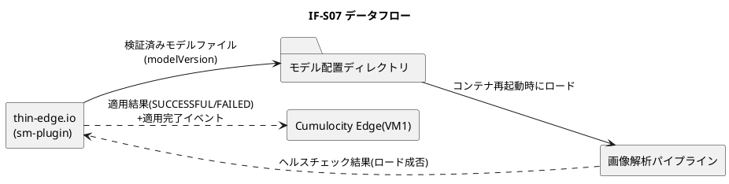
```plantuml
@startuml
title IF-S07 データフロー
left to right direction
rectangle "thin-edge.io\n(sm-plugin)" as SM
folder "モデル配置ディレクトリ" as DIR
rectangle "画像解析パイプライン" as PIPE
rectangle "Cumulocity Edge(VM1)" as C8Y
SM --> DIR : 検証済みモデルファイル\n(modelVersion)
DIR --> PIPE : コンテナ再起動時にロード
PIPE ..> SM : ヘルスチェック結果(ロード成否)
SM ..> C8Y : 適用結果(SUCCESSFUL/FAILED)\n+適用完了イベント
@enduml
```

### 3.5 IF-W01: イベント/計測送信+スナップショット添付(thin-edge→Cumulocity)

- **概要**: 閉域網を横断する定常データ経路の本線。thin-edgeがIF-S04の内容をCumulocityデータモデルに変換して送信する
- **プロトコル**:
  - MQTT over TLS(現場発コネクション。D9整合): イベント/アラーム/計測
  - HTTPS(REST): スナップショット添付(`POST /event/events/{id}/binaries`)、バイナリ取得
- **認証**: デバイス証明書(thin-edge標準のX.509)。証明書のライフサイクルはIF-P01
- **データ内容と量の目安**(構成設計§5.1を多拠点に拡張):

| 種別 | 内容 | 頻度 |
|---|---|---|
| Measurement `x_CameraHealth` | カメラ死活(rtt・応答可否) | 1〜5分間隔 × カメラ台数 × N拠点 |
| Event `x_Detection_*` | 検知イベント(構成設計§4.3ペイロード) | 検知都度(バースト有) |
| Alarm `x_CameraDown` / `x_Alarm_*` | 死活断・通報対象 | 発生都度 |
| イベント添付バイナリ | スナップショットJPEG | イベント都度(サイズ上限は A8 で確定) |

- **容量要件(D17成立条件・N6)**: 定常メッセージレート ≒ Σ(拠点のカメラ台数 ÷ 死活間隔秒) + 検知イベントレート。例: 50拠点 × 300台 × 60秒間隔 ≒ **250 msg/s**(死活のみ)。検知バースト・添付REST・UI参照・オフロードバッチを上乗せした合算値がPoC実測上限に収まること
- **要件**:
  - 閉域網断・Cumulocity停止時、復旧後に**自動再送されること**(at-least-once, D16)。バッファ容量には上限があり、**上限超過による欠落は検知可能であること**(容量値の確定はA7)
  - **Event**: 再送により重複が発生し得る前提とし、`eventUuid` により重複排除可能であること(排除の保証は§4.5)
  - **Alarm**: **未クリア**(ACTIVE または ACKNOWLEDGED)の同一source+同一typeはCumulocityサーバー側でde-duplicateされる(製品仕様。`count` 増分)。CLEARED後の再着信は新規Alarmになることを前提とする
  - 復旧時の一括再送で**古いイベントが通知・昇格ルールを誤発火させないこと**(リプレイ抑止。§3.21の必須ガード)
  - スナップショット添付は**欠落させないこと(遅延は許容)**。添付未着(遅延中)でも参照側の業務動線(映像確認はIF-H07)を阻害しないこと
  - ゲートウェイの接続断(=拠点全体の送信断)がデバイス可用性監視で検知され、アラーム化されること。**監視対象デバイスに `c8y_RequiredAvailability.responseInterval`(単位: 分)の設定が必須**(未設定のデバイスは可用性判定の対象外になる。`c8y_Availability` は判定結果として付与される側)

#### 連携パラメータ

| パラメータ | 意味 | 初期値 | 確定条件・備考 |
|---|---|---|---|
| MQTT keepalive | 接続維持確認の間隔 | 60秒(初期値案) | thin-edge/ブローカー設定 |
| ストア&フォワードキュー容量 | 網断中に保持するメッセージ量の上限 | 要確定(A7) | 「想定最長断時間×バースト時レート」から逆算 |
| REST添付タイムアウト | スナップショット添付リクエストの応答待ち上限 | 30秒(初期値案) | 添付サイズ上限(A8)と連動 |
| `c8y_RequiredAvailability.responseInterval` | この時間だけ受信がない場合に接続断と判定 | 死活間隔×2を分単位に切り上げ(初期値案。死活60秒→2分) | **単位は分**のため、分未満の間隔は丸めが必要 |

#### データフロー図

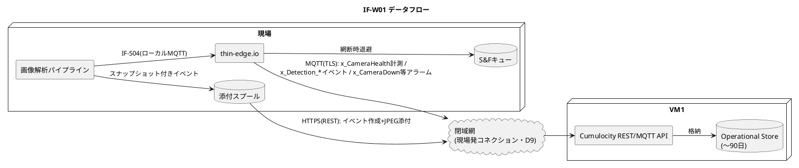
```plantuml
@startuml
title IF-W01 データフロー
left to right direction
node "現場" {
  rectangle "画像解析パイプライン" as PIPE
  rectangle "thin-edge.io" as TE
  database "S&Fキュー" as SF
  database "添付スプール" as SPOOL
}
cloud "閉域網\n(現場発コネクション・D9)" as WAN
node "VM1" {
  rectangle "Cumulocity REST/MQTT API" as API
  database "Operational Store\n(〜90日)" as OS
}
PIPE --> TE : IF-S04(ローカルMQTT)
TE --> SF : 網断時退避
TE --> WAN : MQTT(TLS): x_CameraHealth計測 /\nx_Detection_*イベント / x_CameraDown等アラーム
PIPE --> SPOOL : スナップショット付きイベント
SPOOL --> WAN : HTTPS(REST): イベント作成+JPEG添付
WAN --> API
API --> OS : 格納
@enduml
```

### 3.6 IF-W02: 特徴量登録(パイプライン→ベクトルDB)

- **概要**: 画像解析パイプラインがイベント発生時に抽出した特徴量(ベクトル)を、閉域網経由で本社VM1のベクトルDBに登録する(構成設計§4.7)
- **プロトコル**: REST(HTTPS)。ベクトルDB製品のAPI仕様に依存するため、製品確定(N4)までは以下を概念仕様とする(物理仕様は製品確定後のAPI仕様書で定義)
- **データ項目(論理)**:

| 項目 | 意味 | 必須 |
|---|---|---|
| `eventUuid` | IF-S04で採番したUUIDv7。冪等キー・元イベントへのトレースキー | ○ |
| `siteId` | 拠点ID(§4.1識別子規約) | ○ |
| `cameraExternalId` | 検知元カメラのExternal ID(§4.1) | ○ |
| `eventType` | 検知イベント種別(§4.3命名規約) | ○ |
| `eventTime` | イベント発生時刻(ISO 8601・§4.2) | ○ |
| `modelVersion` | 特徴量を抽出したAIモデルの版数(§4.1) | ○ |
| `containsBiometric` | 生体情報(顔特徴量等)を含むか。エクスポートフィルタの機械的強制に使用(§4.6) | ○ |
| `vector` | 特徴量ベクトル本体 | ○ |
| `dims` | ベクトルの次元数 | ○ |

- **参考例(概念JSON)**:

```json
{
  "eventUuid": "0198c1d4-5e6f-7a8b-9c0d-1e2f3a4b5c6d",  // IF-S04で採番したUUIDv7(冪等キー)
  "siteId": "site-001",                // 拠点ID(§4.1識別子規約)
  "cameraExternalId": "site-001:CAM-SN12345",
  "eventType": "x_Detection_Intrusion",
  "eventTime": "2026-07-20T10:23:45.000+09:00",
  "modelVersion": "2026.06-r3",
  "containsBiometric": false,          // 生体情報(顔特徴量等)を含むか。必須(§4.6)
  "vector": [0.012, -0.334],
  "dims": 512
}
```

- **要件**:
  - 認証は拠点ごとのAPIトークン(マシン認証。人のOIDCとは分離、D8)。TLSサーバー証明書検証必須。**サーバー側でトークン⇔`siteId`のバインドが検証され、他拠点のsiteIdを名乗るリクエストは拒否されること**(横方向なりすまし対策)
  - 網断時も特徴量を**欠損させないこと(遅延は許容)**。かつ**イベント送信(IF-S04→W01)を阻害しないこと**(非同期送信)
  - `eventUuid + modelVersion` をユニークキーとして登録され、再送による重複登録が発生しないこと(冪等)
  - 登録失敗・滞留が検知可能であること(IF-W05)
  - **`containsBiometric` の設定は必須**とし、顔特徴量は生体情報(個人識別符号になり得る)として `true` を設定すること。このフラグはIF-H05/M04のエクスポートフィルタ条件として機械的に強制される(§4.6)
  - 特徴量は映像由来データであり `eventUuid` 経由で元イベント(スナップショット)に辿れるため、アクセス制御はイベントと同等以上とすること

#### 連携パラメータ

| パラメータ | 意味 | 初期値 | 確定条件・備考 |
|---|---|---|---|
| 登録リクエストタイムアウト | ベクトルDB登録の応答待ち上限 | 30秒(初期値案) | N4(製品API)確定後に見直し |
| リトライ | 失敗時の再試行 | 無期限(キュー永続) | 欠損防止優先・遅延許容(§4.5優先度) |
| ローカルキュー容量 | 網断中に退避する特徴量の上限 | 要確定(A8) | イベント量サイジングと連動 |

#### データフロー図

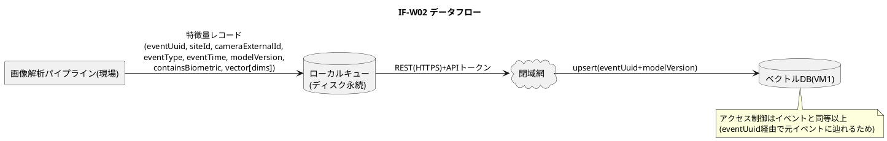
```plantuml
@startuml
title IF-W02 データフロー
left to right direction
rectangle "画像解析パイプライン(現場)" as PIPE
database "ローカルキュー\n(ディスク永続)" as Q
cloud "閉域網" as WAN
database "ベクトルDB(VM1)" as VDB
PIPE --> Q : 特徴量レコード\n(eventUuid, siteId, cameraExternalId,\neventType, eventTime, modelVersion,\ncontainsBiometric, vector[dims])
Q --> WAN : REST(HTTPS)+APIトークン
WAN --> VDB : upsert(eventUuid+modelVersion)
note bottom of VDB : アクセス制御はイベントと同等以上\n(eventUuid経由で元イベントに辿れるため)
@enduml
```

### 3.7 IF-W03: BOX独自形式イベント(BOX→BOXアダプタ)

- **概要**: 画像センシングBOX(旧機器・**改造不可**)が独自形式の検知イベントを閉域網経由でVM1の外部Gateway(BOXアダプタ)へ送信する。BOXはバッファ+再送機能を持つ想定のため、外部GWは本社側に一元集約する(配置の要点)
- **プロトコル**: BOX既存仕様に完全に従う(改造不可のため**受け側が合わせる**)。HTTP POST想定 → **未確定事項N2: BOXの送信仕様(プロトコル・形式・再送間隔・バッファ容量・応答コード解釈)の実機確認**
- **要件**:
  - **受信応答(200)を返したイベントは、以降の受信側障害でも消失しないこと**(BOXは応答を見て再送を止める=応答後の消失は恒久欠損になるため)
  - 受信後の処理失敗が**BOXの再送を無用に誘発しないこと**(受信側内で完結させる)
  - BOXの送信途絶(ハートビートまたは定常イベントが期待間隔を大きく超えて途絶)が検知され、当該BOXのchild deviceに `x_BoxSilent` アラームが上がること(BOX自体は死活監視APIを持たない前提の代替策)

#### 連携パラメータ

| パラメータ | 意味 | 初期値 | 確定条件・備考 |
|---|---|---|---|
| 応答タイムアウト/再送間隔/バッファ容量 | BOX側送信の各種挙動 | BOX仕様に従う | 要確定(N2)。改造不可のため受け側が合わせる |
| 途絶判定閾値 | 最終受信から `x_BoxSilent` を上げるまでの時間 | 期待間隔×3(初期値案) | N2(送信頻度仕様)確定後に具体化 |

#### データフロー図

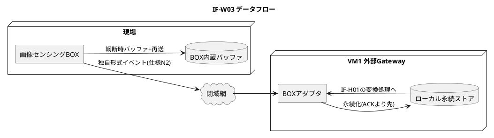
```plantuml
@startuml
title IF-W03 データフロー
left to right direction
node "現場" {
  rectangle "画像センシングBOX" as BOX
  database "BOX内蔵バッファ" as BUF
}
cloud "閉域網" as WAN
node "VM1 外部Gateway" {
  rectangle "BOXアダプタ" as ADP
  database "ローカル永続ストア" as ST
}
BOX --> BUF : 網断時バッファ+再送
BOX --> WAN : 独自形式イベント(仕様N2)
WAN --> ADP
ADP --> ST : 永続化(ACKより先)
ST --> ADP : IF-H01の変換処理へ
@enduml
```

### 3.8 IF-H01: 標準ペイロード投入(BOXアダプタ→thin-edge)+重複排除

- **概要**: BOX独自形式を基盤標準ペイロード(構成設計§4.3)へ変換し、ローカルMQTTでthin-edge(外部GW側)に投入する。**再送に伴う重複イベントはこのIFを通過する時点で排除済みであること**(冪等化。配置の要点)
- **変換後データの契約**:
  - `source`: BOXをthin-edgeのchild deviceとして登録し、そのchild IDを指定。External ID = `{siteId}:BOX-{BOXシリアル}`
  - `type`: BOX検知種別→ `x_Detection_<種別>` へのマッピング(マッピング定義は構成コード管理, D10)
  - `time`: BOX側の**イベント発生時刻**(受信時刻ではない。再送時も同一値になることが重複判定の前提)
  - `x_Detection.aiProduct`: `"legacy-box"` 固定+BOX型番、`modelVersion`: BOXファームウェア版数を充当
- **要件**:
  - BOXの再送に由来する**重複イベントが下流(IF-H02以降)に流れないこと**。重複判定はBOXペイロードの識別情報(シーケンスID優先。なければチャネル識別子を含む複合情報)に基づくこと
  - 重複判定の**保持期間は初期値72時間**とし、「想定最大許容断時間+BOXの再送保証期間」から確定すること(N2確定後に見直し)。保持期間を超える長期断からの再送重複は運用手順(オフロード済みデータとの突合)で救済すること
  - 重複判定が**受信側の再起動を跨いで継続すること**
  - 重複として破棄した件数が記録され、**監査可能であること**
  - 変換不能なペイロードは**破棄されず**退避され、`x_BoxParseError` アラームで検知可能であること
  - 変換成功/失敗/重複破棄件数が監視できること(IF-H12)

#### 連携パラメータ

| パラメータ | 意味 | 初期値 | 確定条件・備考 |
|---|---|---|---|
| 重複判定保持ウィンドウ | 重複と判定する過去参照期間 | 72時間 | 「想定最大許容断時間+BOX再送保証期間」から確定(N2) |

#### データフロー図

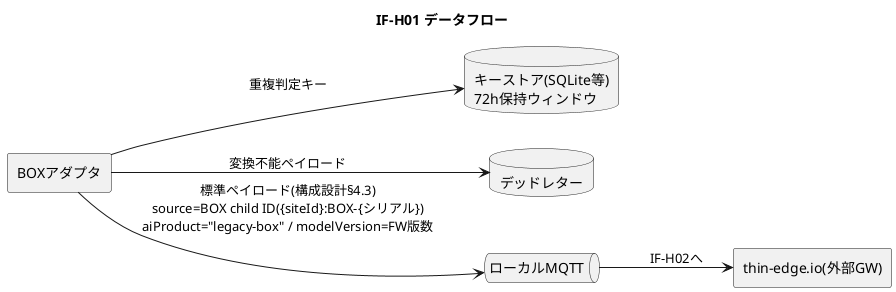
```plantuml
@startuml
title IF-H01 データフロー
left to right direction
rectangle "BOXアダプタ" as ADP
database "キーストア(SQLite等)\n72h保持ウィンドウ" as KS
database "デッドレター" as DL
queue "ローカルMQTT" as MQ
rectangle "thin-edge.io(外部GW)" as TE2
ADP --> KS : 重複判定キー
ADP --> DL : 変換不能ペイロード
ADP --> MQ : 標準ペイロード(構成設計§4.3)\nsource=BOX child ID({siteId}:BOX-{シリアル})\naiProduct="legacy-box" / modelVersion=FW版数
MQ --> TE2 : IF-H02へ
@enduml
```

### 3.9 IF-H02: 外部GWイベント登録(thin-edge→Cumulocity)

thin-edge.io標準機能(mapper)によるローカルMQTT接続。IF-W01と同一の仕組みだが同一サーバールーム内のため閉域網断の影響を受けない。**同一サーバールーム内でもthin-edgeのCumulocity接続はX.509デバイス証明書認証であり**(無認証接続は不可)、外部GW側thin-edgeもIF-P01の証明書ライフサイクル対象に含める。BOX群はこのthin-edgeのchild deviceとして管理され、Cumulocity上では現場のカメラ群と同一のデータモデル(構成設計§4.1・本書§4.1の識別子規約)に統合される。

#### データフロー図

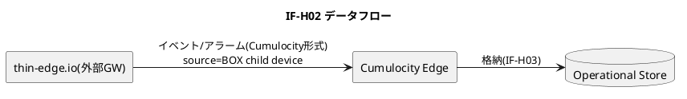
```plantuml
@startuml
title IF-H02 データフロー
left to right direction
rectangle "thin-edge.io(外部GW)" as TE2
rectangle "Cumulocity Edge" as C8Y
database "Operational Store" as OS
TE2 --> C8Y : イベント/アラーム(Cumulocity形式)\nsource=BOX child device
C8Y --> OS : 格納(IF-H03)
@enduml
```

### 3.10 IF-H04: イベント/アラームのオフロード(Operational Store→オブジェクトストレージ)

- **概要**: Cumulocity Operational Store(保持〜90日目安)から長期保存用オブジェクトストレージへ定期エクスポートする。Cumulocity内は短期・オブジェクトストレージが長期という役割分担(構成設計§5.3)
- **経路の契約**: データの取得は**Cumulocity REST API経由のみ**とする(MongoDBを直接読まない=Operational Storeへの直接アクセス不可の原則)
- **形式・格納規約**(構成設計§5.3を多拠点キーに拡張。IF-H11の公開仕様):

```text
s3://iot-archive/
  sites/{siteId}/events/{yyyy}/{mm}/{dd}/events-{siteId}-{yyyymmdd}.parquet
  sites/{siteId}/alarms/{yyyy}/{mm}/{dd}/alarms-{siteId}-{yyyymmdd}.parquet
  sites/{siteId}/measurements/{yyyy}/{mm}/{dd}/...
  sites/{siteId}/snapshots/{yyyy}/{mm}/{dd}/{eventUuid}.jpg + {eventUuid}.json  // 構成設計§4.6の本来形移行時
```

- Parquetを第一候補(分析利用)、スナップショット等バイナリは実体+サイドカーJSON(イベントID・カメラID・時刻・modelVersion)
- Parquetのカラム定義・サイドカーJSONのスキーマ(型/桁)は格納API仕様書で定義
- **スナップショット(イベント添付)のオフロード時期**: 初期版から**添付バイナリもオフロード対象に含める**(格納先 `snapshots/`)。含めない場合、Operational Storeの保持期間(90日)経過でスナップショットが恒久消失するため。※構成設計§4.6の「本来形」(オブジェクトストレージを実体・Cumulocityはサムネイル添付)へ移行した後は、本経路の対象は移行先に読み替える。**N7(DataHub採用可否)の評価では「DataHubはイベント添付をオフロードしない」制約が本要件と衝突する点を判断材料に含めること**
- **要件**:
  - 日次(深夜)で**前日に作成されたデータ**がエクスポートされること。ストア&フォワード再送による**遅着データも取りこぼさないこと**。Events/Alarmsは作成日時(`createdFrom`/`createdTo`)基準で抽出できるが、**Measurements APIには作成日時フィルタがなく発生時刻(`dateFrom`/`dateTo`)しかない**(製品仕様)ため、Measurementsは遅着分を回収する方式を必須とする(回収方式は設計事項)
  - オブジェクトストレージ(長期保存の**正本**)に**重複を含めないこと**(書き込み前に `eventUuid` で排除。§4.5)。同一 `eventUuid` のコピーが複数ある場合は**添付を持つコピーを残すこと**(§4.5-3)
  - **パーティション日付は作成日基準**であり、遅着データでは発生日(`time`)と一致しない。発生日で検索する利用者は `time` カラムでの二次フィルタを必須とする(IF-H11の公開仕様に明記)
  - 同一日付の**再実行が冪等であること**(出力キーが `{siteId}+{日付}` で決まる)。欠損日は検出され自動リトライされること
  - **Alarmは更新されるリソース**(de-duplicationによる `count` 増分、ACKNOWLEDGED/CLEAREDへの遷移)であり、作成日基準で1回だけエクスポートすると正本には作成時点の姿しか残らない。**Alarmは状態変化後に再エクスポートするか、「アーカイブは発生時点のスナップショットであり対応状況を含まない」ことを正本の定義として明記するか**を選択し、仕様として確定すること
  - エクスポート件数とCumulocity側件数の突き合わせが行われ、**不一致はアラーム化**されること(IF-H12経由)
  - データ保持期限(90日)による削除は「当該日のオフロード成功が検証済み」であることを前提とすること(イベント削除時は添付も消えるため、未検証のまま削除するとスナップショットが失われる)
  - ジョブ成否・件数・所要時間が監視できること(IF-H12)
- **製品機能の評価(N7)**: この用途にCumulocity公式のDataHub(DataHub Edge)が存在する。採用可否の比較評価(設計事項)を実装前に実施する

#### 連携パラメータ

| パラメータ | 意味 | 初期値 | 確定条件・備考 |
|---|---|---|---|
| 実行時刻 | 日次バッチの起動時刻 | 深夜02:00(初期値案) | 他バッチ・バックアップ(IF-F03)との重複回避 |
| 遅着回収範囲 | 再送遅着データを回収する遡り日数 | 要確定(A7) | 想定最長断時間と連動 |
| 欠損日リトライ | 欠損検出時の自動リトライ | 次回実行時に自動 | 再実行は冪等(上書き) |
| API取得タイムアウト | Cumulocity RESTからの取得応答待ち上限 | 60秒(初期値案) | 日次データ量(N6)確定後に見直し |

#### データフロー図

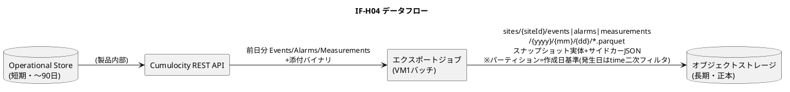
```plantuml
@startuml
title IF-H04 データフロー
left to right direction
database "Operational Store\n(短期・〜90日)" as OS
rectangle "Cumulocity REST API" as API
rectangle "エクスポートジョブ\n(VM1バッチ)" as JOB
database "オブジェクトストレージ\n(長期・正本)" as S3
OS --> API : (製品内部)
API --> JOB : 前日分 Events/Alarms/Measurements\n+添付バイナリ
JOB --> S3 : sites/{siteId}/events|alarms|measurements\n/{yyyy}/{mm}/{dd}/*.parquet\nスナップショット実体+サイドカーJSON\n※パーティション=作成日基準(発生日はtime二次フィルタ)
@enduml
```

### 3.11 IF-H05/M02/M04: 特徴量エクスポート(ベクトルDB→ジョブ→クラウド)

構成設計§4.7の仕様を基礎とし、連携仕様として本書が確定する点は以下:

- **IF-M02(承認・実行指示)**: 保守端末→エクスポートジョブのWeb UI/API(HTTPS, 保守VPN)。認証はKeycloak OIDC+保守ロール。指示内容 = 合意済み範囲の選択(期間・拠点・イベント種別)。**保守端末にデータ本体は流さないこと**
- **IF-H05(抽出)**: ジョブがベクトルDBから指示範囲を抽出する。**`containsBiometric: false` のレコードのみが抽出対象となるフィルタが機械的に強制されること**(生体情報は合意で明示許可されない限り抽出不可。§4.6)。必要に応じ仮名化・フィルタを適用
- **IF-M04(クラウド送信)**: mTLS+APIキーで認証し、特定FQDNのみFW許可(限定アウトバウンドの実体)。**送信内容・日時・実行者(承認者)の監査ログが記録されること**
- **冪等性**: エクスポート単位にジョブIDを採番し、クラウド側へ同一ジョブIDの再送は重複受理されないことを連携先仕様として要求する
- **状態**: △ — 特徴量の拠点外持ち出し合意・仮名化要否(A11)が成立条件。**合意確定まで本IFは設計のみで疎通させないこと**

#### 連携パラメータ

| パラメータ | 意味 | 初期値 | 確定条件・備考 |
|---|---|---|---|
| クラウド送信タイムアウト | IF-M04送信の応答待ち上限 | 60秒(初期値案) | 連携先(クラウド)仕様確定後に見直し |
| 送信リトライ回数 | 失敗時の再試行回数 | 3回(初期値案) | ジョブID冪等のため再送は安全 |

#### データフロー図

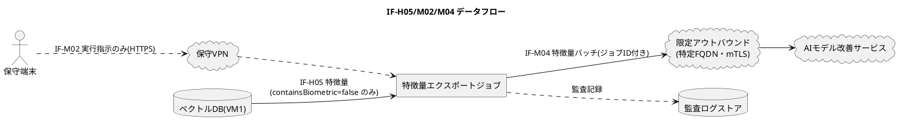
```plantuml
@startuml
title IF-H05/M02/M04 データフロー
left to right direction
actor "保守端末" as MT
cloud "保守VPN" as VPN
database "ベクトルDB(VM1)" as VDB
rectangle "特徴量エクスポートジョブ" as JOB
cloud "限定アウトバウンド\n(特定FQDN・mTLS)" as OUT
cloud "AIモデル改善サービス" as AI
database "監査ログストア" as AUD
MT ..> VPN : IF-M02 実行指示のみ(HTTPS)
VPN ..> JOB
VDB --> JOB : IF-H05 特徴量\n(containsBiometric=false のみ)
JOB --> OUT : IF-M04 特徴量バッチ(ジョブID付き)
OUT --> AI
JOB ..> AUD : 監査記録
@enduml
```

### 3.12 IF-H06: イベント/アラーム参照(紐づけ確認アプリ→Cumulocity)

- **プロトコル**: Cumulocity REST API(`GET /event/events`, `GET /alarm/alarms`、イベント添付バイナリ取得)
- **認証**: Keycloak OIDC(人)→CumulocityのSSO連携(IF-P04)。アプリのサービスアカウントは**読み取り専用ロールに限定すること**
- **要件**:
  - IF-W01再送由来の重複イベントがあり得るため、一覧表示時に `x_Detection.eventUuid` で**重複が除外されて表示されること**。Events APIの `fragmentType`/`fragmentValue` は**トップレベルの単純値にしか効かず、ネストした `x_Detection.eventUuid` では絞り込めない**ため、除外は参照側(クライアント)の責務とする。同一 `eventUuid` が複数ある場合は**添付を持つものを表示対象とすること**(§4.5-3)
  - **必ずsource(カメラ)+type+時間窓で母集合を絞ってから取得すること**。全件走査・`withTotalPages` の多用を禁止する(API利用規約)
  - スナップショット(イベント添付画像)の表示動線を本アプリが担うこと(Cockpit標準では自動表示されないため)。**添付が未着(遅延中, §3.2)の場合は「画像準備中」を表示し業務動線を止めないこと**
  - スナップショット画像の取得は監査ログ対象(§4.7)

#### 連携パラメータ

| パラメータ | 意味 | 初期値 | 確定条件・備考 |
|---|---|---|---|
| APIタイムアウト | Cumulocity RESTの応答待ち上限 | 30秒(初期値案) | — |
| 取得ページサイズ(`pageSize`) | 1回の取得件数 | 100(初期値案) | **製品既定は5、上限2000**。UI用途で上限値を常用すると本節の「母集合を絞る」方針に反するため中間値を既定とする |

#### データフロー図

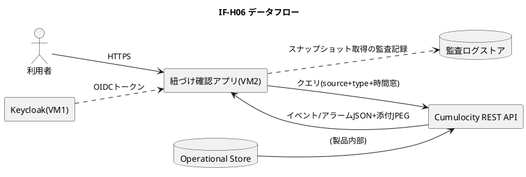
```plantuml
@startuml
title IF-H06 データフロー
left to right direction
actor 利用者 as U
rectangle "紐づけ確認アプリ(VM2)" as APP
rectangle "Keycloak(VM1)" as KC
rectangle "Cumulocity REST API" as API
database "Operational Store" as OS
database "監査ログストア" as AUD
U --> APP : HTTPS
KC ..> APP : OIDCトークン
APP --> API : クエリ(source+type+時間窓)
API --> APP : イベント/アラームJSON+添付JPEG
OS --> API : (製品内部)
APP ..> AUD : スナップショット取得の監査記録
@enduml
```

### 3.13 IF-H07: 該当映像の参照(紐づけ確認アプリ→GSC)

- **プロトコル**: VMS抽象レイヤー(構成設計§6.1の5操作)経由。Genetec固有APIはアダプタに閉じ込める(D13)
- **紐づけキー**: イベントのソースカメラManaged Objectが持つ `x_Camera.vmsCameraId` + イベント時刻 → `getPlaybackUrl(vmsCameraId, time, {preSec, postSec})`。`clipHint`(構成設計§4.3)があれば切り出し範囲に使用
- **要件**:
  - **映像バイト列は中継しないこと**(D13)。再生参照(URL等)を返すのみ
  - 再生URL発行は監査ログ対象(誰がどのカメラ・時刻帯を参照したか。§4.7)
- **IF-W04(Genetec連携)の監視要件**: Federation断は映像確認動線(本IF・IF-H14/H15)を全面停止させるため、**接続状態が監視され断がアラーム化されること**(IF-H12経由)。断中は紐づけ確認アプリが映像機能の不可を明示すること(§3.22の縮退要件と共通)
- **IF-W04(Genetec連携)の確認条件(△の理由)**: GSC⇔サイトVMSのFederationは、接続確立の方向・使用ポートが「現場発」原則(D9)と整合するか、および閉域網を渡る唯一の常時映像系経路としてのWAN帯域(何台分の映像/メタデータを流すか)を製品仕様で確認するまで確定としない。再生(IF-H07)時にも録画映像がサイトVMS→GSC→アプリとWANを渡るため、帯域見積りに含める

#### 連携パラメータ

| パラメータ | 意味 | 初期値 | 確定条件・備考 |
|---|---|---|---|
| 再生URL発行タイムアウト | getPlaybackUrl の応答待ち上限 | 10秒(初期値案) | IF-W04帯域確認と連動 |
| 切り出し範囲既定(preSec/postSec) | clipHint未指定時の再生範囲 | 前10秒/後20秒 | 既存設計値(構成設計§4.3・本書§3.22と共通) |

#### データフロー図

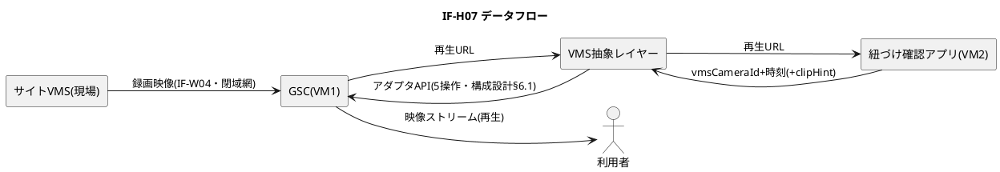
```plantuml
@startuml
title IF-H07 データフロー
left to right direction
actor 利用者 as U
rectangle "紐づけ確認アプリ(VM2)" as APP
rectangle "VMS抽象レイヤー" as ABS
rectangle "GSC(VM1)" as GSC
rectangle "サイトVMS(現場)" as VMS
APP --> ABS : vmsCameraId+時刻(+clipHint)
ABS --> GSC : アダプタAPI(5操作・構成設計§6.1)
GSC --> ABS : 再生URL
ABS --> APP : 再生URL
VMS --> GSC : 録画映像(IF-W04・閉域網)
GSC --> U : 映像ストリーム(再生)
@enduml
```

### 3.14 IF-H08: 顔判定用映像ストリーム(GSC→生体認証SA)【未確定】

- **現行図の経路**: GSCが対象カメラ映像を生体認証SAへ転送(仮置き)
- **未確定理由**: 認証遅延の懸念(構成設計§4.8)。リアルタイム用途(ゲート開閉等)なら「現場で顔特徴量抽出→結果のみ送信」(案a)が推奨であり、経路自体が変わる
- **要決定条件**: 認証結果の要求応答時間(A9)。確定までは本IFの詳細仕様(プロトコル・対象カメラ選定・帯域)を凍結
- **制約(確定分)**: いずれの案でもカメラの同時RTSPセッション上限(§3.1)と生体情報の取り扱い規定(保持期間・保存場所・持ち出し禁止範囲)を満たすこと

#### データフロー図

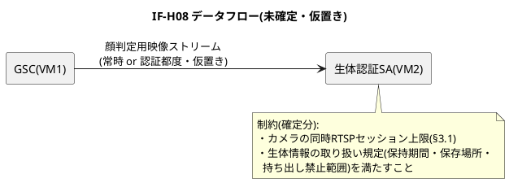
```plantuml
@startuml
title IF-H08 データフロー(未確定・仮置き)
left to right direction
rectangle "GSC(VM1)" as GSC
rectangle "生体認証SA(VM2)" as SA
GSC --> SA : 顔判定用映像ストリーム\n(常時 or 認証都度・仮置き)
note bottom of SA : 制約(確定分):\n・カメラの同時RTSPセッション上限(§3.1)\n・生体情報の取り扱い規定(保持期間・保存場所・\n  持ち出し禁止範囲)を満たすこと
@enduml
```

### 3.15 IF-H09/H10: 認証系(SA→Keycloak、各アセット→Keycloak)

- **IF-H10(共通OIDC)**: 全アセット・基盤UIはKeycloakをIdPとするOIDC(Authorization Code Flow)でSSOすること(D8)。KeycloakはVM1配置(アセット層のデプロイ影響を受けない共通インフラ)。**人の認証(OIDC)とマシン認証(APIトークン/証明書)は分離すること**
- **IF-H09(顔認証結果のIdP連携)**: 生体認証SAの認証結果をKeycloakのセッション/トークンに反映する方式(カスタム認証フロー/トークン交換)はSA製品仕様依存 → 未確定事項N3

#### データフロー図

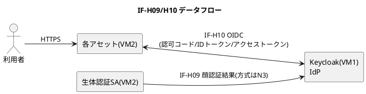
```plantuml
@startuml
title IF-H09/H10 データフロー
left to right direction
actor 利用者 as U
rectangle "各アセット(VM2)" as APP
rectangle "Keycloak(VM1)\nIdP" as KC
rectangle "生体認証SA(VM2)" as SA
U --> APP : HTTPS
APP <--> KC : IF-H10 OIDC\n(認可コード/IDトークン/アクセストークン)
SA --> KC : IF-H09 顔認証結果(方式はN3)
@enduml
```

### 3.16 IF-H11: 長期データ利用(他アセット→オブジェクトストレージ)

- **プロトコル**: S3互換API。読み取り専用アクセスキーをアセット単位に発行し、プレフィックス(`sites/{siteId}/...`)単位でアクセス制御すること
- **契約**: オブジェクトストレージ内の格納規約(§3.10)を公開仕様とし、アセットはCumulocity REST(短期・IF-H06相当)とオブジェクトストレージ(長期・本IF)を保持期間で使い分ける。発生日で検索する場合は `time` カラムの二次フィルタを必須とする(§3.10)
- **監査**: オブジェクトストレージの読み出しは監査ログ対象(S3アクセスログ有効化。§4.7)

#### データフロー図

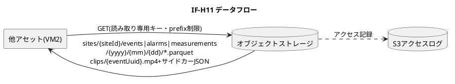
```plantuml
@startuml
title IF-H11 データフロー
left to right direction
rectangle "他アセット(VM2)" as OA
database "オブジェクトストレージ" as S3
database "S3アクセスログ" as LOG
OA --> S3 : GET(読み取り専用キー・prefix制限)
S3 --> OA : sites/{siteId}/events|alarms|measurements\n/{yyyy}/{mm}/{dd}/*.parquet\nclips/{eventUuid}.mp4+サイドカーJSON
S3 ..> LOG : アクセス記録
@enduml
```

### 3.17 IF-W05/H12: テレメトリ(Alloy/各コンポーネント→Otelインフラ)

- **プロトコル**: OTLP(gRPC 4317 / HTTP 4318)、TLS
- **対象**: メトリクス(コンテナ・ホスト・アプリ)、ログ(構造化ログ)、トレース(将来)。現場はAlloyが集約して閉域網経由で転送(IF-W05)、本社内コンポーネントは直接送信(IF-H12)
- **要件**:
  - **必須ラベル**: `site_id`, `component`, `version` を全シグナルに付与すること(多拠点の切り分けに必須)
  - **業務データ分離**: テレメトリにイベント内容・画像・個人情報を含めないこと(ログのマスキング規約は実装フェーズで定義)
  - 網断時はローカルバッファで吸収し復旧後に送信されること。バッファ上限超過時は古いデータから破棄してよい(**テレメトリは欠損許容**)

#### 連携パラメータ

| パラメータ | 意味 | 初期値 | 確定条件・備考 |
|---|---|---|---|
| メトリクス送出インターバル | 収集・送出の周期 | 60秒(初期値案) | ログは即時送出 |
| 送信タイムアウト | OTLP送信の応答待ち上限 | 10秒(初期値案) | — |
| ローカルバッファ上限 | 網断時のローカル保持上限 | 要確定 | 超過時は古いデータから破棄(欠損許容)。閉域網帯域と連動 |

#### データフロー図

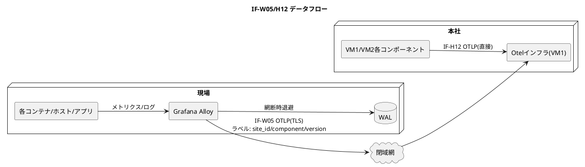
```plantuml
@startuml
title IF-W05/H12 データフロー
left to right direction
node "現場" {
  rectangle "各コンテナ/ホスト/アプリ" as SRC
  rectangle "Grafana Alloy" as AL
  database "WAL" as WAL
}
cloud "閉域網" as WAN
node "本社" {
  rectangle "VM1/VM2各コンポーネント" as HQ
  rectangle "Otelインフラ(VM1)" as OTEL
}
SRC --> AL : メトリクス/ログ
AL --> WAL : 網断時退避
AL --> WAN : IF-W05 OTLP(TLS)\nラベル: site_id/component/version
WAN --> OTEL
HQ --> OTEL : IF-H12 OTLP(直接)
@enduml
```

### 3.18 IF-D01: ソフトウェア更新Operation(モデル配布)

構成設計§4.7を基礎とし、**登録先の記述は本書が上書きする**(同§4.7は「ファイルリポジトリ」としているが誤り。下記「登録先の契約」を正とする)。連携仕様の要点:

- **経路の契約**: Operationは**既存の現場発MQTT接続上**で配信されること(D9整合: 本社→現場の新規着信接続は作らない)。モデルバイナリはthin-edgeがCumulocityからHTTPSで取得(これも現場発)
- **登録先の契約**: **Device Management > ソフトウェアリポジトリ**に登録すること(名称=モデル名、version=`modelVersion`、softwareType=`ai-model`)。`c8y_SoftwareUpdate` のUI発行動線はソフトウェアリポジトリのエントリのみ選択できるため、ファイルリポジトリへの登録では成立しない
- **Operation種別**: `c8y_SoftwareUpdate`。対象デバイス = 画像解析装置(thin-edgeゲートウェイ)
- **要件**:
  - **配布完全性**: クラウド取得時(IF-M03)に記録したハッシュ/署名が適用前に検証されること(IF-S07)。不一致は即FAILED。保守端末・リポジトリのどこが侵害されても**未検証モデルが全拠点に展開されない構造であること**(サプライチェーン対策)
  - **段階配布**: 拠点グループ単位の段階配布が可能で、**失敗閾値で自動停止すること**。ただし**Cumulocityのbulk operationに失敗率での自動停止機能はない**(製品が提供するのは一括生成・生成間隔・進捗集計・手動キャンセルまで)ため、進捗監視と閾値判定・キャンセル実行は**基盤側のロールアウト制御として自作する要件**とする(A10)。帯域×モデルサイズの設計もA10
  - **滞留管理**: オフラインデバイス宛Operationは滞留し再接続時に配信される(製品仕様)。Operationに有効期限の運用を定め、段階配布の進行判定から滞留分を除外すること(A10)
  - **結果報告**: 適用結果(SUCCESSFUL/FAILED)がOperationステータスで報告されること。FAILED時は旧モデル維持(IF-S07)
  - **冪等性**: 同一モデルバージョンの再配布が安全であること(適用済みならスキップ)

#### 連携パラメータ

| パラメータ | 意味 | 初期値 | 確定条件・備考 |
|---|---|---|---|
| Operation有効期限 | PENDING滞留を打ち切る期限 | 7日(初期値案) | 期限超過は手動キャンセル(A10) |
| 段階配布の失敗閾値 | 配布を自動停止する失敗率 | 要確定(A10) | ロールアウト設計と同時に確定 |
| バイナリ取得リトライ | モデルダウンロード失敗時の再試行 | thin-edge既定 | 現場発HTTPS |

#### データフロー図

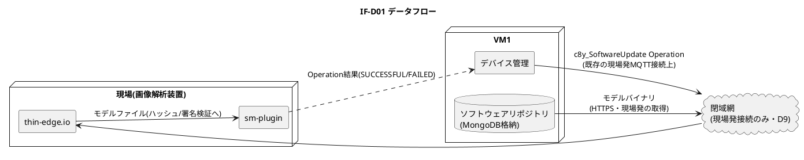
```plantuml
@startuml
title IF-D01 データフロー
left to right direction
node "VM1" {
  rectangle "デバイス管理" as DM
  database "ソフトウェアリポジトリ\n(MongoDB格納)" as REPO
}
cloud "閉域網\n(現場発接続のみ・D9)" as WAN
node "現場(画像解析装置)" {
  rectangle "thin-edge.io" as TE
  rectangle "sm-plugin" as SM
}
DM --> WAN : c8y_SoftwareUpdate Operation\n(既存の現場発MQTT接続上)
REPO --> WAN : モデルバイナリ\n(HTTPS・現場発の取得)
WAN --> TE
TE --> SM : モデルファイル(ハッシュ/署名検証へ)
SM ..> DM : Operation結果(SUCCESSFUL/FAILED)
@enduml
```

### 3.19 IF-M01/M03: 保守経路(保守端末→Cumulocity UI、保守端末→クラウド)

- **IF-M01**: 保守VPN経由HTTPS。Keycloak OIDC+保守ロール(モデル登録・オペレーション発行権限を限定すること)。操作は監査ログ対象。登録先は**ソフトウェアリポジトリ**(§3.18。softwareType=`ai-model`)
- **IF-M03**: 改善モデルの取得は保守端末起点のダウンロード(人の承認を挟む運用。経路区分は「保守拠点発アウトバウンド」§1.1)。取得時に**提供元公表のハッシュ/署名を検証して台帳に記録すること**(§3.18)。**保守端末が業務データ(特徴量・映像)の中継点になることは禁止**(構成設計§4.7) — 本IFで流れるのはモデルバイナリのみ

#### データフロー図

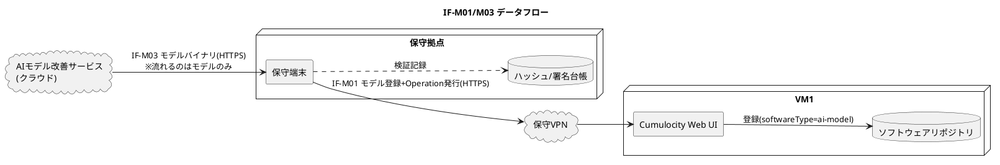
```plantuml
@startuml
title IF-M01/M03 データフロー
left to right direction
cloud "AIモデル改善サービス\n(クラウド)" as AI
node "保守拠点" {
  rectangle "保守端末" as MT
  database "ハッシュ/署名台帳" as LEDGER
}
cloud "保守VPN" as VPN
node "VM1" {
  rectangle "Cumulocity Web UI" as UI
  database "ソフトウェアリポジトリ" as REPO
}
AI --> MT : IF-M03 モデルバイナリ(HTTPS)\n※流れるのはモデルのみ
MT ..> LEDGER : 検証記録
MT --> VPN : IF-M01 モデル登録+Operation発行(HTTPS)
VPN --> UI
UI --> REPO : 登録(softwareType=ai-model)
@enduml
```

### 3.20 IF-S08: カメラ死活ポーリング(thin-edge→カメラ群)

IF-W01の `x_CameraHealth` 計測を生む前提経路(旧F1。レビュー反映版タブで図示済み)。

- **プロトコル**: ONVIF(GetSystemDateAndTime等)/ICMP。カメラ側に要求されるのは応答のみ(Cumulocity対応不要)
- **頻度**: 1〜5分間隔 × カメラ台数(間隔は構成コードD10で管理)
- **要件(判定規約)**:
  - 無応答N回連続(既定3回)で `x_CameraDown` アラームが上がること。復旧で自動クリアされること
  - 短時間の断続でアラームがばたつかないこと(フラッピング対策のヒステリシスを既定値として持つ。構成設計§5.4を引き継ぐ)
- **前提**: カメラのchild device登録と `x_Camera.vmsCameraId` 設定はIF-P02のプロビジョニングで実施済みであること

#### 連携パラメータ

| パラメータ | 意味 | 初期値 | 確定条件・備考 |
|---|---|---|---|
| ポーリング間隔 | 死活確認の周期 | 1〜5分(拠点ごとに設定) | 構成コード(D10)で管理 |
| 無応答判定回数 | アラームを上げる連続無応答回数 | 3回 | 既存設計値 |
| 応答タイムアウト | 1回のONVIF/ICMP応答待ち上限 | 5秒(初期値案) | — |
| 復旧判定回数 | 自動クリアする連続応答回数(ヒステリシス) | 3回(初期値案) | フラッピング対策 |

#### データフロー図

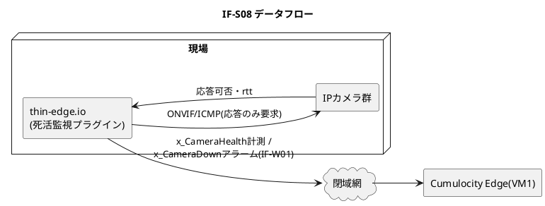
```plantuml
@startuml
title IF-S08 データフロー
left to right direction
node "現場" {
  rectangle "thin-edge.io\n(死活監視プラグイン)" as POLL
  rectangle "IPカメラ群" as CAM
}
cloud "閉域網" as WAN
rectangle "Cumulocity Edge(VM1)" as C8Y
POLL --> CAM : ONVIF/ICMP(応答のみ要求)
CAM --> POLL : 応答可否・rtt
POLL --> WAN : x_CameraHealth計測 /\nx_CameraDownアラーム(IF-W01)
WAN --> C8Y
@enduml
```

### 3.21 IF-H13a/H13b: 通知(Alarm→通知コンシューマ→利用者/案件アプリ)

「検知→通知→映像確認」動線(旧F2→F3→F4)の中核。レビュー反映版タブに通知エッジは図示済みだが、**通知コンシューマはコンポーネントとして図に未記載**(図の次版で追加)。

**実装手段の方針決定(2026-07-27)**: **Notification 2.0 購読による基盤標準の通知コンシューマ**を第一候補とする。選定理由: (a) Streaming Analytics(Apama)の追加ライセンス・リソースに依存しない (b) 永続購読(at-least-once・購読オフセット保持)によりコンシューマ停止中のAlarmを取りこぼさない (c) 必須ガード(重複耐性・リプレイ抑止)や配信先認証をコンシューマ側で完全に制御できる。**成立条件**: EdgeにおけるNotification 2.0の対応状況・有効化手順・リソース要件の確認(N8)。不可の場合のフォールバックはStreaming Analytics(EPL)または自作ポーリング。

**Notification 2.0 は購読型(コンシューマがWebSocketで受信)であり、Cumulocityが任意URLへPOSTするpush型Webhookではない**。したがって本経路は以下の2ホップに分かれ、いずれも**イニシエーターは通知コンシューマ**である:

| ホップ | 経路 | 方式 |
|---|---|---|
| IF-H13a | 通知コンシューマ → Cumulocity | 購読(サブスクリプション)作成=REST、通知受信=WebSocket。接続はコンシューマ発 |
| IF-H13b | 通知コンシューマ → 案件側アプリ / SMTP | Webhook(HTTPS POST)/ メール送信 |

**通知コンシューマの配置**: 全案件共通の基盤標準部品であり、アセット層(VM2)のデプロイ影響を受けない**VM1配置を想定**(Keycloakと同じ理由)。配置構成図に存在しない新規コンポーネントのため、図の次版で追加する → 配置の最終確認は設計事項

#### IF-H13a: Alarm通知の購読・受信(コンシューマ→Cumulocity)

- **契機**: Alarm発生(Event→Alarm昇格は案件側保守のルールで判定。D7)
- **プロトコル**: サブスクリプション作成・管理 = REST(HTTPS)、通知受信 = WebSocket(TLS)。**接続確立はコンシューマ発**
- **認証**: マシン認証(サブスクリプション用の専用資格情報+受信トークン)。トークンは有効期限を持つため更新が必要
- **要件**:
  - 受信確認(ack)により購読オフセットが進み、**未ack分はコンシューマ再起動後に再配信されること**(at-least-once)
  - WebSocket切断時に自動再接続し、**切断中に発生したAlarmが復旧後に受信できること**
  - 購読の滞留にも上限がある前提とし、**上限値と超過時の欠落が検知可能であること**(N8で確認)
  - 受信は at-least-once であり**重複配信が発生し得る**前提とすること(重複の始末はIF-H13bの要件)

#### IF-H13b: 通知配信(コンシューマ→案件アプリ/メール)

- **出力(契約)**: (a) Webhook(HTTPS POST)→案件側アプリのエンドポイント (b) メール(本社内SMTP)。通知にはカメラID・時刻・**紐づけ確認アプリへのディープリンク**を含めること(構成設計§5.2)
- **要件**:
  - **重複耐性**: `eventUuid` の評価窓内重複により二重通知が発生しないこと(IF-H13aのat-least-once再配信・IF-W01の再送の双方に起因する重複を吸収する)
  - **リプレイ抑止**: イベント`time`が現在時刻からX分以上古い場合は昇格・通知が抑止されること(記録のみ。§3.5の再送リプレイ対策)
  - **抑止分の可視化(必須)**: 上記により、**閉域網断がX分を超えた場合、断中に発生した検知は誰にも通知されない**(断中は現場からのアラーム閲覧も不可=IF-W06)。この欠落を運用で救済するため、**網断復旧時に「抑止された昇格候補の一覧」が運用者・利用者に提示され、事後レビューできること**を要件とする
  - **配信先認証**: Webhookは受信側が送信元を検証できること(共有シークレット/署名ヘッダ+送信元制限)。偽通知の注入を防ぐ
  - 配信失敗が検知可能であること(IF-H12で送出)。受信側は重複受理に耐えること
  - 通知先(Webhook URL・メールアドレス)・配信チャネルの選択は構成コード(D10)で管理し、拠点・環境での手作業設定を禁止すること
- **昇格ルールの実装先**: Event→Alarm昇格(D7)・リプレイガードも同コンシューマ上への実装を候補とし、通知系のSmart Rules/EPL依存を排除する方向で設計する。その場合コンシューマはEventも購読し(IF-H13a)、**Alarm作成をRESTで書き戻す**経路が加わる(設計事項)
- **現場利用者のアラーム閲覧経路**: **IF-W06(§3.25)として採番**。通知メール内リンクの遷移先も本経路

#### 連携パラメータ

| パラメータ | 意味 | 初期値 | 確定条件・備考 |
|---|---|---|---|
| WebSocket再接続間隔(H13a) | 切断検知後の再接続試行間隔 | 5秒→指数増加・上限60秒(初期値案) | 再接続中の滞留はサーバー側購読が保持 |
| 受信トークン更新リードタイム(H13a) | トークン失効前に更新を開始する猶予 | 有効期限の50%経過時点(初期値案) | 有効期限の製品既定はN8で確認 |
| リプレイ抑止閾値(H13b) | イベント`time`がこれより古い場合に通知を抑止 | 15分(初期値案) | §3.5の再送リプレイ対策。運用開始後に見直し |
| Webhookタイムアウト(H13b) | 通知POSTの応答待ち上限 | 10秒(初期値案) | — |
| Webhookリトライ回数(H13b) | 通知失敗時の再試行回数 | 3回(初期値案) | 受信側は重複受理に耐えること(eventUuid) |

#### データフロー図

```plantuml
@startuml
title IF-H13a/H13b データフロー
left to right direction
database "Operational Store" as OS
rectangle "Cumulocity\n(Notification 2.0)" as C8Y
rectangle "通知コンシューマ\n(基盤標準部品・VM1想定)" as CONS
rectangle "案件側アプリ" as APP
rectangle "SMTP(本社内)" as MAIL
actor 利用者 as U
rectangle "紐づけ確認アプリ(VM2)" as LNK
OS --> C8Y : Alarm
CONS --> C8Y : IF-H13a 購読作成(REST)\n※接続はコンシューマ発
C8Y --> CONS : IF-H13a Alarm通知(WebSocket)\nat-least-once・ackでオフセット前進
CONS --> APP : IF-H13b Webhook(HTTPS+署名)\nカメラID・時刻・ディープリンク
CONS --> MAIL : IF-H13b 通知メール(同内容)
MAIL --> U
U --> LNK : ディープリンク遷移(HTTPS)
@enduml
```

### 3.22 IF-H14/H15: クリップエクスポート(紐づけアプリ→抽象レイヤー→オブジェクトストレージ)

オブジェクトストレージの「映像クリップ+メタデータ」を成立させる経路(旧F5(b)。D2改訂の「クリップ保存指示」)。

- **IF-H14(保存指示)**: 紐づけ確認アプリ→VMS抽象レイヤー `exportClip(vmsCameraId, from, to, destination)`(構成設計§6.1)。契機は (a) Alarm昇格時の自動指示 (b) 紐づけアプリからの手動指示。切り出し範囲は `clipHint`(構成設計§4.3、既定 前10秒/後20秒)
- **IF-H15(書き込み)**: クリップはS3互換APIでオブジェクトストレージへ直接書き込まれる。格納先は `sites/{siteId}/clips/{yyyy}/{mm}/{dd}/{eventUuid}.mp4` + サイドカーJSON(`eventUuid`・カメラID・時刻・modelVersion。§3.10の規約に統合)
- **要件**:
  - 自動保存の対象は**Alarm昇格分のみ**とし、全量保存はしないこと(D14の原則)
  - 抽象レイヤーは指示役に徹し、**映像バイト列を中継しないこと**(D13)
  - 手動保存指示は操作者・対象・時刻が監査ログに記録されること(§4.7)
  - Alarm多発時のエクスポート滞留が監視できること(ジョブキュー長をIF-H12で送出)
  - **完了期限(必須)**: クリップの元映像は**サイトVMSの録画保持期間内にしか存在しない**ため、生成失敗の再試行が保持期間を超えると**恒久的に取得不能**になる。したがって (a) 保存指示は完了するまで再試行されること(at-least-once) (b) **録画保持期間から逆算した完了期限を設定し、期限接近・期限超過が警告されること**を要件とする
  - **VMS/GSC障害時の縮退**: GSC・サイトVMSが停止している場合、紐づけ確認アプリは映像機能の不可を明示して他の動線(イベント・スナップショット確認)を継続できること(抽象レイヤーの `health()` を利用)
- **帯域の注意**: クリップ生成の元映像は既にGSC(本社)側にあるためWAN追加負荷はIF-W04に含まれる

#### 連携パラメータ

| パラメータ | 意味 | 初期値 | 確定条件・備考 |
|---|---|---|---|
| 切り出し範囲既定(clipHint) | クリップの前後秒数 | 前10秒/後20秒 | 既存設計値(構成設計§4.3) |
| エクスポート滞留アラート閾値 | ジョブキュー長の警告閾値 | 要確定 | Alarm多発時の運用設計と連動 |
| クリップ生成の完了期限 | この期限内に生成できなければ恒久喪失として警告 | サイトVMS録画保持期間の50%(初期値案) | 保持期間はVMS製品・顧客設定に依存(要確認) |

#### データフロー図

```plantuml
@startuml
title IF-H14/H15 データフロー
left to right direction
rectangle "紐づけ確認アプリ(VM2)" as APP
rectangle "VMS抽象レイヤー" as ABS
rectangle "GSC(アダプタ)" as GSC
database "オブジェクトストレージ" as S3
APP --> ABS : IF-H14 保存指示(メタデータのみ)
ABS --> GSC : exportClip指示
GSC --> S3 : IF-H15 クリップ書き込み\nsites/{siteId}/clips/{yyyy}/{mm}/{dd}/{eventUuid}.mp4\n+サイドカーJSON(eventUuid・カメラID・時刻・modelVersion)
@enduml
```

### 3.23 IF-P01〜P04: プロビジョニング・証明書・時刻同期・SSO連携【図外】

- **IF-P01 デバイス証明書ライフサイクル(△)**: thin-edgeのX.509認証(IF-W01・**IF-H02の外部GW側thin-edgeを含む**)の前提。実現すべきこと:
  - (a) **初回enrollment** — 拠点構築時に証明書が発行されること(方式はCumulocityの証明書管理機能に合わせ実装フェーズで確定)
  - (b) **更新** — 有効期限前に自動更新されること
  - (c) **失効** — 拠点撤収・機器盗難時に当該証明書を失効させ、信頼ストアから除去できること(運用手順書に定める)
  - 発行・失効の操作は監査ログ対象
- **IF-P02 拠点プロビジョニング(○)**: 拠点追加時に以下が登録・設定されること。**全手順を構成コード+登録ツールで自動化し、手作業登録を禁止する**(D10):
  1. `siteId` 採番(構成コードのインベントリ登録)
  2. 証明書発行(IF-P01)
  3. thin-edgeゲートウェイのデバイス登録
  4. カメラ・BOXのchild device**明示登録**(REST)+**thin-edge側の自動登録無効化と規約準拠External IDでのエンティティ登録**(§4.1「二重登録の防止」)、および `x_Camera.vmsCameraId` の必須設定(**設定漏れ・二重登録は登録ツールがエラーとすること** — 紐づけ動線IF-H07の成立条件)
  5. 拠点グループ(資産階層)への編成
  6. FW/ACL・NTP設定の構成適用(IF-F01)
- **IF-P03 NTP時刻同期(○)**: 拠点内NTPサーバーを必須構成とし、カメラ・VMS・解析装置・BOXは拠点内NTPを参照すること。拠点内NTPは閉域網経由で本社NTPと階層同期すること(全機器が同一時刻源系統に揃う)。時刻ずれはイベント×映像の紐づけ精度(IF-H07)と重複判定(§3.8)の成立条件のため、**ずれ閾値超過が検知されアラーム化されること**(IF-W05でオフセットを送出)
- **IF-P04 Keycloak⇔Cumulocity SSO連携(△)**: IF-H06/M01が前提とする「Keycloak OIDC→Cumulocityログイン」は、Cumulocity側の外部OIDCプロバイダ設定+ロールマッピング(Keycloakロール→Cumulocityグローバルロール)の構築が必要。**Edge環境でのOIDC SSO対応状況・設定手順はバージョン依存のため要確認** → §5 N8

#### 連携パラメータ

| パラメータ | 意味 | 初期値 | 確定条件・備考 |
|---|---|---|---|
| 証明書有効期間/更新リードタイム | 発行証明書の期限と自動更新の開始タイミング | 要確定 | IF-P01の方式確定(実装フェーズ)と同時 |
| NTPずれ閾値 | アラーム化する時刻オフセット | 1秒(初期値案) | 紐づけ精度(IF-H07)・重複判定(§3.8)と連動(A9) |

#### データフロー図

```plantuml
@startuml
title IF-P01〜P04 データフロー
left to right direction
rectangle "構成コード/登録ツール" as TOOL
rectangle "CA/証明書台帳" as CA
node "VM1" {
  rectangle "Cumulocity" as C8Y
  rectangle "Keycloak" as KC
  rectangle "本社NTP" as HQNTP
}
node "拠点" {
  rectangle "thin-edge" as TE
  rectangle "拠点内NTPサーバー" as NTP
  rectangle "カメラ/VMS/解析装置/BOX" as DEV
}
TOOL --> C8Y : IF-P02 デバイス/child device登録\n+x_Camera.vmsCameraId+グループ編成
CA --> TE : IF-P01 X.509デバイス証明書\n(発行/更新/失効)
DEV --> NTP : IF-P03 時刻同期
NTP --> HQNTP : 階層同期(閉域網)\n※ずれ閾値超過はアラーム化(IF-W05)
C8Y <--> KC : IF-P04 OIDC SSO(ログイン都度)
@enduml
```

### 3.24 IF-F01〜F03: フリート構成管理・メタ監視・バックアップ【図外】

- **IF-F01 フリート構成管理(◎・旧F8)**: 保守拠点のAnsible等から保守VPNトンネル内SSHで現場装置(画像解析装置)・本社VM群へ構成適用・パッチを実施。VPN確立は拠点/本社発(D9整合)。月次パッチ+随時。構成は「構成バージョン」(D10)として版管理されること
- **IF-F02 メタ監視(○・旧F7の復活)**: **Otelインフラ(VM1)自体が停止すると監視も同時に失われる**ため、VM1の外(保守拠点)からの独立した死活監視を必須とする。要件:
  - 対象: Cumulocity API応答・Keycloak・Otel・オブジェクトストレージ・GSC・各VMホスト
  - 経路: 保守VPN経由(5〜15分間隔・数KB。**業務データは含めないこと**)
  - Otel経由のアラート(IF-H12)とは**独立**に、本経路の異常は保守拠点側の通知手段(メール等)で基盤運用会社に届くこと(「障害を検知する側」の生存性確保)
- **IF-F03 バックアップ(△)**: 中央集約(D17)によりVM1/VM2は全拠点影響のSPOFであり、バックアップ/リストアは可用性設計の成立条件。対象と位置づけ(方式・値はN9で確定):

| 対象 | 内容 | 備考 |
|---|---|---|
| Cumulocity Operational Store(MongoDB) | イベント/アラーム/計測/添付/Inventory | Edge製品のバックアップ手順に従う |
| Keycloak DB | ユーザー・ロール・クライアント設定 | 認証全停止に直結。優先度最高 |
| ベクトルDB | 特徴量 | 消失は学習資産の喪失(再生成不可) |
| オブジェクトストレージ | 長期アーカイブ・クリップ | 正本。世代/リージョン分離を検討 |
| 構成コード・証明書台帳 | プロビジョニング情報 | リポジトリ側で管理(復旧の起点) |
| **監査ログストア** | 閲覧・操作の監査記録 | §4.7で「1年以上・改ざん防止」を要件化しており、保全対象外にはできない |
| **BOXアダプタのローカル永続ストア・デッドレター** | 受信済みBOXイベント・変換不能データ | 喪失するとIF-W03の「200応答済みイベントは消失しない」保証が破れる(BOXは再送済みで復元不可) |
| **重複判定キーストア(§3.8)** | BOXイベントの重複判定キー | 喪失すると復旧後に重複が下流へ流出する |
| **オフロードジョブの実行記録(§3.10)** | 成功日付・突合結果 | 欠損日検出の基礎。喪失すると保持期限による削除の安全性が判定できない |

  RPO/RTOの目標値、バックアップ先(VM1と障害ドメインを分離した保存先)、リストア訓練の頻度をN9として確定する。仮想化基盤HA(D17確認条件)と併せて可用性設計書に切り出す

#### 連携パラメータ

| パラメータ | 意味 | 初期値 | 確定条件・備考 |
|---|---|---|---|
| メタ監視間隔 | 外部死活監視の周期 | 5〜15分 | 既存設計値 |
| 連続失敗判定回数 | 通報を上げる連続失敗回数 | 3回(初期値案) | — |
| 監視タイムアウト | 1回の死活確認の応答待ち上限 | 10秒(初期値案) | — |
| バックアップ頻度 | 各データストアの取得周期 | 日次以上 | N9(RPO/RTO)で確定 |

#### データフロー図

```plantuml
@startuml
title IF-F01〜F03 データフロー
left to right direction
node "保守拠点" {
  rectangle "Ansible等(構成コード)" as ANS
  rectangle "監視系" as MON
}
cloud "保守VPN\n(拠点/本社発トンネル)" as VPN
node "本社/現場" {
  rectangle "現場装置・VM群" as TGT
  rectangle "VM1/VM2コンポーネント" as SVC
  database "各データストア\n(MongoDB/Keycloak/ベクトルDB/S3)" as DS
}
database "バックアップ先\n(VM1外)" as BK
ANS --> VPN : IF-F01 SSH(構成・パッチ)
VPN --> TGT
MON --> VPN : IF-F02 死活確認(HTTPS等)
VPN --> SVC
DS --> BK : IF-F03 バックアップ(日次以上・製品別)
@enduml
```

### 3.25 IF-W06: 現場アラーム閲覧(現場管理端末→紐づけ確認アプリ)

- **概要**: 現場利用者が通知(IF-H13b)のディープリンクまたはブックマークから、閉域網経由でVM2の紐づけ確認アプリにアクセスし、アラーム・スナップショット・映像を確認する。**現場UI(IF-S05。装置ローカル)とは別動線**であることを利用者向けに明示すること
- **プロトコル**: HTTPS(**現場発**。D9整合 — 現場→本社方向のクライアントアクセスであり、本社→現場の新規着信は発生しない)
- **認証**: Keycloak OIDC(IF-H10)。**現場管理端末からVM1のKeycloakに到達できるFW/ACL設定が前提**(IF-P02の構成適用に含める)
- **要件**:
  - 表示内容の重複除外・監査は紐づけ確認アプリ側の責務(IF-H06/H07)に従うこと。本IF独自の重複排除・再送設計は不要(同期閲覧)
  - **閉域網断時は現場からのアラーム閲覧が不可**であることを利用者向けに明示すること。断時にローカルで完結する確認は現場UI(IF-S05)の責務
- **帯域の注意**: スナップショット表示・映像再生(IF-H07経由の再生ストリーム)が閉域網を**現場向き**に流れるため、IF-W04と合わせたWAN帯域見積りに含めること

#### 連携パラメータ

| パラメータ | 意味 | 初期値 | 確定条件・備考 |
|---|---|---|---|
| HTTPリクエストタイムアウト | 閲覧要求の応答待ち上限 | 30秒(初期値案) | 映像再生は別途IF-H07 |
| セッションタイムアウト | 無操作失効時間 | Keycloak設定に従う | IF-H10と共通 |

#### データフロー図

```plantuml
@startuml
title IF-W06 データフロー
left to right direction
actor "現場管理端末" as T
cloud "閉域網" as WAN
rectangle "紐づけ確認アプリ(VM2)" as LNK
rectangle "Keycloak(VM1)" as KC
T --> WAN : HTTPS(閲覧要求・現場発)
WAN --> LNK
LNK --> WAN : アラーム一覧/スナップショット/再生URL
WAN --> T
KC ..> LNK : IF-H10 OIDC認証
@enduml
```

### 3.26 IF-H16: 本社業務利用者のWeb UI閲覧(業務端末→Cumulocity Web UI)

- **概要**: 本社の業務利用者がCumulocity Web UI(Cockpit等)でイベント/アラーム/デバイス状態を閲覧する。**運用確認・ダッシュボード用途**と位置づけ、スナップショットの業務動線は紐づけ確認アプリが担う(Cockpit標準では添付が自動表示されないため。§3.12)
- **プロトコル**: HTTPS(本社内)
- **認証**: Keycloak OIDC→Cumulocity SSO(IF-P04。△N8)。SSO構築までの暫定はCumulocityローカルユーザー(最小権限ロール)
- **要件**:
  - **権限**: 閲覧ロールを既定とし、デバイス管理操作(Operation発行等)は保守ロール(IF-M01経由)に限定すること。拠点単位の閲覧範囲はグループ+Inventoryロールで制御(D17)
  - **監査**: Web UI経由のスナップショット(イベント添付)取得もIF-H06と同じく監査対象(§4.7)。ただし**Cumulocityは読み取り操作の監査記録を製品として持たない**ため、§4.7の「監査の限界」に従い、添付を読み取れるロールの保有者を限定することで担保すること
  - **アラーム対応操作**: 通報系Alarm(`x_Alarm_*`)の確認(ACKNOWLEDGE)・手動クローズは本IF経由の操作とし、操作可能なロールを明示すること
- **未確定事項**: N8 — Keycloak⇔Cumulocity(Edge)のOIDC SSO対応状況・設定手順(IF-P04)

#### 連携パラメータ

| パラメータ | 意味 | 初期値 | 確定条件・備考 |
|---|---|---|---|
| セッションタイムアウト | 無操作失効時間 | Keycloak設定に従う(SSO構築後) | 暫定期間はCumulocity側設定 |

#### データフロー図

```plantuml
@startuml
title IF-H16 データフロー
left to right direction
actor "業務端末(本社)" as T
rectangle "Cumulocity Web UI\n(Cockpit等)" as UI
rectangle "Keycloak(VM1)" as KC
database "Operational Store" as OS
T --> UI : HTTPS(閲覧・アラーム対応操作)
KC ..> UI : IF-P04 OIDC SSO(△N8)
OS --> UI : イベント/アラーム/デバイス状態
note bottom of UI : 閲覧ロール既定・操作は保守ロール限定\n添付画像の業務動線は紐づけ確認アプリ(§3.12)
@enduml
```

### 3.27 IF-H17/H18: 運用知識基盤(Otel→運用知識基盤→他アセット)【未確定】

- **概要**: 図に追加された「運用知識基盤」(VM1)と、その前後のテレメトリ経路。IF-H17=Otelインフラ→運用知識基盤(テレメトリを運用知識として蓄積・加工)、IF-H18=運用知識基盤→他アセット(蓄積した運用知識を提供)。**製品/自作の別・データ内容・APIが未定義**のため、本書では経路の存在と制約のみ確定する
- **プロトコル・認証・エラー処理・冪等性**: いずれも未定(N10)。**認証方式は§4.4の「空白行を作らない」原則の例外として明示管理**し、実装確定後にマトリクスへ割り当てること
- **頻度**: IF-H17=定常 / IF-H18=利用都度
- **制約(確定分)**: テレメトリ由来である以上、**業務データ・個人情報を含めない原則**(§3.17・§4.6)を本経路にも適用すること。運用知識基盤から他アセットへの提供内容にもイベント本文・画像を含めないこと
- **要決定条件**: N10 — 運用知識基盤の位置づけ(製品/自作の別・データ内容・API)

#### データフロー図

```plantuml
@startuml
title IF-H17/H18 データフロー(未確定・N10)
left to right direction
rectangle "Otelインフラ(VM1)" as OTEL
rectangle "運用知識基盤(VM1)" as KB
rectangle "他アセット(VM2)" as OA
OTEL ..> KB : IF-H17 テレメトリ(プロトコル未定)
KB ..> OA : IF-H18 運用知識の提供(プロトコル未定)
note bottom of KB : 業務データ・個人情報を含めない原則(§3.17・§4.6)を適用
@enduml
```

---

## 4. 共通規約

### 4.1 識別子規約(多拠点前提)

| 識別子 | 規約 | 例 |
|---|---|---|
| 拠点ID `siteId` | `site-` + 3桁連番。構成コード(D10)のインベントリと一致させる | `site-001` |
| デバイスExternal ID | `{siteId}:{機器種別}-{シリアル}`。全拠点をVM1の単一Cumulocityに集約するため**拠点プレフィックス必須**。thin-edge mapperの自動登録が付ける既定形式(`{メインデバイスID}:device:{child-id}`)とは一致しないため、下記「二重登録の防止」を必須要件とする | `site-001:CAM-SN12345`, `site-001:BOX-B9876` |
| イベントUUID `eventUuid` | 発生源(パイプライン/BOXアダプタ)で採番する**UUIDv7**(RFC 9562)。全IF横断の冪等キー・トレースキー | `0198c1d4-5e6f-7a8b-9c0d-1e2f3a4b5c6d` |
| モデル版数 `modelVersion` | 全検知イベント必須(構成設計§4.3)。配布(IF-D01)〜検知〜特徴量(IF-W02)を貫通 | `2026.06-r3` |

**二重登録の防止(必須要件)**: thin-edge mapperの自動登録は既定で有効であり、child deviceトピックへの初回publish時に**既定形式のExternal IDで別のManaged Objectを自動作成する**。RESTで規約準拠のMOを先に登録しても mapper はそれを照合しないため、**放置すると計測・イベントが自動生成された別MOに紐づき、`x_Camera.vmsCameraId` を設定したMOには何も届かず紐づけ動線(IF-H07)が成立しない**。したがって以下を満たすこと:

- 現場・外部GWの双方のthin-edgeで**自動登録を無効化**し、規約準拠のExternal IDを明示指定してエンティティ登録すること(またはmapperが解決するExternal IDが規約と一致するよう構成すること)
- 登録後、**当該child deviceに送信した計測/イベントが規約準拠のMOに紐づくことを検証すること**(IF-P02の登録ツールの受入条件)。実機確認はN6/A7に含める

### 4.2 時刻

- 全拠点・本社でNTP同期必須(階層構成は構成コードで定義。IF-P03)
- タイムスタンプはISO 8601、タイムゾーンオフセット明記(`+09:00`)
- イベントは**発生時刻**(受信時刻ではない)を `time` に設定すること。再送時も不変であること(重複判定の前提)

### 4.3 命名規約

- カスタムフラグメント・イベント/アラーム型は `x_` プレフィックス(構成設計§4.2の型命名規約に準拠): `x_Detection_<種別>`, `x_CameraDown`, `x_CameraHealth`, `x_Camera`, `x_BoxSilent`, `x_BoxParseError`
- Alarm重要度(CRITICAL/MAJOR/MINOR/WARNING)の割当基準は基盤規約1枚で全案件共通化

### 4.4 認証方式マトリクス

全IFをいずれかの行に割り当てる(空白行を作らない)。認証を積めないIFは補償制御を明記する。

| 主体/形態 | 方式 | 対象IF |
|---|---|---|
| 人(ブラウザ) | Keycloak OIDC(SSO)。Cumulocityへの連携はIF-P04 | IF-S05(方式未確定N1), W06, H06, H10, H13b(通知リンク先), H14, H16(SSO構築までは暫定ローカルユーザー), M01, M02 |
| デバイス(thin-edge) | X.509デバイス証明書(ライフサイクルはIF-P01)。**外部GW側thin-edgeも同一サーバールーム内であっても無認証接続はできず本行に該当** | IF-W01, **H02**, D01 |
| プロビジョニング(初回登録) | **証明書がまだ無い状態の登録**のため、一回性の登録トークン等でブートストラップする(方式は実装フェーズで確定。**なりすまし登録の防御を要件とする**) | IF-P01(△) |
| プロビジョニング(登録ツール) | 専用サービスアカウント。child device登録・`vmsCameraId` 設定という**強い書き込み権限**のため、実行主体・実行環境を限定し操作を監査対象とする | IF-P02 |
| SSO基盤間連携 | CumulocityをOIDC RPとしてKeycloakに登録(クライアントシークレット等。設定は静的) | IF-P04(△N8) |
| マシン間(API) | APIトークン(拠点/コンポーネント単位、最小権限)。**トークン⇔siteIdバインドをサーバー側で検証**(§3.6) | IF-W02, W05, H04, H05, H06(サービスアカウント), H11, H12, H13a(購読用資格情報+受信トークン), H15 |
| 通知配信(基盤→案件アプリ) | **共有シークレット/署名ヘッダ+送信元制限**(受信側が送信元を検証できること) | IF-H13b(Webhook) |
| VMSアダプタ | GSC APIの専用サービスアカウント(読み取り+エクスポート権限に限定) | IF-H07, H14(抽象レイヤー→GSC) |
| クラウド連携 | mTLS+APIキー、特定FQDN限定 | IF-M04(本社発), M03(保守拠点発) |
| 認証不能な旧機器 | **補償制御**: 送信元IP/セグメントACL(BOX収容セグメントのみ許可)+受信側スキーマ検証+§3.7の監視 | IF-W03 |
| 製品独自 | Genetec Federation認証(製品仕様。△要確認) / SA製品仕様(N3) | IF-W04, H08, H09 |
| 拠点内/サーバールーム内ローカル | ネットワーク分離(Compose内部/専用セグメント) | IF-S01〜S04, S06〜S08, H01 |
| 保守経路 | 保守VPN(拠点/本社発トンネル)+SSH鍵/OIDC | IF-F01, F02 |
| インフラ | 製品別(バックアップ先の認証はN9で確定) | IF-F03, P03(NTP) |
| 製品内部 | 認証対象外(Cumulocity内部処理・外部からアクセスしない) | IF-H03 |
| **未割当(例外管理)** | **実装確定後に本表へ割り当てる**(空白行を作らない原則の明示的な例外) | IF-H17, H18(N10) |

### 4.5 信頼性・再送の共通要件

1. **閉域網断は「あるもの」として設計する**: 現場発の全IFはローカルバッファを持ち、復旧後に自動再送されること。各バッファには容量上限があり、**上限超過による欠落は検知可能であること**(容量値の確定はA7)
2. **再送はat-least-once**であり重複が発生し得る。データ種別ごとに以下の重複排除が保証されること:

| データ | 保証される内容 | キー |
|---|---|---|
| BOXイベント | 下流(IF-H02以降)に重複が流れないこと | BOX識別情報+発生時刻等(§3.8) |
| Alarm | ACTIVE中の同一source+typeは二重発報しないこと | 製品仕様のde-duplicate(§3.5) |
| Event(通知・ルール評価) | 評価窓内の重複で二重通知が発生しないこと+リプレイ抑止 | `eventUuid`(§3.21) |
| Event(長期保存) | 正本(オブジェクトストレージ)に重複を含めないこと | `eventUuid`(§3.10) |
| Event(短期参照UI) | 一覧表示で重複が除外されること | `eventUuid`(§3.12) |
| Event(スナップショット付き) | **同一 `eventUuid` のコピーが複数ある場合、添付を持つものが残ること** | `eventUuid`+添付有無(下記) |
| 特徴量 | 重複登録が発生しないこと | `eventUuid+modelVersion`(§3.6) |

3. **添付付きイベントの重複は「添付あり優先」で解決する**: スナップショット付きイベントの登録は「イベント作成→添付」の2段階であり**アトミックではない**。作成成功後・添付前に障害が起きて再登録されると、**同一 `eventUuid` で「添付なし」「添付あり」の2コピーが並存し得る**。かつ参照側はカスタムフラグメント値でイベントを検索できない(§3.12)ため、発行側が既存コピーを見つけて上書きすることも保証できない。したがって重複排除を行う全箇所(§3.10 正本書き込み・§3.12 UI表示)は、**単に1件を選ぶのではなく「添付を持つコピーを優先して残す」判定とすること**。これにより「スナップショットを欠落させない」(§3.2・§3.5)が重複排除によって破られないことを保証する
4. **優先度**: イベント/アラーム(業務) > 計測(死活) > テレメトリ(欠損許容) > 特徴量(遅延許容・欠損防止)
5. **デッドレター**: 変換・解釈不能データは破棄せず退避され、アラームで検知可能であること(§3.8)

### 4.6 データ分類と経路制約

分類は**データの種別名ではなく「個人識別可能性(顔・人物を含むか)」を軸**に引く。同じ「特徴量」でも顔特徴量は生体情報として扱う。

| 分類 | 例 | 個人識別可能性 | 許可される経路 |
|---|---|---|---|
| 映像ストリーム | RTSP | 高(人物が写る) | 拠点内+VMS系統(IF-W04)のみ。基盤IFには流さない(D1)。IF-H08は未確定 |
| イベント/計測/アラーム(本文) | x_Detection等 | 低(メタデータ) | 閉域網内(現場→本社)。クラウド送信禁止 |
| スナップショット画像 | イベント添付JPEG | **高(人物の顔が写り得る)** | 閉域網内。クラウド送信禁止。**閲覧は監査ログ対象(§4.7)** |
| 一般特徴量(顔以外) | `containsBiometric: false` のベクトル | 中(元イベントに辿れる) | 閉域網内+**合意成立後のみ**限定アウトバウンド(A11) |
| **生体情報(顔データ・顔特徴量)** | 顔画像、`containsBiometric: true` のベクトル、IF-H08/H09 | **個人識別符号になり得る** | 特記事項として別途規定(保持期間・保存場所・持ち出し禁止範囲。A9)。**IF-H05/M04のエクスポートは `containsBiometric: false` のみをフィルタ条件として機械的に強制**(合意で明示的に許可されない限り生体情報はクラウドへ出ない構造にする) |
| モデルバイナリ | IF-M03/D01 | なし | クラウド→保守端末→ソフトウェアリポジトリ→現場(下り方向のみ。ハッシュ/署名検証必須 §3.18) |
| テレメトリ | OTLP | なし(含めない) | 閉域網内。業務データ・個人情報を含めない(§3.17) |

### 4.7 監査ログ

「操作した」だけでなく**「閲覧した」ことの監査**を対象に含める(人物が写る画像・映像・生体関連データを扱う基盤の顧客監査要求を想定)。

- **対象IFと記録契機**:

| IF | 記録する事象 |
|---|---|
| IF-H06 | スナップショット画像の取得(イベント一覧参照はメタデータのみのため対象外) |
| IF-H07 | 映像再生URL発行(誰がどのカメラ・時刻帯を参照したか) |
| IF-H11 | オブジェクトストレージの読み出し(S3アクセスログ有効化) |
| IF-H14 | クリップ保存の手動指示 |
| IF-M01/M02 | モデル登録・オペレーション発行/エクスポート承認(操作系) |
| IF-P01 | 証明書の発行・失効 |
| IF-H10 | Keycloak認証イベント(成功/失敗/権限昇格) |

- **監査の限界と補償策(重要)**: **Cumulocityは製品としてREST/UI経由の読み取り操作を監査記録しない**。したがってIF-H06(アプリ経由)の監査はアプリ実装で担保できるが、**Cockpit や REST を直接叩いてイベント添付を取得する経路(IF-H16 ほか)は監査に残らない**。この抜け道を塞ぐため、**イベント添付を読み取れるCumulocityロール/アカウントを、紐づけ確認アプリのサービスアカウントと監査対象の保守アカウントに限定すること**を要件とする(限定できない範囲は監査ギャップとしてリスク受容を明記する)
- **記録項目**: 主体(ユーザーID/サービスアカウント)・対象データ(eventUuid/カメラID/オブジェクトキー)・`siteId`・時刻・操作種別
- **保存**: テレメトリ(Otel)とは分離した監査ログストアに保存し、保持期間は顧客契約に従う(既定: 1年以上を推奨)。改ざん防止(追記専用)を要件とする
- **参照権限**: 監査ログの閲覧は基盤運用の監査ロールに限定

---

## 5. 未確定事項一覧

既存宿題(architecture-camera-monitoring.md §8)との対応と、本仕様で識別済みの項目:

| # | 項目 | 影響IF | 既存宿題との対応 |
|---|---|---|---|
| N1 | 現場UIの認証方式(閉域網断時のローカル認証) | IF-S05 | 新規 |
| N2 | 画像センシングBOXの送信仕様(プロトコル・形式・シーケンスID有無・再送間隔・バッファ容量・応答コード解釈) | IF-W03, H01 | 新規。重複判定と保持期間(72h仮)の確定に必須 |
| N3 | 生体認証SAのIdP連携方式(Keycloakカスタムフロー/トークン交換) | IF-H09 | 新規(A9と連動) |
| N4 | ベクトルDB製品選定とAPI仕様 | IF-W02, H05 | 新規 |
| N5 | オブジェクトストレージ製品選定(S3互換) | IF-H04, H11 | A2(Data Lake製品選定)を本社配置に読み替え |
| N6 | **D17成立条件**: 多拠点合算スループット(§3.5試算式)でのEdge受信性能・MongoDB容量の実測、Edge中央利用のライセンス/サポート可否のベンダー確認(**ライセンスのデバイス数上限が全拠点のchild device総数を収容できることを含む**)、Edge提供形態(OVA/k8s)の選定とサポート期限、**グループ+Inventoryロールによる拠点分離がEvent/Alarm/添付取得APIに実効すること**の確認 | IF-W01, H03, H06, 全体 | A5/A7を**多拠点合算規模で再定義** |
| — | thin-edgeの自動登録無効化+規約準拠External IDでのエンティティ登録の動作確認(§4.1「二重登録の防止」の成立条件)、**MQTT受信メッセージサイズ上限と検知イベント本文(boundingBoxes等)最大サイズの突き合わせ** | IF-S04, W01, H01, P02 | 新規(§4.1)。A7/A8と連動 |
| N7 | DataHub(DataHub Edge)採用可否の評価(自作オフロードバッチとの比較) | IF-H04 | 新規(§3.10) |
| N8 | Keycloak⇔Cumulocity(Edge)のOIDC SSO対応状況・設定手順、**EdgeにおけるNotification 2.0の対応状況・有効化手順・リソース要件、受信トークンの有効期限、購読滞留の上限と超過時挙動(IF-H13a第一候補の成立条件)**、Streaming Analytics(EPL)のライセンス形態とSmart Rules利用可否(フォールバック判断・Event→Alarm昇格の実装手段) | IF-P04, H13a, H13b, H06, M01 | 新規(§3.21, §3.23)。§3.21の方針決定(Notification 2.0第一候補)を反映 |
| N9 | バックアップ/リストア方式とRPO/RTO目標、バックアップ先の障害ドメイン分離、リストア訓練頻度 | IF-F03 | 新規(§3.24。D17確認条件(2)と連動) |
| N10 | **運用知識基盤の位置づけ**(製品/自作の別・データ内容・API・認証方式)。確定まで§4.4の認証割当は例外管理 | IF-H17, H18 | 新規(§3.27) |
| — | スナップショットのサイズ上限・Operational Storeサイジング。バイナリアップロードサイズ上限設定値・1イベント1添付制約の確認 | IF-W01, S04 | A8(拡張) |
| — | 生体認証SAの応答時間要件と映像入力経路 | IF-H08 | A9 |
| — | モデルサイズ×帯域・段階ロールアウト・ロールバック設計。モデル世代の保持数と旧版削除運用 | IF-D01, S07 | A10(拡張) |
| — | 特徴量の拠点外持ち出し合意・仮名化要否 | IF-M04 | A11 |
| — | thin-edge child device規模の実績+ストア&フォワードの必要容量(想定最長断×バースト) | IF-W01 | A7(拡張。N6と合わせ多拠点合算で実測) |
| — | Measurementsの遅着分の回収方式の確定(作成日時フィルタが無いことは製品仕様として確定済み。ルックバック等の方式・遡り日数を設計で決める) | IF-H04 | 新規(§3.10) |
| — | Genetec Federationの接続方向・使用ポート・WAN帯域のD9整合確認 | IF-W04, H07, H15 | 新規(§3.13) |

---

## 6. 図とのトレーサビリティ

配置構成図の全エッジと本書IFの対応(検証用)。図に描かれていないIFは後段の「図外」表に列挙する(図の次版でエッジ追加を推奨するものに★)。

| 図のエッジ | IF |
|---|---|
| カメラ→サイトVMS「RTSP(映像)」 | IF-S01 |
| サイトVMS→画像解析パイプライン「RTSP(映像)」 | IF-S02 |
| →画像センシングBOX「映像入力」 | IF-S03 |
| 画像解析パイプライン→thin-edge「イベント/アラーム(ローカルMQTT)」 | IF-S04 |
| 現場管理端末→フロントエンド「HTTPS」 | IF-S05 |
| フロントエンド→バックエンド「API」 | IF-S06 |
| thin-edge→画像解析パイプライン「モデル適用(sm-plugin)」 | IF-S07 |
| thin-edge→Cumulocity API「MQTT+REST(閉域網経由)」 | IF-W01 |
| 画像解析パイプライン→ベクトルDB「特徴量(ベクトル)登録」 | IF-W02 |
| BOX→BOXアダプタ「独自形式イベント」 | IF-W03 |
| サイトVMS→GSC「Genetec連携」 | IF-W04 |
| Alloy→Otel「ログ/メトリクス転送(OTLP)」 | IF-W05 |
| BOXアダプタ→thin-edge2「標準ペイロード(ローカルMQTT)」 | IF-H01 |
| thin-edge2→イベント/アラーム処理「MQTT(ローカル)」 | IF-H02 |
| デバイス管理/イベント処理→Operational Store「格納」 | IF-H03 |
| Operational Store→オブジェクトストレージ「オフロード」 | IF-H04 |
| ベクトルDB→エクスポートジョブ「抽出」 | IF-H05 |
| 紐づけ確認アプリ→REST API「イベント/アラーム参照」 | IF-H06 |
| 紐づけ確認アプリ→GSC「該当映像の参照」 | IF-H07 |
| GSC→生体認証SA「対象カメラ映像の取得」 | IF-H08 |
| 生体認証SA→Keycloak「IdP連携」 | IF-H09 |
| 紐づけ確認アプリ→Keycloak「OIDC認証(各アセット共通)」 | IF-H10 |
| 他アセット→オブジェクトストレージ「データ利用」 | IF-H11 |
| 他アセット→Otel「テレメトリ収集(OTLP)」 | IF-H12 |
| デバイス管理→thin-edge「ソフトウェア更新Operation」 | IF-D01 |
| 保守端末→Web UI「モデル登録+更新オペレーション発行」 | IF-M01 |
| 保守端末→エクスポートジョブ「エクスポート承認・実行指示」 | IF-M02 |
| AIクラウド→保守端末「改善モデル取得(保守端末起点でDL)」 | IF-M03 |
| エクスポートジョブ→AIクラウド「特徴量データ送信」 | IF-M04 |

レビュー反映版タブで図示済みとなったIF(旧版では図外):

| 図のエッジ/ノード | IF |
|---|---|
| thin-edge→カメラ群「ONVIF/ICMP死活確認」 | IF-S08 |
| イベント/アラーム処理→他アセット「通知 Webhook/メール」 | IF-H13a/H13b(※) |
| 紐づけ確認アプリ→GSC「クリップ保存指示(exportClip)」 | IF-H14 |
| GSC→オブジェクトストレージ「映像クリップ+サイドカーJSON(S3互換)」 | IF-H15 |
| 保守端末→VM1「メタ監視(外部死活監視)」 | IF-F02 |
| 現場管理端末→紐づけ確認アプリ「アラーム閲覧(HTTPS・閉域網経由)」 | IF-W06 |
| 業務端末(ブラウザ)→Cumulocity Web UI「HTTPS(閲覧・操作)」 | IF-H16 |
| Otelインフラ→運用知識基盤→他アセット(ノード「運用知識基盤」と前後の破線) | IF-H17/H18 |

※ 図は「Cumulocity→他アセット」の1本のエッジだが、実際は通知コンシューマを経由する2ホップ(§3.21)。**通知コンシューマがコンポーネントとして図に未記載**のため、図の次版で追加が必要。

なお図に描かれていないIF(運用系):

| IF | 内容 | 図の次版でのエッジ追加 |
|---|---|---|
| IF-P01〜P04 | 証明書・プロビジョニング・NTP・SSO連携 | 任意(運用系) |
| IF-F01, F03 | フリート構成管理・バックアップ | 任意(運用系) |
