# IoT基盤 データ連携仕様書(配置構成ベース)

- 作成日: 2026-07-20
- 更新: 2026-07-20 設計レビュー(Cumulocity製品観点+アーキテクチャ観点)の指摘(高+中)を反映。D17参照・スナップショット添付フロー再設計・ソフトウェアリポジトリ修正・図外経路(§3.20〜)・監査ログ(§4.7)追加
- 更新: 2026-07-23 図タブ「全体構成(配置構成・レビュー反映)」と突き合わせ。GSCのVM1外配置を反映、図示済みとなったIF(S08/H13/H14/H15/F02)の図外表記を解除、図の新規エッジを採番(IF-W06/H16/H17/H18)。AlloyのOTLP終端の図上不整合は結線ミスと確認・図修正済み(受け口=Otelインフラで確定)
- ステータス: 初版ドラフト。設計段階(構築前)
- 対象構成: [cumulocity-iot-architecture.drawio](cumulocity-iot-architecture.drawio) タブ**「全体構成(配置構成・レビュー反映)」**= 現場(顧客拠点×N) + 閉域網 + 本社サーバールーム(VM1/VM2 + GSC専用VM) + 基盤運用(保守拠点) + AIモデル改善サービス(クラウド)。※タブ「全体構成(配置構成)」は旧版、「全体構成(1拠点)のコピー」は旧1拠点設計の参考資料であり本書の対象外
- 前提文書:
  - [design-decisions.md](design-decisions.md) — 設計判断記録(D1〜D17)
  - [architecture-camera-monitoring.md](architecture-camera-monitoring.md) — 構成・データフロー設計(§4.3 標準ペイロード、§4.6 スナップショット、§4.7 特徴量/モデル配布、§6 VMS抽象レイヤー)

---

## 1. 位置づけ・前提

本書は配置構成図に現れる**全データ経路(エッジ)を連携インターフェース(IF)として採番・仕様化**し、あわせて**図に現れないが存在すべき運用系経路**も採番する。各IFの詳細度は現時点の設計確度に応じて濃淡を付け、未確定のIFは「未確定」と明記し要決定条件を示す。

※旧版図で図外だったIF-S08(カメラ死活)・IF-H13(通知Webhook)・IF-H14/H15(クリップ)・IF-F02(メタ監視)は、レビュー反映版タブでエッジとして図示済み。引き続き図外なのはIF-P01〜P04・IF-F01・IF-F03と、IF-H13のメール(SMTP)経路(§6参照)。

### 1.0 配置の設計判断(D17)と成立条件

本書の配置(全拠点→本社VM1の**単一Cumulocity Edge・単一テナント**への集約)は **D17**([design-decisions.md](design-decisions.md))として記録された設計判断に基づく。1顧客に閉じるためマルチテナントは不要であり、拠点単位のデータ・権限区分は**グループ(資産階層)+Inventoryロール**で実現する。

D17の成立条件(契約・PoC前の確認事項。§5 N6):

1. **多拠点合算性能**: Cumulocity Edgeはクラスタ非対応・垂直スケールのみ(公式目安 約100tps/CPUコア)。全拠点合算のスループット(§3.5の試算式)がPoCで実測上限に収まること
2. **HA/バックアップ**: Edge自体はHA非対応(仮想化基盤依存)。VM1の仮想化基盤HA+バックアップ/リストア設計(§3.24)が成立すること
3. **ライセンス/サポート**: Edgeの中央サーバー利用(1インスタンス全拠点収容)のライセンス・サポート可否をベンダーに確認すること

**配置上の注意**: Cumulocity Edgeは専用VM(OVAアプライアンス)またはKubernetes(k3s)へのデプロイが標準提供形態であり、他ミドルウェア(GSC・Keycloak等)との同一VM同居は標準サポート外。図の「VM1」は論理区画であり、実配置ではEdge用VMを分離する(GSCはWindows Server要件のため必然的に別VM)。レビュー反映版タブではこの判断を反映し、**GSCはVM1枠の外(本社サーバールーム内の専用VM)として描画されている**。本書でGSCの配置は「本社・専用VM(VM1外)」と表記する。

### 1.1 経路区分

| 区分 | 意味 | セキュリティ原則 |
|---|---|---|
| 拠点内 | 現場LAN内 or 本社サーバールーム内で完結 | セグメント分離+ローカル認証 |
| 閉域網 | 現場⇔本社を結ぶWAN(インターネット非経由) | 通信は**現場発**を原則(D9)。本社→現場方向のデータは既存の現場発MQTT接続上でのみ流す |
| 保守VPN | 基盤運用会社(保守拠点)→本社。人の操作経路 | 操作のみ。**業務データの中継禁止**(§4.7「承認は人、転送は機械」) |
| 限定アウトバウンド | 本社→クラウド。特定FQDNのみFW許可 | mTLS+監査ログ必須。現場からの直接アウトバウンドは存在しない |
| 保守拠点発アウトバウンド | 保守拠点→クラウド(改善モデル取得 IF-M03) | 保守端末のFWも特定FQDNのみ許可。流れるのはモデルバイナリのみ(業務データ禁止) |

### 1.2 IF-ID採番規則

`IF-<系統><連番>`。系統: **S**=現場内 / **W**=現場→本社(閉域網) / **H**=本社内 / **D**=本社→現場(下り) / **M**=保守VPN・クラウド連携 / **P**=プロビジョニング・証明書(図外) / **F**=フリート運用・バックアップ(F02のみ図示済み)。

---

## 2. 連携IF一覧

凡例: 状態 ◎=確定(既存文書に根拠) ○=本書で仕様化(要レビュー) △=未確定(要決定条件あり)

### 現場内(S)

| IF-ID | 名称 | 送信元(イニシエーター) | 送信先 | プロトコル | 頻度/量 | 状態 |
|---|---|---|---|---|---|---|
| IF-S01 | カメラ映像(VMS録画) | IPカメラ | サイトVMS(Genetec) | RTSP | 常時ストリーム | ◎(基盤責務外, D1) |
| IF-S02 | カメラ映像(解析用) | サイトVMS → 画像解析パイプライン | 画像解析パイプライン | RTSP | 常時ストリーム | ◎ |
| IF-S03 | カメラ映像(BOX用) | (映像分配) | 画像センシングBOX | 既存映像入力 | 常時 | ◎(既存・改造不可) |
| IF-S04 | 検知イベント/アラーム投入 | 画像解析パイプライン | thin-edge.io(ローカルMQTTバス) | MQTT | 検知都度(バースト有) | ○ |
| IF-S05 | 現場UI閲覧・操作 | 現場管理端末(ブラウザ) | フロントエンド | HTTPS | 利用都度 | ○ |
| IF-S06 | 現場UI API | フロントエンド | バックエンド | HTTP(REST) | 利用都度 | ○ |
| IF-S07 | モデル適用 | thin-edge.io(sm-plugin) | 画像解析パイプライン | ローカル(ファイル差し替え+コンテナ再起動) | モデル配布都度 | ○ |
| IF-S08 | カメラ死活ポーリング *(§3.20)* | thin-edge.io(ONVIF死活監視プラグイン) | IPカメラ群 | ONVIF(GetSystemDateAndTime等)/ICMP | 1〜5分間隔 × 台数 | ◎(旧F1・レビュー反映版で図示済み) |

### 現場→本社・閉域網(W)

| IF-ID | 名称 | 送信元 | 送信先 | プロトコル | 頻度/量 | 状態 |
|---|---|---|---|---|---|---|
| IF-W01 | イベント/計測送信+スナップショット添付 | thin-edge.io(現場) | Cumulocity Edge(VM1) | MQTT(TLS)+REST(HTTPS) | 検知都度+死活1〜5分間隔 | ◎ |
| IF-W02 | 特徴量登録 | 画像解析パイプライン | ベクトルDB(VM1) | REST(HTTPS) | イベント都度 | ○ |
| IF-W03 | BOX独自形式イベント | 画像センシングBOX | BOXアダプタ(VM1外部GW) | BOX独自(HTTP想定・要確認) | 検知都度。網断時はBOXがバッファ+再送 | △ |
| IF-W04 | VMS中央統合連携 | サイトVMS(Genetec) | Genetec Security Center(本社・専用VM) | Genetec独自(Federation等) | 常時 | △(接続方向・帯域のD9整合確認。§3.13補足) |
| IF-W05 | テレメトリ転送 | Grafana Alloy(現場) | Otelインフラ(VM1) | OTLP(gRPC/HTTP, TLS) | 定常(秒〜分オーダー) | ○ |
| IF-W06 | 現場アラーム閲覧 | 現場管理端末(ブラウザ) | 紐づけ確認アプリ(VM2) | HTTPS | 利用都度 | ○(§3.25) |

### 本社内(H)

| IF-ID | 名称 | 送信元 | 送信先 | プロトコル | 頻度/量 | 状態 |
|---|---|---|---|---|---|---|
| IF-H01 | 標準ペイロード投入 | BOXアダプタ | thin-edge.io(外部GW側) | MQTT(ローカル) | BOXイベント都度 | ○ |
| IF-H02 | 外部GWイベント登録 | thin-edge.io(外部GW側) | Cumulocity Edge | MQTT(ローカル) | 同上 | ◎(thin-edge標準) |
| IF-H03 | 運用データ格納 | Cumulocity(デバイス管理/イベント処理) | Operational Store | 内部(MongoDB) | 常時 | ◎(製品内部・仕様化対象外) |
| IF-H04 | イベント/アラームのオフロード | Operational Store → エクスポートジョブ | オブジェクトストレージ | Cumulocity REST→S3互換API | 日次バッチ | ○ |
| IF-H05 | 特徴量抽出 | 特徴量エクスポートジョブ | ベクトルDB | ベクトルDB API | エクスポート実行都度 | ○ |
| IF-H06 | イベント/アラーム参照 | 紐づけ確認アプリ | Cumulocity REST API | REST(HTTPS) | 利用都度 | ◎ |
| IF-H07 | 該当映像の参照 | 紐づけ確認アプリ | GSC(VMS抽象レイヤー経由) | 抽象レイヤーAPI(§6.1) | 利用都度 | ◎ |
| IF-H08 | 顔判定用映像ストリーム | GSC | 生体認証SA(VM2) | RTSP/Genetec SDK | 常時 or 認証都度 | △(§4.8経路未確定) |
| IF-H09 | 顔認証結果のIdP連携 | 生体認証SA | Keycloak | OIDC/Keycloak API | 認証都度 | △(SA仕様依存) |
| IF-H10 | ユーザー認証(共通) | 各アセット(紐づけアプリ・他アセット) | Keycloak | OIDC(HTTPS) | ログイン都度 | ◎(D8) |
| IF-H11 | 長期データ利用 | 他アセット(案件側アプリ等) | オブジェクトストレージ | S3互換API | 利用都度 | ○ |
| IF-H12 | テレメトリ収集(本社内) | VM1/VM2の各コンポーネント | Otelインフラ | OTLP | 定常 | ○ |
| IF-H13 | 通知(Alarm→利用者/案件アプリ) *(§3.21)* | Cumulocity(EPL/Notification 2.0) | 案件側アプリ(Webhook)/SMTP | HTTPS(Webhook)/SMTP | Alarm発生都度 | ○(旧F3。Webhookはレビュー反映版で図示済み・SMTPは図外) |
| IF-H14 | クリップ保存指示 *(§3.22)* | 紐づけ確認アプリ | VMS抽象レイヤー(`exportClip`) | 抽象レイヤーAPI(§6.1) | Alarm都度(自動)+手動指示 | ○(旧F5(b)・レビュー反映版で図示済み) |
| IF-H15 | クリップ書き込み *(§3.22)* | GSC(VMS抽象レイヤーアダプタ・本社専用VM) | オブジェクトストレージ | S3互換API | 同上 | ○(レビュー反映版で図示済み) |
| IF-H16 | 本社業務利用者のWeb UI閲覧 | 業務端末(ブラウザ) | Cumulocity Web UI(Cockpit等) | HTTPS | 利用都度 | ○(§3.26) |
| IF-H17 | テレメトリの運用知識基盤への集約 | Otelインフラ | 運用知識基盤(VM1) | 未定(N10) | 定常 | △(§3.27) |
| IF-H18 | 運用知識の提供 | 運用知識基盤 | 他アセット(VM2) | 未定(N10) | 利用都度 | △(§3.27) |

### 本社→現場・下り(D)

| IF-ID | 名称 | 送信元 | 送信先 | プロトコル | 頻度/量 | 状態 |
|---|---|---|---|---|---|---|
| IF-D01 | ソフトウェア更新Operation(モデル配布) | Cumulocity(デバイス管理) | thin-edge.io(現場) | **既存の現場発MQTT接続上**でOperation配信+HTTPSでバイナリ取得 | モデル更新都度(数ヶ月単位) | ◎(§4.7) |

### 保守VPN・クラウド連携(M)

| IF-ID | 名称 | 送信元 | 送信先 | プロトコル | 頻度/量 | 状態 |
|---|---|---|---|---|---|---|
| IF-M01 | モデル登録+更新オペレーション発行 | 保守端末(ブラウザ) | Cumulocity Web UI | HTTPS(保守VPN) | モデル更新都度 | ◎(§4.7) |
| IF-M02 | 特徴量エクスポート承認・実行指示 | 保守端末 | 特徴量エクスポートジョブ | HTTPS(保守VPN) | エクスポート都度 | ○ |
| IF-M03 | 改善モデル取得 | 保守端末 | AIモデル改善サービス(クラウド) | HTTPS | モデル更新都度 | ◎(§4.7) |
| IF-M04 | 特徴量データ送信 | 特徴量エクスポートジョブ | AIモデル改善サービス(クラウド) | HTTPS(mTLS)・限定アウトバウンド | 承認都度(バッチ) | △(A11持ち出し合意) |

### 運用系経路(P/F)

図の運用に必須の経路。IF-F02はレビュー反映版タブで図示済み。IF-P01〜P04・IF-F01・IF-F03は引き続き図外。詳細は§3.23〜§3.24。

| IF-ID | 名称 | 送信元 | 送信先 | プロトコル | 頻度/量 | 状態 |
|---|---|---|---|---|---|---|
| IF-P01 | デバイス証明書ライフサイクル(enrollment/更新/失効) | 現場thin-edge | Cumulocity/CA | 証明書登録API(HTTPS) | 拠点追加時+更新周期 | △(§3.23) |
| IF-P02 | 拠点プロビジョニング(child device登録・vmsCameraId設定) | 構成コード/登録ツール | Cumulocity | REST(HTTPS) | 拠点追加・カメラ増設時 | ○(§3.23) |
| IF-P03 | NTP時刻同期 | 拠点内全機器 | 拠点内NTP→本社NTP(階層) | NTP | 常時 | ○(§3.23) |
| IF-P04 | Keycloak⇔Cumulocity SSO連携 | Cumulocity(OIDC RP) | Keycloak | OIDC(HTTPS) | ログイン都度(設定は静的) | △(§3.23) |
| IF-F01 | フリート構成管理(旧F8) | 保守拠点Ansible等 | 現場装置/VM群 | 保守VPNトンネル内SSH | 月次パッチ+随時 | ◎(旧F8) |
| IF-F02 | メタ監視(旧F7・VM1外部からの死活監視) | 保守拠点の監視系 | VM1/VM2主要コンポーネント | 保守VPN経由HTTPS等 | 5〜15分間隔 | ○(§3.24・レビュー反映版で図示済み) |
| IF-F03 | バックアップ | VM1/VM2各データストア | バックアップ先(VM1外) | 製品別 | 日次以上 | △(§3.24) |

---

## 3. 各IF詳細

**記載項目の規約**: 各節は共通項目を以下の順で必ず記載する — **概要 / プロトコル / 認証 / エラー処理・再送 / 冪等性・重複排除 / 監視**(コア6項目)。該当する節のみ **頻度・データ量 / 監査 / 未確定事項・要決定条件** を続ける(条件付き3項目)。節固有の**独自項目**はその後に記載する。コア項目に書く内容がない場合は省略せず「該当なし(理由)」を明記する(§4.4の「空白行を作らない」原則と同じ趣旨: 書き漏れと意図的な非該当を区別する)。複数IFをまとめた節では項目内でIF別に併記する。

### 3.1 IF-S01/S02/S03: 映像ストリーム(参考記載)

- **概要**: カメラ映像の拠点内ストリーム(IF-S01=カメラ→サイトVMS、IF-S02=サイトVMS→画像解析パイプライン、IF-S03=カメラ→画像センシングBOX)。D1(映像は基盤責務外)によりVMS/カメラ/BOXの製品仕様に従う参考記載であり、基盤としての規定は独自項目の2点のみ
- **プロトコル**: IF-S01/S02=RTSP、IF-S03=既存映像入力(BOX既存系統)
- **認証**: 該当なし(基盤責務外・D1。拠点内はネットワーク分離で担保=§4.4)
- **エラー処理・再送**: 該当なし(製品仕様に従う・D1)
- **冪等性・重複排除**: 該当なし(常時ストリームのため対象外)
- **監視**: 該当なし(基盤としてはカメラ死活をIF-S08で監視。ストリーム自体の監視はVMS/BOX製品機能)
- **頻度・データ量**: 常時ストリーム × 3系統
- **カメラの同時RTSPセッション数**: サイトVMS+画像解析パイプライン+BOXの3系統が既に取得している。追加の映像取得系統(生体認証SA直結案など)はカメラ負荷評価を必須とする(§4.8前提認識)
- **時刻同期**: 拠点内NTPを必須構成とし、カメラ・VMS・解析装置・BOXが同一時刻源を参照する。イベント×映像の紐づけ精度(IF-H07)は時刻同期精度に直結する

#### 処理フロー図

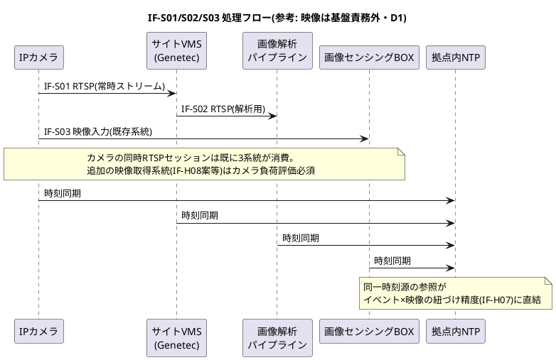

#### データフロー図

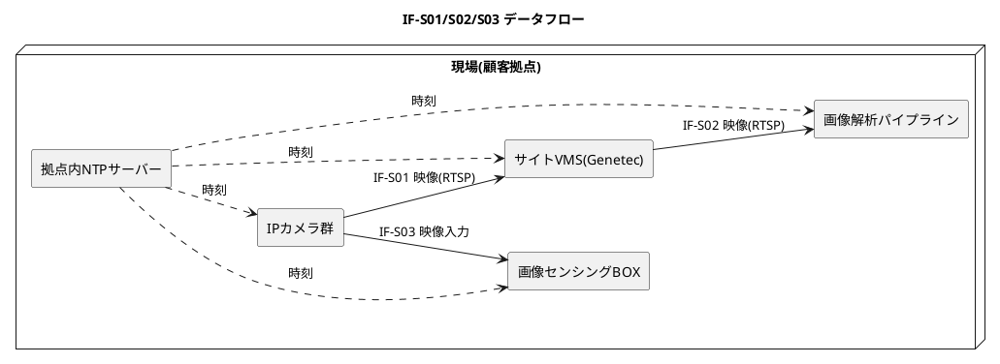

### 3.2 IF-S04: 検知イベント/アラーム投入(パイプライン→thin-edge)

- **概要**: 画像解析パイプラインが映像解析からイベント/アラームを生成し、ローカルMQTTバスにpublishする。thin-edge mapperがCumulocity形式に変換して送信(IF-W01)する
- **プロトコル**: MQTT(Docker Compose内部ネットワーク。thin-edgeローカルブローカー)。スナップショット付きイベントのみHTTPプロキシ経由REST(独自項目参照)
- **認証**: Compose内部ネットワークに閉じる。外部公開しない
- **エラー処理・再送**: ローカルブローカー到達不可時はパイプライン側で短期リトライ(指数バックオフ、上限例: 60秒)。それでも失敗する場合はローカルログに記録しアラートメトリクスを上げる(IF-W05経由で検知)。MQTT経路の閉域網断はthin-edgeのストア&フォワードが吸収する(容量上限あり。§3.5)
- **冪等性・重複排除**: パイプライン内で採番するイベントUUIDを `x_Detection.eventUuid` として付与(再起動時の二重publish対策。下流の重複判定に使用可能)
- **監視**: publish失敗数・キュー滞留をAlloy経由でOtelへ(IF-W05)
- **頻度・データ量**: 検知都度(バースト有)
- **トピック**(thin-edge.io標準に従う):
  - イベント: `te/device/<child-id>///e/<event-type>`
  - アラーム: `te/device/<child-id>///a/<alarm-type>`
  - 計測: `te/device/<child-id>///m/<measurement-type>`
- **ペイロード**: [architecture-camera-monitoring.md §4.3](architecture-camera-monitoring.md) の検知イベント標準ペイロード(F2規約)に準拠。`modelVersion` 必須。ソースは**対象カメラのchild device**に付ける(§4.1の重要規約)
- **投入形式の使い分け**: thin-edgeトピック経由ではsourceとイベントtypeは**トピックが決定**し、ペイロード内の `source.id` / `type` は使われない。§4.3のJSON(Cumulocity REST形式)と混同しないこと:

| 項目 | (a) thin-edgeトピック投入(スナップショットなしイベント/計測/アラーム) | (b) HTTPプロキシ経由REST投入(スナップショット付きイベント) |
|---|---|---|
| source | トピックの `<child-id>` で決定 | ペイロードの `source.id`(Managed Object ID) |
| type | トピックの `<event-type>` で決定 | ペイロードの `type` |
| ペイロード | `text`, `time`, `x_Detection`(カスタムフラグメント) | §4.3のREST形式全体 |
| 網断耐性 | thin-edgeストア&フォワード対象 | 対象外(パイプラインのスプールで担保・下記) |

- **スナップショット付きイベント**: **HTTPプロキシ経由 `POST /event/events` でイベントを直接作成し(レスポンスでイベントIDを取得)、続けて `POST /event/events/{id}/binaries` で添付**する(§4.6初期版)。MQTT経由ではmapperが採番するイベントIDを発行元が知り得ないため、この経路に統一する。イベント添付は**1イベント1バイナリ**(要バージョン確認)
- **網断時のスナップショット保全**: HTTP経路はthin-edgeのストア&フォワード対象外のため、パイプラインは `eventUuid` をキーに**イベント+画像をローカルスプール(ディスク永続)**し、再送ワーカーが復旧後に「イベント作成→添付」を順に実行する。スプールにより添付は**欠落させない(遅延は許容)**。スプール容量とローテーションはA8サイジングと合わせて設計

#### 処理フロー図

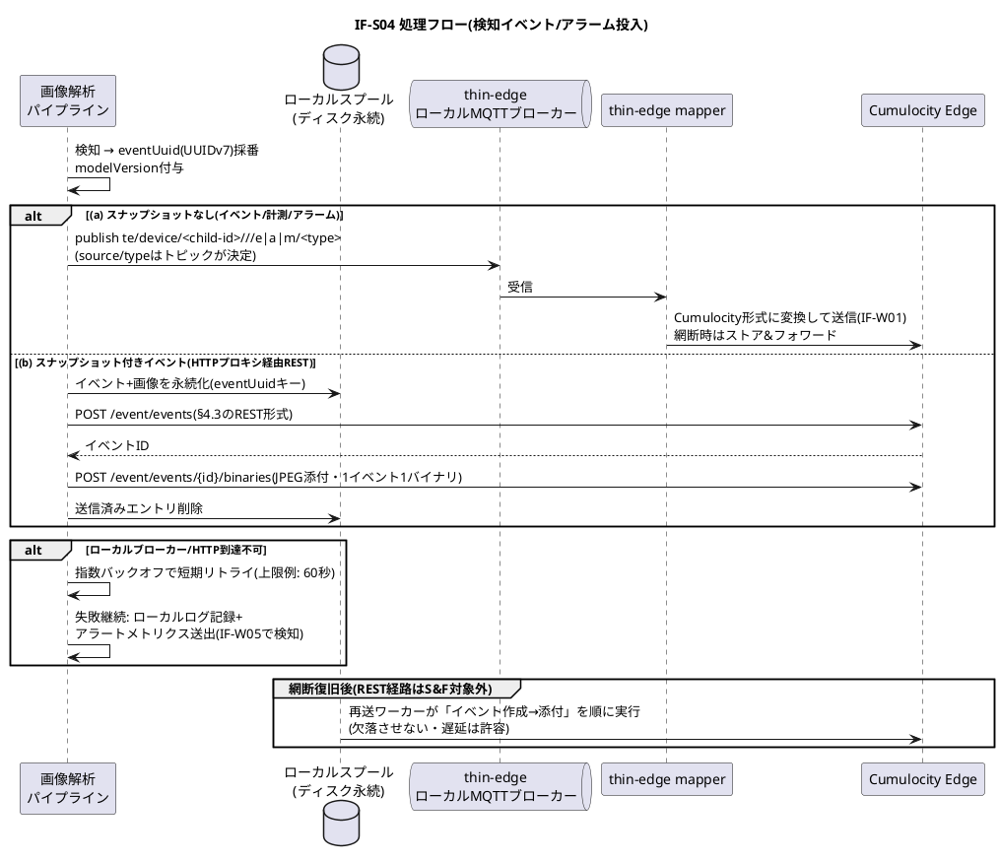

#### データフロー図

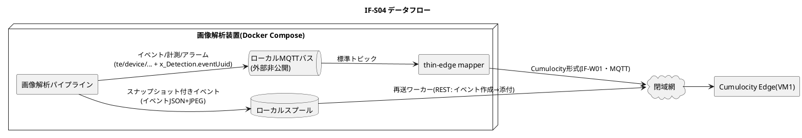

### 3.3 IF-S05/S06: 現場UI(管理端末→FE→BE)

- **概要**: 現場管理端末(ブラウザ)から画像解析装置の状態確認・設定操作を行うローカルUI
- **プロトコル**: S05=HTTPS(装置ローカル証明書)、S06=REST(Compose内部)
- **認証**: 現場は本社Keycloakに常時依存できない(閉域網断時もローカルUIは使える必要がある)ため、**ローカル認証を基本**とする。方式(ローカルアカウント/Keycloakのオフライン対応/トークンキャッシュ)は実装フェーズで確定 → 未確定事項N1
- **エラー処理・再送**: 該当なし(拠点内で完結する同期リクエスト/レスポンスのため再送設計は不要)
- **冪等性・重複排除**: 該当なし(閲覧・設定操作のUIでありデータ連携の再送重複が発生しない)
- **監視**: アクセスログ・監査ログをAlloyが収集(IF-W05)
- **頻度・データ量**: 利用都度
- **未確定事項・要決定条件**: N1 — 現場UIの認証方式(閉域網断時のローカル認証)

#### 処理フロー図

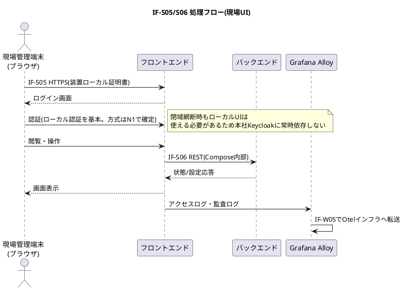

#### データフロー図

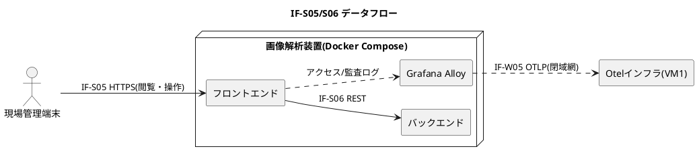

### 3.4 IF-S07: モデル適用(sm-plugin→パイプライン)

- **概要**: IF-D01で受領したモデルファイルを画像解析パイプラインに適用する装置内処理
- **プロトコル**: ローカル(ファイル差し替え+コンテナ再起動。ネットワーク連携なし)
- **認証**: 該当なし(装置内ローカル処理。拠点内はネットワーク分離で担保=§4.4)
- **エラー処理・再送**: 検証NG・モデルロード失敗時は旧モデルにロールバックし、CumulocityへFAILEDを報告(IF-D01の結果報告)
- **冪等性・重複排除**: 同一モデルバージョンの再適用は「適用済みならスキップ」判定(§3.18)
- **監視**: 適用結果はIF-D01のOperationステータス(SUCCESSFUL/FAILED)で報告。起動時ヘルスチェックでモデルロード成否を確認
- **頻度・データ量**: モデル配布都度(数ヶ月単位)
- **未確定事項・要決定条件**: A10 — ロールバック設計の詳細
- **手順**: (1) sm-pluginが**モデルファイルのハッシュ/署名を検証**(§3.18の配布完全性規約。不一致は即FAILED) (2) モデルファイルを所定ディレクトリに配置 (3) パイプラインコンテナ再起動 (4) 起動時ヘルスチェック(モデルロード成否) (5) 失敗時は旧モデルにロールバックし、Cumulocityへ失敗を報告(IF-D01の結果報告)
- **バージョン整合**: 適用後の検知イベントは `modelVersion`(§4.3)で新旧を判別する。適用完了時点をイベントとしてCumulocityに記録し、modelVersion切替時刻を追跡可能にする

#### 処理フロー図

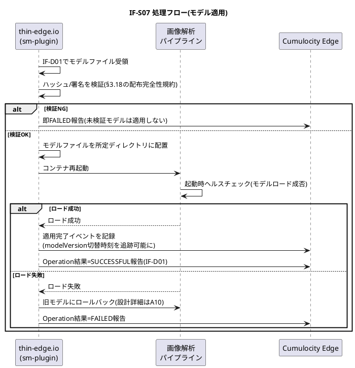

#### データフロー図

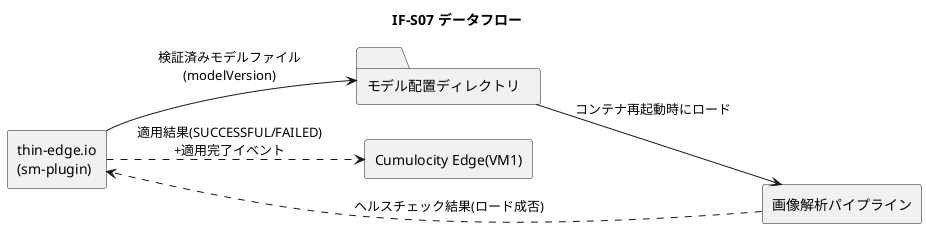

### 3.5 IF-W01: イベント/計測送信+スナップショット添付(thin-edge→Cumulocity)

- **概要**: 閉域網を横断する定常データ経路の本線。thin-edge mapperがIF-S04の内容をCumulocityデータモデルに変換して送信する
- **プロトコル**:
  - MQTT over TLS(現場発コネクション。D9整合): イベント/アラーム/計測
  - HTTPS(REST): スナップショット添付(`POST /event/events/{id}/binaries`)、バイナリ取得
- **認証**: デバイス証明書(thin-edge標準のX.509)。証明書の発行・更新手順は構成コード(D10)で管理
- **エラー処理・再送**: 閉域網断・Cumulocity停止時はthin-edgeローカルブローカーの**ストア&フォワード**が保持し復旧後に再送(D16)。**ただしキュー保持数・容量には上限があり(mosquitto設定依存)、上限超過分は欠落する**。「想定最長断時間 × バースト時レート」から必要容量を逆算して設定し、欠落発生は検知可能にする(A7の実測項目)
- **冪等性・重複排除**(Event/Alarmで保証が異なる):
  - **Event**: Cumulocityは重複を排除しない。at-least-once再送により長時間断からの復旧時に重複が発生し得る。重複の始末は§4.5の責務一元化に従う(オフロード時に排除、参照側でも `eventUuid` 除外)
  - **Alarm**: ACTIVE中の同一source+同一typeは**Cumulocityがサーバー側でde-duplicate**(count増分)するため再送重複で二重発報しない。ただしCLEARED後の再着信は新規Alarmになる
- **監視**: thin-edge接続状態はCumulocityのデバイス可用性監視(c8y_Availability、required interval設定必須)で検知。ゲートウェイ断=拠点全体の送信断としてアラーム化。ストア&フォワードのキュー使用率・欠落発生もIF-W05で送出
- **未確定事項・要決定条件**: N6 — 多拠点合算スループットの実測(D17成立条件)/ A7 — ストア&フォワードのキュー設定値と必要容量 / A8 — スナップショットのサイズ上限
- **頻度・データ量**([§5.1](architecture-camera-monitoring.md)を多拠点に拡張):

| 種別 | 内容 | 頻度 |
|---|---|---|
| Measurement `x_CameraHealth` | カメラ死活(rtt・応答可否) | 1〜5分間隔 × カメラ台数 × N拠点 |
| Event `x_Detection_*` | 検知イベント(§4.3ペイロード) | 検知都度(バースト有) |
| Alarm `x_CameraDown` / `x_Alarm_*` | 死活断・通報対象 | 発生都度 |
| イベント添付バイナリ | スナップショットJPEG | イベント都度(サイズ上限は A8 で確定) |

- **合算試算式(D17成立条件・N6)**: 定常メッセージレート ≒ Σ(拠点のカメラ台数 ÷ 死活間隔秒) + 検知イベントレート。例: 50拠点 × 300台 × 60秒間隔 ≒ **250 msg/s**(死活のみ)。Edgeの垂直スケール目安(約100tps/CPUコア)に対し、検知バースト・添付REST・UI参照・オフロードバッチを上乗せした余裕率をPoCで確定する
- **再送リプレイ対策**: 復旧時の一括再送で古いイベントがSmart Rules/EPLに流れ込み、通知が復旧時刻にまとめて発火する。ルール雛形に「イベント`time`が現在時刻からX分以上古い場合は昇格・通知を抑止(記録のみ)」のガードを必須で組み込む(§3.21)
- **スナップショット添付**: 網断中のイベント+画像はパイプラインのローカルスプールが保全し、復旧後にREST経路で「イベント作成→添付」を順に実行する(§3.2)。**スプールにより欠落させない(遅延は許容)**。紐づけアプリは添付未着(遅延中)でも業務動線(映像確認はIF-H07)を阻害しない表示とする

#### 処理フロー図

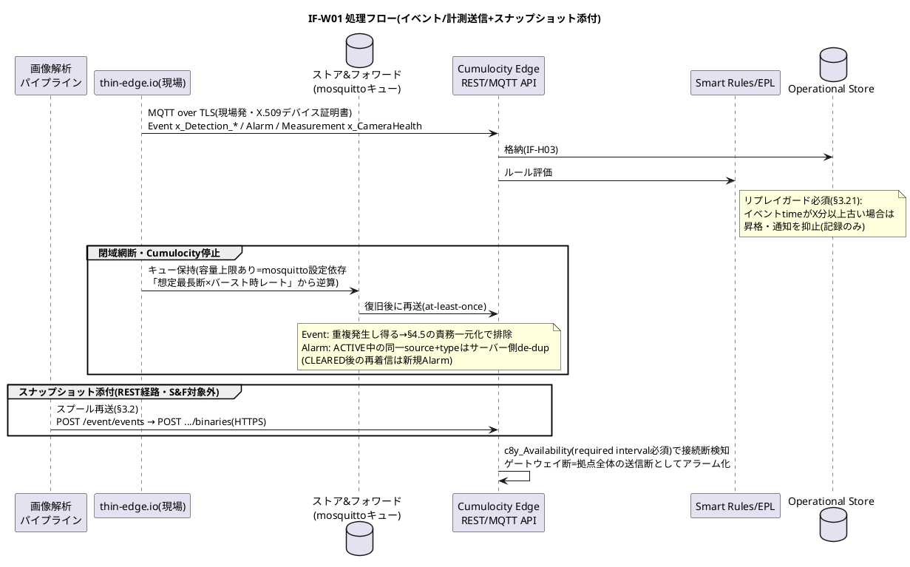

#### データフロー図

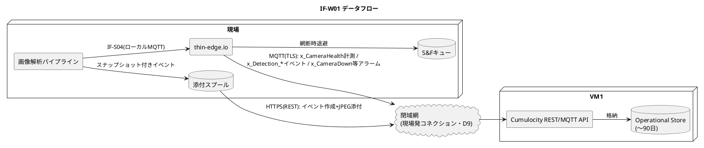

### 3.6 IF-W02: 特徴量登録(パイプライン→ベクトルDB)

- **概要**: 画像解析パイプラインがイベント発生時に抽出した特徴量(ベクトル)を、閉域網経由で本社VM1のベクトルDBに登録する(§4.7)
- **プロトコル**: REST(HTTPS)。ベクトルDB製品のAPI仕様に依存するため、製品確定までは独自項目のペイロードを概念仕様とする
- **認証**: 拠点ごとのAPIトークン(マシン認証。人のOIDCとは分離、D8)。TLSサーバー証明書検証必須。**サーバー側でトークン⇔`siteId`のバインドを検証**し、他拠点のsiteIdを名乗るリクエストを拒否する(横方向なりすまし対策)
- **エラー処理・再送**: 網断時はパイプライン側のローカルキュー(ディスク永続)に退避し復旧後に再送。**イベント送信(IF-S04→W01)を阻害しない**非同期送信とする(特徴量は学習用であり、リアルタイム性より欠損防止を優先)
- **冪等性・重複排除**: `eventUuid + modelVersion` をユニークキーとしてupsert。再送による重複登録を排除
- **監視**: 登録失敗数・キュー滞留をIF-W05で送出
- **頻度・データ量**: イベント都度
- **未確定事項・要決定条件**: N4 — ベクトルDB製品選定とAPI仕様
- **ペイロード(概念)**:

```json
{
  "eventUuid": "0198c1d4-5e6f-7a8b-9c0d-1e2f3a4b5c6d",  // IF-S04で採番したUUIDv7(冪等キー)
  "siteId": "site-001",                // 拠点ID(§4.1識別子規約)
  "cameraExternalId": "site-001:CAM-SN12345",
  "eventType": "x_Detection_Intrusion",
  "eventTime": "2026-07-20T10:23:45.000+09:00",
  "modelVersion": "2026.06-r3",
  "containsBiometric": false,          // 生体情報(顔特徴量等)を含むか。必須(§4.6)
  "vector": [0.012, -0.334],
  "dims": 512
}
```

- **個人情報上の注意**: 特徴量は映像由来データ。ベクトルDB内でも `eventUuid` 経由で元イベント(スナップショット)に辿れるため、アクセス制御はイベントと同等以上とする。**顔特徴量は生体情報(個人識別符号になり得る)として扱い、`containsBiometric: true` を必須設定**。このフラグはIF-H05/M04でのエクスポートフィルタ条件として機械的に強制される(§4.6)

#### 処理フロー図

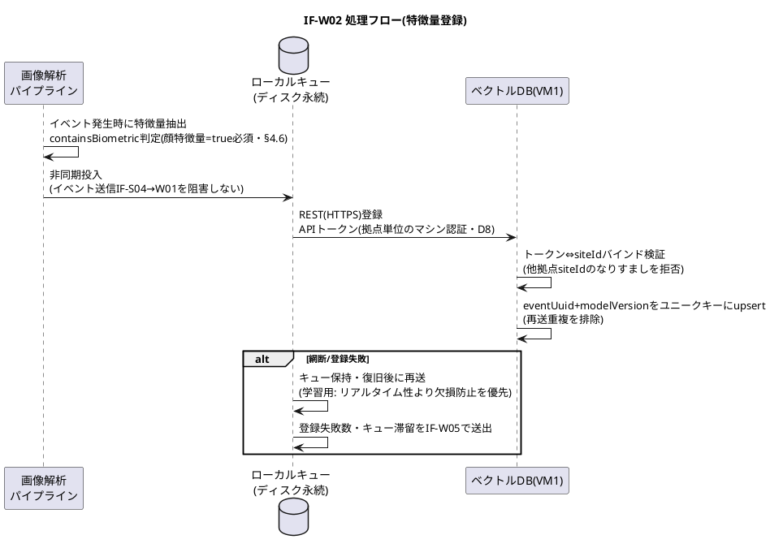

#### データフロー図

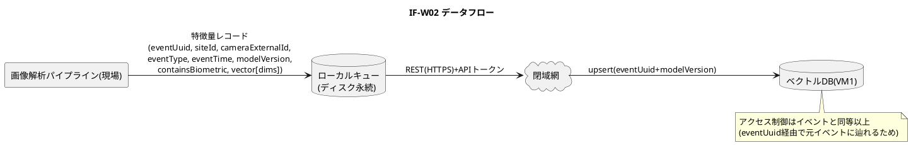

### 3.7 IF-W03: BOX独自形式イベント(BOX→BOXアダプタ)

- **概要**: 画像センシングBOX(旧機器・**改造不可**)が独自形式の検知イベントを閉域網経由でVM1の外部Gateway(BOXアダプタ)へ送信する。BOXはバッファ+再送機能を持つ想定のため、外部GWは本社側に一元集約する(配置の要点)
- **プロトコル**: BOX既存仕様に完全に従う(改造不可のため受け側が合わせる)。HTTP POST想定(実機確認はN2)
- **認証**: 認証を積めない旧機器のため**補償制御**で代替(§4.4): 送信元IP/セグメントACL(BOX収容セグメントのみ許可)+アダプタ側スキーマ検証+本節の監視
- **エラー処理・再送**(永続化前ACK禁止): アダプタは**受信→ローカル永続ストアへの書き込み完了→200応答**の順とする。改造不可のBOXは200応答を見て再送を止めるため、永続化前に応答するとアダプタクラッシュ時にイベントが恒久消失する(唯一の再送機会の放棄)。永続化後の変換・投入失敗はアダプタ内のリトライ/デッドレターで完結させる(BOXの再送を無用に誘発しない)。応答コードの解釈はBOX仕様次第で調整 → N2
- **冪等性・重複排除**: BOXの再送に伴う重複イベントは受信側のBOXアダプタ(IF-H01)で排除する(§3.8。§4.5の責務一元化)
- **監視**: BOXごとの最終受信時刻をアダプタが保持し、閾値超過(例: ハートビートまたは定常イベントが期待間隔のM倍途絶)で当該BOXのchild deviceに `x_BoxSilent` アラームを上げる(BOX自体は死活監視APIを持たない前提の代替策)
- **頻度・データ量**: 検知都度。網断時はBOXがバッファ+再送
- **未確定事項・要決定条件**: N2 — BOXの送信仕様(プロトコル・形式・シーケンスID有無・再送間隔・バッファ容量・応答コード解釈)の実機確認

#### 処理フロー図

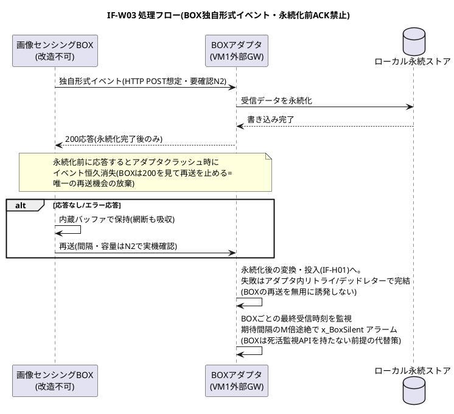

#### データフロー図

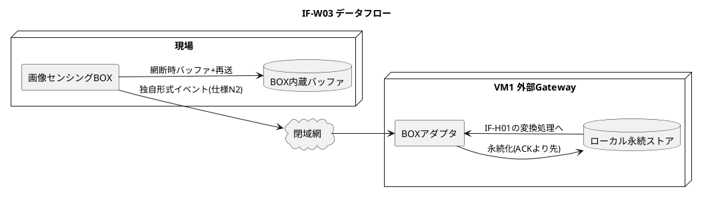

### 3.8 IF-H01: 標準ペイロード投入(BOXアダプタ→thin-edge)+重複排除

- **概要**: BOX独自形式を基盤標準ペイロード(§4.3)へ変換し、ローカルMQTTでthin-edge(外部GW側)に投入する。**再送に伴う重複イベントはここで排除する**(冪等化。配置の要点)
- **プロトコル**: MQTT(ローカル。本社サーバールーム内の外部GW装置内で完結)
- **認証**: 該当なし(サーバールーム内ローカル。ネットワーク分離で担保=§4.4)
- **エラー処理・再送**: 変換不能ペイロードは破棄せずデッドレターディレクトリに保存し、`x_BoxParseError` アラームを上げる
- **冪等性・重複排除**:
  - 重複判定キー: BOXペイロードに通し番号(シーケンスID)があれば `{BOXシリアル}+{シーケンスID}` を最優先。なければ `{BOXシリアル}+{チャネル/カメラ識別子}+{イベント発生時刻(ms)}+{検知種別}` の複合キー(同一BOXが複数チャネルを持つ場合の別イベント誤破棄を防ぐため**チャネル識別子を必ず含める**)
  - 保持ウィンドウ: **「想定最大許容断時間 + BOXの再送保証期間」から逆算して定める**(初期値: 72時間。断時間のSLO側の定義とN2のBOXバッファ仕様確認後に確定)。窓を超える長期断からの再送は重複としてすり抜け得るため、窓超過断が発生した場合の手動突合手順(オフロード済みデータとの`time`+キー照合)を運用手順書に定める
  - キーはアダプタのローカル永続ストア(SQLite等)に保持し、アダプタ再起動でも重複排除が継続するようにする
  - 判定結果: 重複は破棄し、破棄件数をメトリクスとして記録(監査可能にする)
- **監視**: 変換成功/失敗/重複破棄件数をIF-H12で送出
- **頻度・データ量**: BOXイベント都度
- **変換規約**:
  - `source`: BOXをthin-edgeのchild deviceとして登録し、そのchild IDを指定。External ID = `{siteId}:BOX-{BOXシリアル}`
  - `type`: BOX検知種別→ `x_Detection_<種別>` へのマッピング表(構成コード管理, D10)
  - `time`: BOX側の**イベント発生時刻**(受信時刻ではない。再送時も同一値になることが重複判定の前提)
  - `x_Detection.aiProduct`: `"legacy-box"` 固定+BOX型番、`modelVersion`: BOXファームウェア版数を充当

#### 処理フロー図

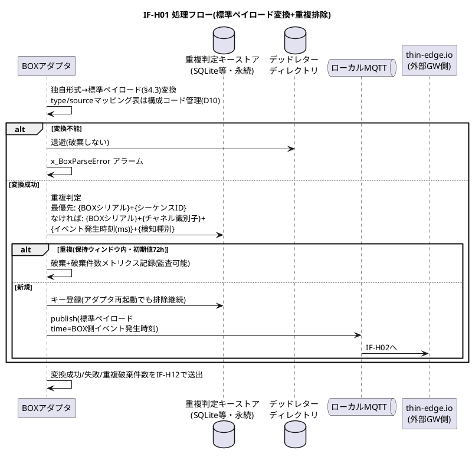

#### データフロー図

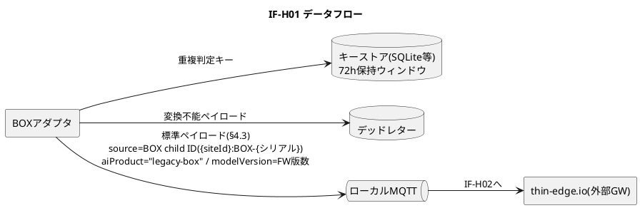

### 3.9 IF-H02: 外部GWイベント登録(thin-edge→Cumulocity)

- **概要**: thin-edge.io標準機能(mapper)がBOX由来の標準ペイロードをCumulocityに登録する。IF-W01と同一の仕組みだが同一サーバールーム内のため閉域網断の影響を受けない。BOX群はこのthin-edgeのchild deviceとして管理され、Cumulocity上では現場のカメラ群と同一のデータモデル(§4.1)に統合される
- **プロトコル**: MQTT(ローカル。thin-edge標準)
- **認証**: 該当なし(サーバールーム内ローカル。ネットワーク分離で担保=§4.4)
- **エラー処理・再送**: thin-edge標準機能に従う(同一サーバールーム内のため閉域網断の影響を受けない)
- **冪等性・重複排除**: 該当なし(BOX再送由来の重複は前段のIF-H01で排除済み=§4.5の責務一元化)
- **監視**: 該当なし(本IF独自の監視なし。BOX途絶検知はIF-W03、変換系メトリクスはIF-H01が担う)
- **頻度・データ量**: BOXイベント都度(IF-H01と同じ)

#### 処理フロー図

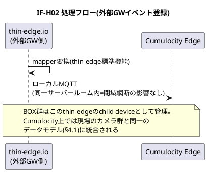

#### データフロー図

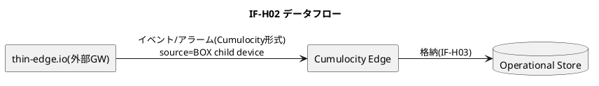

### 3.10 IF-H04: イベント/アラームのオフロード(Operational Store→オブジェクトストレージ)

- **概要**: Cumulocity Operational Store(保持〜90日目安)から長期保存用オブジェクトストレージへ定期エクスポートする。Cumulocity内は短期・オブジェクトストレージが長期という役割分担(§5.3)
- **プロトコル**: エクスポートジョブ(VM1上のバッチ)が**Cumulocity REST APIで前日分を取得**し、S3互換APIで書き込む。MongoDBを直接読まない(Operational Storeへの直接アクセス不可の原則。配置の要点)
- **認証**: APIトークン(コンポーネント単位・最小権限のマシン認証=§4.4)
- **エラー処理・再送**: ジョブの実行記録(成功日付)を管理し、欠損日を検出したら自動リトライ。件数突合の不一致はアラーム化(独自項目「整合性検証と保持期限の順序保証」)
- **冪等性・重複排除**: 出力キーが `{siteId}+{日付}` で決まるため再実行は上書きで冪等。書き込み前に `eventUuid` で重複を排除する(§4.5の責務一元化)。オブジェクトストレージは長期保存の正本であり、重複を含んだままの恒久保存はIF-H11の全利用者に除外実装を強いるため許容しない
- **監視**: ジョブ成否・件数・所要時間をIF-H12で送出。失敗・突合不一致時はアラーム
- **頻度・データ量**: 日次バッチ(深夜。詳細は独自項目「スケジュール」)
- **未確定事項・要決定条件**: N7 — この用途にはCumulocity公式の **DataHub(DataHub Edge)**(Operational Store→データレイクへのParquetオフロード)が存在する。自作バッチとの比較(追加リソース(Dremio)・ライセンス費用 vs 開発保守費。ただしDataHubはイベント添付バイナリをオフロードしない)を実装前に実施する。あわせてMeasurements APIの作成日時フィルタ有無を実機確認(ルックバック方式の要否判定)
- **形式・格納規約**(§5.3を多拠点キーに拡張):

```text
s3://iot-archive/
  sites/{siteId}/events/{yyyy}/{mm}/{dd}/events-{siteId}-{yyyymmdd}.parquet
  sites/{siteId}/alarms/{yyyy}/{mm}/{dd}/alarms-{siteId}-{yyyymmdd}.parquet
  sites/{siteId}/measurements/{yyyy}/{mm}/{dd}/...
  sites/{siteId}/snapshots/{yyyy}/{mm}/{dd}/{eventUuid}.jpg + {eventUuid}.json  // 将来: §4.6本来形移行時
```

- Parquetを第一候補(分析利用)、スナップショット等バイナリは実体+サイドカーJSON(イベントID・カメラID・時刻・modelVersion)
- **スケジュール**: 日次(深夜)。Events/Alarmsは「前日に作成されたデータ」を作成日時(`createdFrom/createdTo`)基準で抽出(ストア&フォワード再送による遅着分を取りこぼさない)
- **Measurementsの遅着対策**: Measurements APIには作成日時フィルタがなく `dateFrom/dateTo`(発生時刻)しかない(要実機確認)。発生時刻基準では再送遅着分がどの日次バッチにも拾われず欠損するため、**発生時刻基準+ルックバック再取得**(直近M日分を毎回再取得して差分を追記。Mは最大許容断時間と連動)を仕様とする
- **パーティションと発生日のズレ(利用者向け仕様)**: パーティション日付は**作成日**基準のため、遅着データでは発生日(`time`)と一致しない。発生日で検索する利用者は `time` カラムでの二次フィルタを必須とする(この旨をIF-H11の公開仕様に明記)
- **整合性検証と保持期限の順序保証**: エクスポート件数とCumulocity側件数の突き合わせを行い、**不一致は記録だけでなくアラーム化**して基盤運用に通知(IF-H12経由)。データ保持期限(90日)による削除は「当該日のオフロード成功が検証済み」であることを前提とし、未検証日が残っている場合は運用手順として保持設定の延長・手動リカバリを行う(イベント削除時は添付も消えるため、ここが崩れるとスナップショットも失われる)

#### 処理フロー図

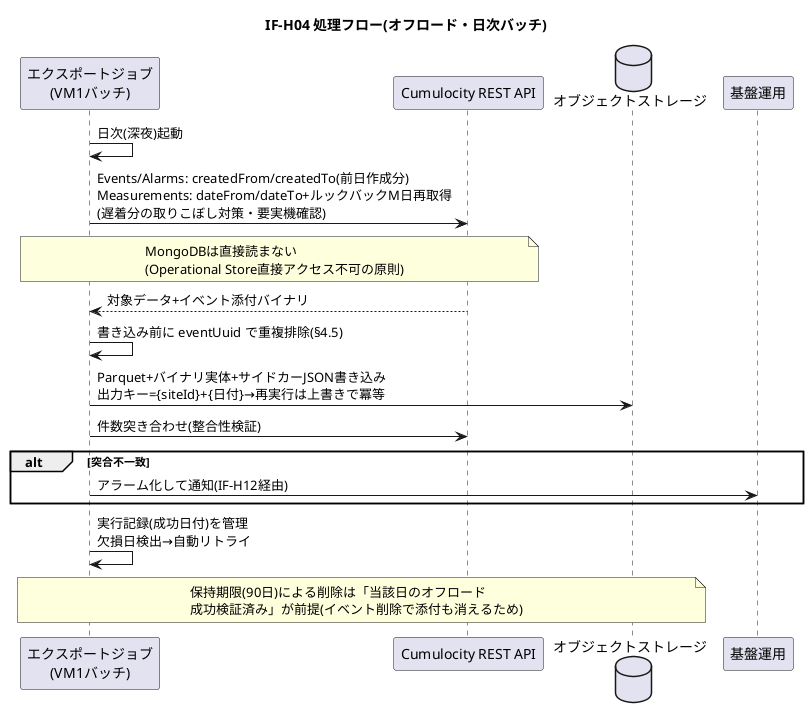

#### データフロー図

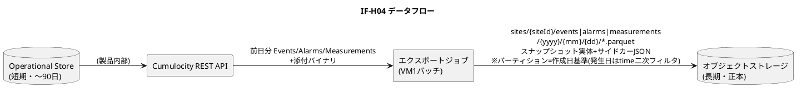

### 3.11 IF-H05/M02/M04: 特徴量エクスポート(ベクトルDB→ジョブ→クラウド)

- **概要**: §4.7の仕様を正とする特徴量エクスポートの3段経路。IF-M02=保守端末からの承認・実行指示、IF-H05=ジョブによるベクトルDBからの抽出、IF-M04=AIモデル改善サービス(クラウド)への送信。「承認は人、転送は機械」(§4.7)の原則により**保守端末にデータ本体は流さない**
- **プロトコル**: IF-M02=HTTPS(保守VPN。エクスポートジョブのWeb UI/API)/ IF-H05=ベクトルDB API / IF-M04=HTTPS(特定FQDNのみFW許可=限定アウトバウンドの実体)
- **認証**: IF-M02=Keycloak OIDC+保守ロール / IF-H05=マシン間APIトークン(§4.4)/ IF-M04=mTLS+APIキー
- **エラー処理・再送**: 失敗時はジョブ単位で再実行(再送安全性は冪等性の項のジョブIDで担保)
- **冪等性・重複排除**: エクスポート単位にジョブIDを採番し、クラウド側へ同一ジョブIDの再送は重複受理されない(またはクラウド側でジョブID単位のupsert)ことを連携先仕様として要求する
- **監視**: 該当なし(本IF独自のメトリクス規定なし。実行は監査ログで追跡)
- **頻度・データ量**: エクスポート都度(承認都度のバッチ)
- **監査**: 送信内容・日時・実行者(承認者)の監査ログを記録(§4.7のIF-M01/M02操作系監査)
- **未確定事項・要決定条件**: △ — 特徴量の拠点外持ち出し合意・仮名化要否(A11)が成立条件。合意確定まで本IFは**設計のみで疎通させない**
- **IF別詳細**:
  - **IF-M02(承認・実行指示)**: 指示内容 = 合意済み範囲の選択(期間・拠点・イベント種別)
  - **IF-H05(抽出)**: ジョブがベクトルDBから指示範囲を抽出。必要に応じ仮名化・フィルタ適用。**`containsBiometric: false` のレコードのみを抽出対象とするフィルタを機械的に強制**(生体情報は合意で明示許可されない限り抽出不可。§4.6)
  - **IF-M04(クラウド送信)**: 送信内容は特徴量バッチ(ジョブID付き)のみ

#### 処理フロー図

```plantuml
@startuml
title IF-H05/M02/M04 処理フロー(特徴量エクスポート)
actor "保守端末\n(保守VPN)" as MT
participant "特徴量エクスポート\nジョブ(VM1)" as JOB
database "ベクトルDB" as VDB
participant "AIモデル改善\nサービス(クラウド)" as AI
database "監査ログ" as AUD
MT -> JOB : IF-M02 承認・実行指示(HTTPS)\nKeycloak OIDC+保守ロール\n指示内容=合意済み範囲(期間・拠点・イベント種別)
note right of MT : 保守端末にデータ本体は流さない\n(「承認は人、転送は機械」§4.7)
JOB -> VDB : IF-H05 指示範囲を抽出
note over JOB, VDB : containsBiometric: false のみを抽出対象と\nするフィルタを機械的に強制(§4.6。生体情報は\n合意で明示許可されない限り抽出不可)
VDB --> JOB : 特徴量レコード
JOB -> JOB : 必要に応じ仮名化・フィルタ適用\nエクスポート単位にジョブID採番
JOB -> AI : IF-M04 送信(mTLS+APIキー・\n特定FQDNのみFW許可=限定アウトバウンド)
AI --> JOB : 同一ジョブIDの再送は重複受理されない\n(連携先仕様として要求)
JOB -> AUD : 送信内容・日時・実行者(承認者)を記録
note over MT, AI : △: A11(持ち出し合意)成立まで設計のみ・疎通させない
@enduml
```

#### データフロー図

```plantuml
@startuml
title IF-H05/M02/M04 データフロー
left to right direction
actor "保守端末" as MT
cloud "保守VPN" as VPN
database "ベクトルDB(VM1)" as VDB
rectangle "特徴量エクスポートジョブ" as JOB
cloud "限定アウトバウンド\n(特定FQDN・mTLS)" as OUT
cloud "AIモデル改善サービス" as AI
database "監査ログストア" as AUD
MT ..> VPN : IF-M02 実行指示のみ(HTTPS)
VPN ..> JOB
VDB --> JOB : IF-H05 特徴量\n(containsBiometric=false のみ)
JOB --> OUT : IF-M04 特徴量バッチ(ジョブID付き)
OUT --> AI
JOB ..> AUD : 監査記録
@enduml
```

### 3.12 IF-H06: イベント/アラーム参照(紐づけ確認アプリ→Cumulocity)

- **概要**: 紐づけ確認アプリ(VM2)がCumulocityからイベント/アラームとスナップショット添付を参照する読み取り経路。「検知→通知→映像確認」動線の入口
- **プロトコル**: Cumulocity REST API(`GET /event/events`, `GET /alarm/alarms`、イベント添付バイナリ取得)
- **認証**: Keycloak OIDC(人)→CumulocityのSSO連携。アプリのサービスアカウントは読み取り専用ロールに限定
- **エラー処理・再送**: 該当なし(同期参照APIのため再送設計は不要。添付未着時の表示は独自項目「スナップショット」)
- **冪等性・重複排除**: IF-W01再送由来の重複イベントがあり得るため、一覧表示時に `x_Detection.eventUuid` で重複除外する(§3.5)。ただしEvents APIは**カスタムフラグメントの値でのフィルタ不可**のため、除外はクライアント側処理になる。**必ずsource(カメラ)+type+時間窓で母集合を絞ってから取得**し、全件走査・`withTotalPages` の多用を禁止する(API利用規約)
- **監視**: 該当なし(本IF独自の監視規定なし)
- **頻度・データ量**: 利用都度
- **監査**: スナップショット画像の取得を監査記録(§4.7。イベント一覧参照はメタデータのみのため対象外)
- **スナップショット**: イベント添付画像をREST経由で取得・表示(§4.6。Cockpit標準では自動表示されないため本アプリが表示動線を担う)。添付が未着(スプール再送の遅延中, §3.2)の場合は「画像準備中」を表示し動線を止めない

#### 処理フロー図

```plantuml
@startuml
title IF-H06 処理フロー(イベント/アラーム参照)
actor 利用者 as U
participant "紐づけ確認アプリ\n(VM2)" as APP
participant "Keycloak" as KC
participant "Cumulocity REST API" as API
database "監査ログ" as AUD
U -> APP : アクセス
APP -> KC : OIDC認証(IF-H10・SSO)
APP -> API : GET /event/events, GET /alarm/alarms\n必ずsource(カメラ)+type+時間窓で母集合を絞る\n(全件走査・withTotalPages多用の禁止=API利用規約)
note right of API : サービスアカウントは\n読み取り専用ロールに限定
API --> APP : イベント/アラーム一覧
APP -> APP : x_Detection.eventUuid でクライアント側重複除外\n(カスタムフラグメント値のAPIフィルタ不可のため)
U -> APP : スナップショット表示要求
APP -> API : イベント添付バイナリ取得
alt 添付未着(スプール再送の遅延中・§3.2)
  APP --> U : 「画像準備中」表示(動線を止めない)
else 取得成功
  APP --> U : 画像表示
  APP -> AUD : 画像取得を監査記録(§4.7\n※イベント一覧参照はメタデータのみのため対象外)
end
@enduml
```

#### データフロー図

```plantuml
@startuml
title IF-H06 データフロー
left to right direction
actor 利用者 as U
rectangle "紐づけ確認アプリ(VM2)" as APP
rectangle "Keycloak(VM1)" as KC
rectangle "Cumulocity REST API" as API
database "Operational Store" as OS
database "監査ログストア" as AUD
U --> APP : HTTPS
KC ..> APP : OIDCトークン
APP --> API : クエリ(source+type+時間窓)
API --> APP : イベント/アラームJSON+添付JPEG
OS --> API : (製品内部)
APP ..> AUD : スナップショット取得の監査記録
@enduml
```

### 3.13 IF-H07: 該当映像の参照(紐づけ確認アプリ→GSC)

- **概要**: 紐づけ確認アプリがイベントに対応する録画映像をGSC(VMS抽象レイヤー経由)で参照する経路。**映像バイト列は中継しない**(D13)— 再生参照(URL等)を返すのみ
- **プロトコル**: VMS抽象レイヤー([§6.1](architecture-camera-monitoring.md)の5操作)経由。Genetec固有APIはアダプタに閉じ込める(D13)
- **認証**: GSC APIの専用サービスアカウント(読み取り+エクスポート権限に限定=§4.4)
- **エラー処理・再送**: 該当なし(同期参照のため再送設計は不要)
- **冪等性・重複排除**: 該当なし(参照のみで状態変更を伴わない)
- **監視**: 該当なし(本IF独自の監視規定なし)
- **頻度・データ量**: 利用都度
- **監査**: 映像再生URL発行を監査記録 — 誰がどのカメラ・時刻帯を参照したか(§4.7)
- **未確定事項・要決定条件**: IF-W04(Genetec連携)の確認(△の理由) — GSC⇔サイトVMSのFederationは、接続確立の方向・使用ポートが「現場発」原則(D9)と整合するか、および閉域網を渡る唯一の常時映像系経路としてのWAN帯域(何台分の映像/メタデータを流すか)を製品仕様で確認するまで確定としない。再生(IF-H07)時にも録画映像がサイトVMS→GSC→アプリとWANを渡るため、帯域見積りに含める
- **紐づけキー**: イベントのソースカメラManaged Objectが持つ `x_Camera.vmsCameraId` + イベント時刻 → `getPlaybackUrl(vmsCameraId, time, {preSec, postSec})`。`clipHint`(§4.3)があれば切り出し範囲に使用

#### 処理フロー図

```plantuml
@startuml
title IF-H07 処理フロー(該当映像の参照)
actor 利用者 as U
participant "紐づけ確認アプリ" as APP
participant "VMS抽象レイヤー" as ABS
participant "GSC\n(Genetecアダプタ)" as GSC
database "監査ログ" as AUD
U -> APP : イベントから「映像確認」
APP -> APP : ソースカメラManaged Objectの\nx_Camera.vmsCameraId+イベント時刻を解決\n(clipHintがあれば切り出し範囲に使用)
APP -> ABS : getPlaybackUrl(vmsCameraId, time, {preSec, postSec})
ABS -> GSC : Genetec固有API\n(アダプタに閉じ込める・D13)
GSC --> ABS : 再生URL
ABS --> APP : 再生参照(URL等)のみ返す\n(映像バイト列は中継しない・D13)
APP -> AUD : 再生URL発行を監査記録\n(誰が・どのカメラ・時刻帯を参照したか)
U -> GSC : 再生\n(録画映像はサイトVMS→GSC→アプリとWANを渡る\n=IF-W04の帯域見積りに含める)
@enduml
```

#### データフロー図

```plantuml
@startuml
title IF-H07 データフロー
left to right direction
actor 利用者 as U
rectangle "紐づけ確認アプリ(VM2)" as APP
rectangle "VMS抽象レイヤー" as ABS
rectangle "GSC(本社・専用VM)" as GSC
rectangle "サイトVMS(現場)" as VMS
APP --> ABS : vmsCameraId+時刻(+clipHint)
ABS --> GSC : アダプタAPI(5操作・§6.1)
GSC --> ABS : 再生URL
ABS --> APP : 再生URL
VMS --> GSC : 録画映像(IF-W04・閉域網)
GSC --> U : 映像ストリーム(再生)
@enduml
```

### 3.14 IF-H08: 顔判定用映像ストリーム(GSC→生体認証SA)【未確定】

- **概要**: GSCが対象カメラ映像を生体認証SAへ転送する経路(現行図の仮置き)。認証遅延の懸念(§4.8)により、リアルタイム用途(ゲート開閉等)なら「現場で顔特徴量抽出→結果のみ送信」(案a)が推奨であり、経路自体が変わる可能性がある
- **プロトコル**: 未定(RTSP/Genetec SDKを仮置き。A9確定まで凍結)
- **認証**: 未定(製品独自 — Genetec/SA製品仕様に依存=§4.4。A9確定後に規定)
- **エラー処理・再送**: 未定(A9確定まで凍結)
- **冪等性・重複排除**: 未定(A9確定まで凍結)
- **監視**: 未定(A9確定まで凍結)
- **頻度・データ量**: 常時 or 認証都度(仮置き)
- **未確定事項・要決定条件**: 認証結果の要求応答時間(A9)。確定までは本IFの詳細仕様(プロトコル・対象カメラ選定・帯域)を凍結
- **制約(確定分)**: いずれの案でもカメラの同時RTSPセッション上限(§3.1)と生体情報の取り扱い規定(保持期間・保存場所・持ち出し禁止範囲)を満たすこと

#### 処理フロー図

```plantuml
@startuml
title IF-H08 処理フロー(仮置き・詳細凍結中)
participant "GSC" as GSC
participant "生体認証SA(VM2)" as SA
== 現行図の仮置き経路 ==
GSC -> SA : 対象カメラ映像の転送(RTSP/Genetec SDK)
SA -> SA : 顔判定→認証(結果はIF-H09でIdP連携)
== 代替案a(リアルタイム用途で推奨) ==
note over GSC, SA : ゲート開閉等なら「現場で顔特徴量抽出→結果のみ送信」\n(経路自体が変わる=本IF廃止の可能性)\n要決定条件: 認証結果の要求応答時間(A9)。\n確定まで詳細仕様(プロトコル・対象カメラ選定・帯域)は凍結
@enduml
```

#### データフロー図

```plantuml
@startuml
title IF-H08 データフロー(未確定・仮置き)
left to right direction
rectangle "GSC(本社・専用VM)" as GSC
rectangle "生体認証SA(VM2)" as SA
GSC --> SA : 顔判定用映像ストリーム\n(常時 or 認証都度・仮置き)
note bottom of SA : 制約(確定分):\n・カメラの同時RTSPセッション上限(§3.1)\n・生体情報の取り扱い規定(保持期間・保存場所・\n  持ち出し禁止範囲)を満たすこと
@enduml
```

### 3.15 IF-H09/H10: 認証系(SA→Keycloak、各アセット→Keycloak)

- **概要**: 認証系の2経路。IF-H10=全アセット・基盤UIがKeycloakをIdPとしてSSOする共通認証(D8)、IF-H09=生体認証SAの認証結果をKeycloakのセッション/トークンに反映するIdP連携。KeycloakはVM1配置(アセット層のデプロイ影響を受けない共通インフラ)
- **プロトコル**: IF-H10=OIDC(Authorization Code Flow・HTTPS)/ IF-H09=Keycloakカスタム認証フロー/トークン交換(SA製品仕様依存 → N3)
- **認証**: 本IF自体が認証基盤の経路。人の認証(OIDC)とマシン認証(APIトークン/証明書)は分離する(D8)
- **エラー処理・再送**: 該当なし(ログイン都度の同期フローのため再送設計は不要)
- **冪等性・重複排除**: 該当なし(認証フローのためデータ再送重複が発生しない)
- **監視**: 該当なし(本IF独自の監視規定なし。Keycloak自体の死活はIF-F02のメタ監視対象)
- **頻度・データ量**: IF-H10=ログイン都度 / IF-H09=認証都度
- **監査**: Keycloak認証イベント(成功/失敗/権限昇格)を記録(§4.7)
- **未確定事項・要決定条件**: N3 — 生体認証SAのIdP連携方式(Keycloakカスタムフロー/トークン交換)

#### 処理フロー図

```plantuml
@startuml
title IF-H09/H10 処理フロー(認証系)
actor 利用者 as U
participant "アセット\n(紐づけアプリ・他アセット)" as APP
participant "Keycloak(VM1)" as KC
participant "生体認証SA(VM2)" as SA
== IF-H10: 共通OIDC SSO(D8) ==
U -> APP : アクセス
APP -> KC : Authorization Code Flowへリダイレクト
U -> KC : 認証
KC --> APP : 認可コード→トークン取得
APP --> U : ログイン完了(SSO)
note over APP, KC : KeycloakはVM1配置=アセット層(VM2)の\nデプロイ・再起動の影響を受けない共通インフラ
== IF-H09: 顔認証結果のIdP連携(N3未確定) ==
SA -> KC : 認証結果をセッション/トークンに反映\n(カスタム認証フロー/トークン交換=SA製品仕様依存)
note over SA, KC : 人の認証(OIDC)とマシン認証\n(APIトークン/証明書)は分離(D8)
@enduml
```

#### データフロー図

```plantuml
@startuml
title IF-H09/H10 データフロー
left to right direction
actor 利用者 as U
rectangle "各アセット(VM2)" as APP
rectangle "Keycloak(VM1)\nIdP" as KC
rectangle "生体認証SA(VM2)" as SA
U --> APP : HTTPS
APP <--> KC : IF-H10 OIDC\n(認可コード/IDトークン/アクセストークン)
SA --> KC : IF-H09 顔認証結果(方式はN3)
@enduml
```

### 3.16 IF-H11: 長期データ利用(他アセット→オブジェクトストレージ)

- **概要**: 他アセット(案件側アプリ等)が長期アーカイブ(オブジェクトストレージ)のデータを利用する読み取り経路
- **プロトコル**: S3互換API
- **認証**: 読み取り専用アクセスキーをアセット単位に発行し、プレフィックス(`sites/{siteId}/...`)単位でアクセス制御
- **エラー処理・再送**: 該当なし(同期読み取りのため再送設計は不要)
- **冪等性・重複排除**: 該当なし(読み取り専用。重複はIF-H04の書き込み前に排除済み=§4.5)
- **監視**: 該当なし(本IF独自の監視規定なし)
- **頻度・データ量**: 利用都度
- **監査**: オブジェクトストレージの読み出しを記録(S3アクセスログ有効化=§4.7)
- **契約**: オブジェクトストレージ内の格納規約(§3.10)を公開仕様とし、アセットはCumulocity REST(短期・IF-H06相当)とオブジェクトストレージ(長期・本IF)を保持期間で使い分ける。発生日で検索する場合は `time` カラムの二次フィルタ必須(パーティションは作成日基準・§3.10)

#### 処理フロー図

```plantuml
@startuml
title IF-H11 処理フロー(長期データ利用)
participant "他アセット\n(案件側アプリ等)" as OA
participant "オブジェクトストレージ" as S3
database "S3アクセスログ\n(監査・§4.7)" as LOG
OA -> S3 : S3互換API(読み取り専用アクセスキー)\nプレフィックス sites/{siteId}/... 単位でアクセス制御
S3 --> OA : Parquet/バイナリ
S3 -> LOG : 読み出しを記録
note over OA, S3 : 発生日で検索する場合は time カラムの二次フィルタ必須\n(パーティションは作成日基準・§3.10)\n短期データはCumulocity REST(IF-H06相当)と保持期間で使い分け
@enduml
```

#### データフロー図

```plantuml
@startuml
title IF-H11 データフロー
left to right direction
rectangle "他アセット(VM2)" as OA
database "オブジェクトストレージ" as S3
database "S3アクセスログ" as LOG
OA --> S3 : GET(読み取り専用キー・prefix制限)
S3 --> OA : sites/{siteId}/events|alarms|measurements\n/{yyyy}/{mm}/{dd}/*.parquet\nclips/{eventUuid}.mp4+サイドカーJSON
S3 ..> LOG : アクセス記録
@enduml
```

### 3.17 IF-W05/H12: テレメトリ(Alloy/各コンポーネント→Otelインフラ)

- **概要**: 全コンポーネントのテレメトリをOtelインフラへ集約する経路。対象はメトリクス(コンテナ・ホスト・アプリ)、ログ(構造化ログ)、トレース(将来)。現場はAlloyが集約して閉域網経由で転送(IF-W05)、本社内コンポーネントは直接送信(IF-H12)
- **プロトコル**: OTLP(gRPC 4317 / HTTP 4318)、TLS
- **認証**: APIトークン(拠点/コンポーネント単位・最小権限のマシン認証=§4.4)
- **エラー処理・再送**: Alloyのローカルバッファ(WAL)で網断を吸収。バッファ上限超過時は古いデータから破棄(テレメトリは欠損許容)
- **冪等性・重複排除**: 該当なし(テレメトリは欠損許容のデータであり重複排除は規定しない=§4.5の優先度)
- **監視**: 該当なし(本IF自体が監視データの経路。Otelインフラ自体の死活はIF-F02のメタ監視で担保=§3.24)
- **頻度・データ量**: 定常(秒〜分オーダー)
- **受け口**: IF-W05/H12の受け口は**Otelインフラ**(確定)。レビュー反映版タブでAlloyのOTLPエッジ終端が運用知識基盤に接続されていた件は結線ミスと確認され、図側を修正済み
- **必須ラベル**: `site_id`, `component`, `version` を全シグナルに付与(多拠点の切り分けに必須)
- **業務データ分離**: テレメトリにイベント内容・画像・個人情報を含めない(ログのマスキング規約を実装フェーズで定義)

#### 処理フロー図

```plantuml
@startuml
title IF-W05/H12 処理フロー(テレメトリ)
participant "現場コンポーネント\n(コンテナ/ホスト/アプリ)" as SRC
participant "Grafana Alloy(現場)" as AL
database "WAL\n(ローカルバッファ)" as WAL
participant "Otelインフラ(VM1)" as OTEL
participant "VM1/VM2\n各コンポーネント" as HQ
SRC -> AL : メトリクス/構造化ログ/(将来)トレース
AL -> AL : 必須ラベル付与:\nsite_id, component, version(多拠点切り分け)
AL -> OTEL : IF-W05 OTLP(gRPC 4317 / HTTP 4318, TLS)\n閉域網経由
group 閉域網断
  AL -> WAL : ローカルバッファに退避
  WAL -> OTEL : 復旧後に送信
  WAL -> WAL : バッファ上限超過は古いデータから破棄\n(テレメトリは欠損許容)
end
HQ -> OTEL : IF-H12 直接送信(OTLP)
note over AL, OTEL : 業務データ分離: イベント内容・画像・個人情報を\n含めない(ログマスキング規約は実装フェーズで定義)
@enduml
```

#### データフロー図

```plantuml
@startuml
title IF-W05/H12 データフロー
left to right direction
node "現場" {
  rectangle "各コンテナ/ホスト/アプリ" as SRC
  rectangle "Grafana Alloy" as AL
  database "WAL" as WAL
}
cloud "閉域網" as WAN
node "本社" {
  rectangle "VM1/VM2各コンポーネント" as HQ
  rectangle "Otelインフラ(VM1)" as OTEL
}
SRC --> AL : メトリクス/ログ
AL --> WAL : 網断時退避
AL --> WAN : IF-W05 OTLP(TLS)\nラベル: site_id/component/version
WAN --> OTEL
HQ --> OTEL : IF-H12 OTLP(直接)
@enduml
```

### 3.18 IF-D01: ソフトウェア更新Operation(モデル配布)

- **概要**: §4.7の仕様を正とするモデル配布経路(ただし登録先はソフトウェアリポジトリに改める・独自項目「登録先」参照)。Cumulocityのソフトウェア更新Operationで画像解析装置(thin-edgeゲートウェイ)へモデルを配布する
- **プロトコル**: Operationは**既存の現場発MQTT接続上**で配信(D9整合: 本社→現場の新規着信接続は作らない)。モデルバイナリはthin-edgeがCumulocityからHTTPSで取得(これも現場発)
- **認証**: X.509デバイス証明書(IF-W01と同一の現場発接続。ライフサイクルはIF-P01=§4.4)
- **エラー処理・再送**: sm-plugin適用失敗(FAILED)時は旧モデル維持(IF-S07)。オフラインデバイス・滞留Operationの扱いは独自項目「滞留管理」
- **冪等性・重複排除**: 同一モデルバージョンの再配布は sm-plugin 側で「適用済みならスキップ」判定
- **監視**: sm-plugin適用結果(SUCCESSFUL/FAILED)をOperationステータスで報告し、配布状況を追跡する
- **頻度・データ量**: モデル更新都度(数ヶ月単位)
- **未確定事項・要決定条件**: A10 — 帯域×モデルサイズ・段階ロールアウト(滞留Operation・失敗閾値含む)・ロールバック設計、モデル世代の保持数と旧版削除運用(§5)
- **登録先**: **Device Management > ソフトウェアリポジトリ**に登録する(名称=モデル名、version=`modelVersion`、softwareType=`ai-model`)。`c8y_SoftwareUpdate` のUI発行動線はソフトウェアリポジトリのエントリのみ選択できるため、Administration > ファイルリポジトリ(Inventoryバイナリ)への登録では成立しない(旧§4.7の記述を本書で訂正)。thin-edge側はsoftwareType=`ai-model`を自作sm-pluginに振り分ける
- **配布完全性(署名/ハッシュ検証)**: クラウド取得時(IF-M03)にモデル提供元のハッシュ/署名を台帳記録し、**sm-pluginが適用前に検証**する(IF-S07)。不一致は即FAILED。保守端末・リポジトリのどこが侵害されても未検証モデルが全拠点に展開されない構造にする(サプライチェーン対策)
- **Operation種別**: `c8y_SoftwareUpdate`。対象デバイス = 画像解析装置(thin-edgeゲートウェイ)
- **ロールアウト**: 拠点グループ単位の段階配布(bulk operation+失敗閾値での自動停止)。帯域×モデルサイズの設計はA10
- **滞留管理**: オフラインデバイス宛OperationはPENDINGで滞留し再接続時に配信される。**Operationの有効期限(期限超過は手動キャンセル)**と、段階ロールアウト中の滞留分の扱い(次段階に進む判定から除外)をA10のロールアウト設計に含める。EXECUTING固着(適用中の装置再起動等)は再実行で回復させる(sm-pluginの「適用済みスキップ」判定が再実行の冪等性を担保)

#### 処理フロー図

```plantuml
@startuml
title IF-D01 処理フロー(ソフトウェア更新Operation=モデル配布)
participant "保守端末" as MT
participant "Cumulocity\n(SWリポジトリ/デバイス管理)" as C8Y
participant "thin-edge.io(現場)" as TE
participant "sm-plugin" as SM
MT -> C8Y : IF-M01 ソフトウェアリポジトリへモデル登録\n(名称=モデル名, version=modelVersion,\nsoftwareType=ai-model)
MT -> C8Y : c8y_SoftwareUpdate 発行\n(拠点グループ単位の段階配布=bulk operation)
C8Y -> TE : Operation配信\n(既存の現場発MQTT接続上・D9整合:\n本社→現場の新規着信接続は作らない)
TE -> C8Y : モデルバイナリをHTTPSで取得(これも現場発)
TE -> SM : softwareType=ai-model を自作sm-pluginに振り分け
SM -> SM : ハッシュ/署名検証→適用(IF-S07)\n同一バージョンは「適用済みならスキップ」(冪等)
SM --> C8Y : Operation結果報告\nSUCCESSFUL / FAILED(FAILED時は旧モデル維持)
group 滞留管理(A10ロールアウト設計)
  C8Y -> C8Y : オフライン宛はPENDING滞留→再接続時に配信\n有効期限超過は手動キャンセル\n段階配布中の滞留分は次段階判定から除外\n失敗閾値で自動停止/EXECUTING固着は再実行で回復
end
@enduml
```

#### データフロー図

```plantuml
@startuml
title IF-D01 データフロー
left to right direction
node "VM1" {
  rectangle "デバイス管理" as DM
  database "ソフトウェアリポジトリ\n(MongoDB格納)" as REPO
}
cloud "閉域網\n(現場発接続のみ・D9)" as WAN
node "現場(画像解析装置)" {
  rectangle "thin-edge.io" as TE
  rectangle "sm-plugin" as SM
}
DM --> WAN : c8y_SoftwareUpdate Operation\n(既存の現場発MQTT接続上)
REPO --> WAN : モデルバイナリ\n(HTTPS・現場発の取得)
WAN --> TE
TE --> SM : モデルファイル(ハッシュ/署名検証へ)
SM ..> DM : Operation結果(SUCCESSFUL/FAILED)
@enduml
```

### 3.19 IF-M01/M03: 保守経路(保守端末→Cumulocity UI、保守端末→クラウド)

- **概要**: 保守経路の2本。IF-M03=クラウドからの改善モデル取得(保守端末起点のダウンロード。人の承認を挟む運用。経路区分は「保守拠点発アウトバウンド」§1.1)、IF-M01=Cumulocity Web UIでのモデル登録+更新オペレーション発行。**保守端末が業務データ(特徴量・映像)の中継点になることは禁止**(§4.7)— 本経路で流れるのはモデルバイナリのみ
- **プロトコル**: IF-M01=HTTPS(保守VPN経由)/ IF-M03=HTTPS(保守端末のFWも特定FQDNのみ許可)
- **認証**: IF-M01=Keycloak OIDC+保守ロール(モデル登録・オペレーション発行権限を限定)/ IF-M03=mTLS+APIキー・特定FQDN限定(§4.4のクラウド連携)
- **エラー処理・再送**: 該当なし(人の操作起点のため再送設計は不要。失敗時は再操作)
- **冪等性・重複排除**: 該当なし(本IFでの規定なし。配布の冪等性は下流のIF-D01/sm-pluginが担保=§3.18)
- **監視**: 該当なし(本IF独自の監視規定なし。操作は監査ログで追跡)
- **頻度・データ量**: モデル更新都度(数ヶ月単位)
- **監査**: IF-M01の操作(モデル登録・オペレーション発行)を監査記録(§4.7)
- **IF別詳細**:
  - **IF-M01**: 登録先は**ソフトウェアリポジトリ**(§3.18。softwareType=`ai-model`)
  - **IF-M03**: 取得時に**提供元公表のハッシュ/署名を検証して台帳に記録**し(§3.18)、IF-M01でソフトウェアリポジトリへ登録する

#### 処理フロー図

```plantuml
@startuml
title IF-M01/M03 処理フロー(保守経路)
actor "保守担当者" as OP
participant "保守端末" as MT
participant "AIモデル改善\nサービス(クラウド)" as AI
participant "Cumulocity Web UI" as UI
database "ハッシュ/署名台帳" as LEDGER
database "監査ログ" as AUD
== IF-M03: 改善モデル取得(保守拠点発アウトバウンド) ==
OP -> MT : 取得操作(人の承認を挟む運用)
MT -> AI : HTTPS(保守端末FWも特定FQDNのみ許可)
AI --> MT : モデルバイナリのみ\n(業務データ=特徴量・映像の中継は禁止)
MT -> MT : 提供元公表のハッシュ/署名を検証
MT -> LEDGER : 検証結果を台帳記録(§3.18)
== IF-M01: モデル登録+オペレーション発行(保守VPN) ==
MT -> UI : Keycloak OIDC+保守ロール\n(モデル登録・オペレーション発行権限を限定)
MT -> UI : ソフトウェアリポジトリへ登録\n(softwareType=ai-model)
MT -> UI : 更新オペレーション発行(IF-D01へ)
UI -> AUD : 操作を監査記録
@enduml
```

#### データフロー図

```plantuml
@startuml
title IF-M01/M03 データフロー
left to right direction
cloud "AIモデル改善サービス\n(クラウド)" as AI
node "保守拠点" {
  rectangle "保守端末" as MT
  database "ハッシュ/署名台帳" as LEDGER
}
cloud "保守VPN" as VPN
node "VM1" {
  rectangle "Cumulocity Web UI" as UI
  database "ソフトウェアリポジトリ" as REPO
}
AI --> MT : IF-M03 モデルバイナリ(HTTPS)\n※流れるのはモデルのみ
MT ..> LEDGER : 検証記録
MT --> VPN : IF-M01 モデル登録+Operation発行(HTTPS)
VPN --> UI
UI --> REPO : 登録(softwareType=ai-model)
@enduml
```

### 3.20 IF-S08: カメラ死活ポーリング(thin-edge→カメラ群)

- **概要**: IF-W01の `x_CameraHealth` 計測を生む前提経路(旧F1)。thin-edgeのONVIF死活監視プラグインがカメラ群を定期ポーリングする。レビュー反映版タブで「ONVIF/ICMP死活確認」エッジとして図示済み
- **プロトコル**: ONVIF(GetSystemDateAndTime等)/ICMP。カメラ側に要求されるのは応答のみ(Cumulocity対応不要)
- **認証**: 該当なし(拠点内。ネットワーク分離で担保=§4.4)
- **エラー処理・再送**: 該当なし(定期ポーリングのため再送不要。無応答時の扱いは独自項目「判定規約」)
- **冪等性・重複排除**: 該当なし(ポーリング都度の計測。アラーム重複はCumulocityサーバー側のde-duplicateで吸収=§4.5)
- **監視**: 本IF自体がカメラ監視の経路。結果は `x_CameraHealth` 計測 / `x_CameraDown` アラームとしてIF-W01経由でCumulocityへ
- **頻度・データ量**: 1〜5分間隔 × カメラ台数(間隔は構成コードD10で管理)
- **判定規約**: 無応答N回連続(既定3回)で `x_CameraDown` アラーム。復旧で自動クリア。フラッピング対策のヒステリシスを既定値として持つ(旧§5.4を引き継ぐ)
- **前提**: カメラのchild device登録と `x_Camera.vmsCameraId` 設定はIF-P02のプロビジョニングで実施済みであること

#### 処理フロー図

```plantuml
@startuml
title IF-S08 処理フロー(カメラ死活ポーリング)
participant "thin-edge.io\nONVIF死活監視プラグイン" as POLL
participant "IPカメラ" as CAM
participant "Cumulocity Edge" as C8Y
loop 1〜5分間隔 × カメラ台数(間隔は構成コードD10で管理)
  POLL -> CAM : ONVIF GetSystemDateAndTime / ICMP\n(カメラ側は応答のみ・Cumulocity対応不要)
  alt 応答あり
    CAM --> POLL : 応答(rtt)
    POLL -> C8Y : Measurement x_CameraHealth(IF-W01経由)
    POLL -> POLL : ダウン中だった場合は復旧→アラーム自動クリア\n(ヒステリシスでフラッピング対策・旧§5.4)
  else 無応答
    POLL -> POLL : 連続無応答カウント
    opt N回連続(既定3回)
      POLL -> C8Y : Alarm x_CameraDown\n(対象カメラのchild deviceに付与)
    end
  end
end
note over POLL, C8Y : 前提: child device登録+x_Camera.vmsCameraId設定は\nIF-P02のプロビジョニングで実施済み
@enduml
```

#### データフロー図

```plantuml
@startuml
title IF-S08 データフロー
left to right direction
node "現場" {
  rectangle "thin-edge.io\n(死活監視プラグイン)" as POLL
  rectangle "IPカメラ群" as CAM
}
cloud "閉域網" as WAN
rectangle "Cumulocity Edge(VM1)" as C8Y
POLL --> CAM : ONVIF/ICMP(応答のみ要求)
CAM --> POLL : 応答可否・rtt
POLL --> WAN : x_CameraHealth計測 /\nx_CameraDownアラーム(IF-W01)
WAN --> C8Y
@enduml
```

### 3.21 IF-H13: 通知(Alarm→利用者/案件アプリ)

- **概要**: 「検知→通知→映像確認」動線(旧F2→F3→F4)の中核。Alarm発生(Event→Alarm昇格は案件側保守のルールで判定。D7)を契機に利用者/案件アプリへ通知する。レビュー反映版タブで「通知 Webhook」エッジ(イベント/アラーム処理→他アセット)として図示済み。メール(SMTP)経路は引き続き図外
- **プロトコル**: (a) Webhook(HTTPS)→案件側アプリのエンドポイント (b) メール(本社内SMTP)。通知にはカメラID・時刻・**紐づけ確認アプリへのディープリンク**を含める(旧§5.2)
- **認証**: 通知リンク先(紐づけ確認アプリ)はKeycloak OIDC(§4.4)。Webhook送信自体の認証方式は実装手段の確定(N8)後に規定
- **エラー処理・再送**: 未定(通知失敗時のリトライ方針は実装手段の確定(N8)後に規定)
- **冪等性・重複排除**(ルール雛形の必須ガード。基盤提供、§3.5): (a) 重複耐性 — `eventUuid` の評価窓内重複を無視 (b) リプレイ抑止 — イベント`time`が現在時刻からX分以上古い場合は昇格・通知を抑止(記録のみ)
- **監視**: 該当なし(本IF独自の監視規定なし)
- **頻度・データ量**: Alarm発生都度
- **未確定事項・要決定条件**: N8 — 任意URLへのWebhookは**標準Smart Ruleにはない**。実装は (1) Streaming Analytics(Apama EPL) (2) Notification 2.0 API購読の自作コンシューマ (3) 自作マイクロサービス、から選択する。EdgeにおけるStreaming Analyticsはオプション拡張(別ライセンス・追加リソース。要確認)のため、ライセンス確認結果(N6と合わせてベンダー確認)で(1)/(2)を決める
- **現場利用者のアラーム閲覧経路**: 現場管理端末(ブラウザ)→閉域網→VM2の紐づけ確認アプリ(HTTPS)= **IF-W06として採番(§3.25)**。現場UIとは別動線であることを利用者向けに明示する(通知メール内リンクも本経路)。閉域網断時は現場からのアラーム閲覧は不可(基盤停止時も録画・検知は継続する原則の説明に含める)
- **設定管理**: 通知先(Webhook URL・メールアドレス)は構成コード(D10)で管理し、拠点・環境での手作業設定を禁止する

#### 処理フロー図

```plantuml
@startuml
title IF-H13 処理フロー(通知)
participant "Cumulocity\n(EPL/Notification 2.0)" as RULE
participant "案件側アプリ" as APP
participant "SMTP(本社内)" as MAIL
actor "利用者" as U
participant "紐づけ確認アプリ\n(VM2)" as LNK
RULE -> RULE : Alarm発生\n(Event→Alarm昇格は案件側保守のルールで判定・D7)
RULE -> RULE : 必須ガード(基盤提供のルール雛形・§3.5):\n(a) eventUuidの評価窓内重複を無視\n(b) イベントtimeがX分以上古い場合は\n昇格・通知を抑止=リプレイ対策(記録のみ)
alt Webhook
  RULE -> APP : HTTPS POST\n(カメラID・時刻・紐づけ確認アプリへのディープリンク)
else メール
  RULE -> MAIL : 送信(同内容)
  MAIL -> U : 通知メール
end
U -> LNK : ディープリンクから閲覧\n(現場利用者は現場管理端末→閉域網→VM2の別動線。\n閉域網断時は現場からのアラーム閲覧不可)
note over RULE : 任意URLへのWebhookは標準Smart Ruleにない。\n実装は (1)Streaming Analytics(EPL) (2)Notification 2.0購読\n(3)自作マイクロサービス から選択(ライセンス確認N8)\n通知先は構成コード(D10)管理・手作業設定禁止
@enduml
```

#### データフロー図

```plantuml
@startuml
title IF-H13 データフロー
left to right direction
database "Operational Store" as OS
rectangle "Cumulocityルール\n(EPL/Notification 2.0)" as RULE
rectangle "案件側アプリ" as APP
rectangle "SMTP(本社内)" as MAIL
actor 利用者 as U
rectangle "紐づけ確認アプリ(VM2)" as LNK
OS --> RULE : Alarm
RULE --> APP : Webhook(HTTPS)\nカメラID・時刻・ディープリンク
RULE --> MAIL : 通知メール(同内容)
MAIL --> U
U --> LNK : ディープリンク遷移(HTTPS)
@enduml
```

### 3.22 IF-H14/H15: クリップエクスポート(紐づけアプリ→抽象レイヤー→オブジェクトストレージ)

- **概要**: オブジェクトストレージの「映像クリップ+メタデータ」を成立させる経路(旧F5(b)。D2改訂の「クリップ保存指示」)。IF-H14=紐づけ確認アプリからの保存指示、IF-H15=GSC側アダプタによるクリップ書き込み。レビュー反映版タブで「クリップ保存指示(exportClip)」「映像クリップ+サイドカーJSON(S3互換)」エッジとして図示済み
- **プロトコル**: IF-H14=VMS抽象レイヤーAPI(§6.1)/ IF-H15=S3互換API(抽象レイヤーは指示役に徹し映像バイト列を中継しない。D13)
- **認証**: IF-H14=GSC APIの専用サービスアカウント(読み取り+エクスポート権限に限定=§4.4)/ IF-H15=マシン間APIトークン(§4.4)
- **エラー処理・再送**: 該当なし(本IFでの明示規定なし。ジョブ滞留は監視の項で検知)
- **冪等性・重複排除**: 該当なし(本IFでの明示規定なし)
- **監視**: Alarm多発時のエクスポートジョブ滞留を監視する(ジョブキュー長をIF-H12で送出)
- **頻度・データ量**: Alarm都度(自動)+手動指示
- **監査**: 手動保存指示は操作者・対象・時刻を監査ログに記録(§4.7)
- **IF別詳細**:
  - **IF-H14(保存指示)**: 紐づけ確認アプリ→VMS抽象レイヤー `exportClip(vmsCameraId, from, to, destination)`(§6.1)。契機は (a) Alarm昇格時の自動指示(対象はAlarm昇格分のみ。全量保存はしない=D14の原則) (b) 紐づけアプリからの手動指示。切り出し範囲は `clipHint`(§4.3、既定 前10秒/後20秒)
  - **IF-H15(書き込み)**: GSC側アダプタが非同期ジョブとしてクリップを生成し、S3互換APIでオブジェクトストレージへ直接書き込む。格納先は `sites/{siteId}/clips/{yyyy}/{mm}/{dd}/{eventUuid}.mp4` + サイドカーJSON(`eventUuid`・カメラID・時刻・modelVersion。§3.10の規約に統合)
- **帯域の注意**: クリップ生成の元映像は既にGSC(本社)側にあるためWAN追加負荷はIF-W04に含まれる

#### 処理フロー図

```plantuml
@startuml
title IF-H14/H15 処理フロー(クリップエクスポート)
participant "紐づけ確認アプリ" as APP
participant "VMS抽象レイヤー" as ABS
participant "GSCアダプタ\n(非同期ジョブ)" as GSC
database "オブジェクトストレージ" as S3
database "監査ログ" as AUD
alt Alarm昇格時(自動指示)
  APP -> ABS : IF-H14 exportClip(vmsCameraId, from, to, destination)\n対象=Alarm昇格分のみ(全量保存はしない=D14)
else 手動指示
  APP -> ABS : IF-H14 exportClip(同上)
  APP -> AUD : 操作者・対象・時刻を監査記録(§4.7)
end
ABS -> GSC : 指示(切り出し範囲=clipHint\n既定: 前10秒/後20秒・§4.3)
GSC -> GSC : 非同期ジョブでクリップ生成\n(元映像は既にGSC側にあるためWAN追加負荷は\nIF-W04に含まれる)
GSC -> S3 : IF-H15 S3互換APIで直接書き込み\n(抽象レイヤーは指示役に徹し\n映像バイト列を中継しない・D13)
GSC -> GSC : ジョブキュー長をIF-H12で送出\n(Alarm多発時のエクスポート滞留を監視)
@enduml
```

#### データフロー図

```plantuml
@startuml
title IF-H14/H15 データフロー
left to right direction
rectangle "紐づけ確認アプリ(VM2)" as APP
rectangle "VMS抽象レイヤー" as ABS
rectangle "GSC(アダプタ)" as GSC
database "オブジェクトストレージ" as S3
APP --> ABS : IF-H14 保存指示(メタデータのみ)
ABS --> GSC : exportClip指示
GSC --> S3 : IF-H15 クリップ書き込み\nsites/{siteId}/clips/{yyyy}/{mm}/{dd}/{eventUuid}.mp4\n+サイドカーJSON(eventUuid・カメラID・時刻・modelVersion)
@enduml
```

### 3.23 IF-P01〜P04: プロビジョニング・証明書・時刻同期・SSO連携【図外】

- **概要**: 図の運用に必須だが図に現れない運用系4経路。IF-P01=デバイス証明書ライフサイクル(thin-edge X.509認証=IF-W01の前提)、IF-P02=拠点プロビジョニング、IF-P03=NTP時刻同期、IF-P04=Keycloak⇔Cumulocity SSO連携
- **プロトコル**: IF-P01=証明書登録API(HTTPS)/ IF-P02=REST(HTTPS)/ IF-P03=NTP(拠点内NTP→本社NTPの階層同期)/ IF-P04=OIDC(HTTPS。設定は静的)
- **認証**: IF-P01=初回enrollmentは登録トークン/CSR(方式は実装フェーズで確定)/ IF-P02=構成コード+登録ツールによる自動化(D10)/ IF-P03=製品別(§4.4のインフラ行)/ IF-P04=本IF自体がSSO連携の設定経路(§4.4)
- **エラー処理・再送**: 該当なし(定常データ経路ではなく運用手順・インフラ系。時刻ずれの検知はIF別詳細のIF-P03)
- **冪等性・重複排除**: 該当なし(本節での明示規定なし)
- **監視**: IF-P03=時刻ずれ閾値超過を検知しアラーム化(IF-W05でオフセットを送出)。他IFは該当なし
- **頻度・データ量**: IF-P01=拠点追加時+更新周期 / IF-P02=拠点追加・カメラ増設時 / IF-P03=常時 / IF-P04=ログイン都度(設定は静的)
- **監査**: IF-P01の証明書発行・失効の操作は監査ログ対象(§4.7)
- **未確定事項・要決定条件**: IF-P01(△)= enrollment方式をCumulocityの証明書管理機能に合わせ実装フェーズで確定 / IF-P04(△)= **Edge環境でのOIDC SSO対応状況・設定手順はバージョン依存のため要確認** → §5 N8
- **IF別詳細**:
  - **IF-P01 デバイス証明書ライフサイクル(△)**: thin-edgeのX.509認証(IF-W01)の前提。(a) 初回enrollment — 拠点構築時に登録トークン/CSRで発行(方式はCumulocityの証明書管理機能に合わせ実装フェーズで確定) (b) 更新 — 有効期限前の自動更新をthin-edge標準機能で行う (c) **失効** — 拠点撤収・機器盗難時に当該証明書を失効させ、Cumulocity側の信頼ストアから除去する手順を運用手順書に定める。発行・失効の操作は監査ログ対象
  - **IF-P02 拠点プロビジョニング(○)**: 拠点追加時の一連フロー: (1) `siteId` 採番(構成コードのインベントリ登録) (2) 証明書発行(IF-P01) (3) thin-edgeゲートウェイのデバイス登録 (4) カメラ・BOXのchild device**明示登録**(REST。§4.1の規約どおり自動登録に頼らない)と `x_Camera.vmsCameraId` の必須設定(**設定漏れは登録ツールがエラーとする** — 紐づけ動線IF-H07の成立条件) (5) 拠点グループ(資産階層)への編成 (6) FW/ACL・NTP設定の構成適用(IF-F01)。全手順を構成コード+登録ツールで自動化し、手作業登録を禁止する(D10)
  - **IF-P03 NTP時刻同期(○)**: 拠点内NTPサーバーを必須構成とし、カメラ・VMS・解析装置・BOXは拠点内NTPを参照。拠点内NTPは閉域網経由で本社NTPと階層同期する(全機器が同一時刻源系統に揃う)。時刻ずれはイベント×映像の紐づけ精度(IF-H07)と重複判定キー(§3.8)の成立条件のため、ずれ閾値超過を検知しアラーム化する(IF-W05でオフセットを送出)
  - **IF-P04 Keycloak⇔Cumulocity SSO連携(△)**: IF-H06/M01が前提とする「Keycloak OIDC→Cumulocityログイン」は、Cumulocity側の外部OIDCプロバイダ設定+ロールマッピング(Keycloakロール→Cumulocityグローバルロール)の構築が必要

#### 処理フロー図

```plantuml
@startuml
title IF-P01〜P04 処理フロー(プロビジョニング中心)
participant "構成コード/\n登録ツール" as TOOL
participant "CA/証明書管理" as CA
participant "Cumulocity(VM1)" as C8Y
participant "現場thin-edge" as TE
participant "Keycloak(VM1)" as KC
== IF-P02: 拠点プロビジョニング(全手順自動化・手作業禁止=D10) ==
TOOL -> TOOL : (1) siteId採番(構成コードのインベントリ登録)
TOOL -> CA : (2) 証明書発行(IF-P01初回enrollment)
TOOL -> C8Y : (3) thin-edgeゲートウェイのデバイス登録
TOOL -> C8Y : (4) カメラ・BOXのchild device明示登録(REST)\nExternal ID={siteId}:{種別}-{シリアル}\nx_Camera.vmsCameraId必須(設定漏れはツールがエラー)
TOOL -> C8Y : (5) 拠点グループ(資産階層)への編成
TOOL -> TOOL : (6) FW/ACL・NTP設定の構成適用(IF-F01)
== IF-P01: デバイス証明書ライフサイクル(△) ==
TE -> C8Y : 更新: 有効期限前の自動更新(thin-edge標準機能)
TOOL -> C8Y : 失効: 拠点撤収・機器盗難時に失効させ\n信頼ストアから除去(発行・失効は監査ログ対象)
== IF-P04: Keycloak⇔Cumulocity SSO連携(△・N8) ==
C8Y -> KC : 外部OIDCプロバイダ設定+ロールマッピング\n(Keycloakロール→Cumulocityグローバルロール)\n※Edge環境での対応状況・設定手順は要確認
@enduml
```

#### データフロー図

```plantuml
@startuml
title IF-P01〜P04 データフロー
left to right direction
rectangle "構成コード/登録ツール" as TOOL
rectangle "CA/証明書台帳" as CA
node "VM1" {
  rectangle "Cumulocity" as C8Y
  rectangle "Keycloak" as KC
  rectangle "本社NTP" as HQNTP
}
node "拠点" {
  rectangle "thin-edge" as TE
  rectangle "拠点内NTPサーバー" as NTP
  rectangle "カメラ/VMS/解析装置/BOX" as DEV
}
TOOL --> C8Y : IF-P02 デバイス/child device登録\n+x_Camera.vmsCameraId+グループ編成
CA --> TE : IF-P01 X.509デバイス証明書\n(発行/更新/失効)
DEV --> NTP : IF-P03 時刻同期
NTP --> HQNTP : 階層同期(閉域網)\n※ずれ閾値超過はアラーム化(IF-W05)
C8Y <--> KC : IF-P04 OIDC SSO(ログイン都度)
@enduml
```

### 3.24 IF-F01〜F03: フリート構成管理・メタ監視・バックアップ【IF-F01/F03は図外】

IF-F02はレビュー反映版タブで「メタ監視(外部死活監視)(保守VPN)」エッジ(保守端末→VM1)として図示済み(図では送信元が保守端末として描かれているが、実体は保守拠点の監視系。下記)。

- **概要**: フリート運用の3経路。IF-F01=保守拠点からの構成適用・パッチ(旧F8)、IF-F02=VM1の外(保守拠点)からの独立した死活監視(旧F7の復活)、IF-F03=VM1/VM2各データストアのバックアップ
- **プロトコル**: IF-F01=保守VPNトンネル内SSH / IF-F02=保守VPN経由HTTPS等 / IF-F03=製品別
- **認証**: IF-F01/F02=保守VPN(拠点/本社発トンネル)+SSH鍵/OIDC(§4.4)/ IF-F03=製品別(バックアップ先の認証はN9で確定=§4.4)
- **エラー処理・再送**: 該当なし(本節での明示規定なし。IF-F02の異常検知時の通報はIF別詳細参照)
- **冪等性・重複排除**: 該当なし(本節での明示規定なし。構成適用は「構成バージョン」の版管理で追跡=D10)
- **監視**: IF-F02自体がメタ監視の経路(「障害を検知する側」の生存性確保)。本経路の異常は保守拠点側の通知手段(メール等)で基盤運用会社に届く設計とする
- **頻度・データ量**: IF-F01=月次パッチ+随時 / IF-F02=5〜15分間隔・数KB(業務データは含めない)/ IF-F03=日次以上
- **未確定事項・要決定条件**: N9 — RPO/RTOの目標値、バックアップ先(VM1と障害ドメインを分離した保存先)、リストア訓練の頻度。仮想化基盤HA(D17確認条件)と併せて可用性設計書に切り出す
- **IF別詳細**:
  - **IF-F01 フリート構成管理(◎・旧F8)**: 保守拠点のAnsible等から保守VPNトンネル内SSHで現場装置(画像解析装置)・本社VM群へ構成適用・パッチを実施。VPN確立は拠点/本社発(D9整合)。月次パッチ+随時。構成は「構成バージョン」(D10)として版管理
  - **IF-F02 メタ監視(○・旧F7の復活)**: **Otelインフラ(VM1)自体が停止すると監視も同時に失われる**ため、VM1の外(保守拠点)からの独立した死活監視を必須とする。対象: Cumulocity API応答・Keycloak・Otel・オブジェクトストレージ・GSC・各VMホスト。経路: 保守VPN経由(5〜15分間隔・数KB。業務データは含めない)。Otel経由のアラート(IF-H12)とは独立に、本経路の異常は保守拠点側の通知手段(メール等)で基盤運用会社に届く設計とする(「障害を検知する側」の生存性確保)
  - **IF-F03 バックアップ(△)**: 中央集約(D17)によりVM1/VM2は全拠点影響のSPOFであり、バックアップ/リストアは可用性設計の成立条件。対象と方式(値はN9で確定):

| 対象 | 内容 | 備考 |
|---|---|---|
| Cumulocity Operational Store(MongoDB) | イベント/アラーム/計測/添付/Inventory | Edge製品のバックアップ手順に従う |
| Keycloak DB | ユーザー・ロール・クライアント設定 | 認証全停止に直結。優先度最高 |
| ベクトルDB | 特徴量 | 消失は学習資産の喪失(再生成不可) |
| オブジェクトストレージ | 長期アーカイブ・クリップ | 正本。世代/リージョン分離を検討 |
| 構成コード・証明書台帳 | プロビジョニング情報 | リポジトリ側で管理(復旧の起点) |

#### 処理フロー図

```plantuml
@startuml
title IF-F01〜F03 処理フロー(フリート運用)
participant "保守拠点\n(Ansible/監視系)" as OPS
participant "現場装置/VM群" as TGT
participant "VM1/VM2主要\nコンポーネント" as SVC
database "バックアップ先\n(VM1外・障害ドメイン分離)" as BK
== IF-F01: フリート構成管理(月次パッチ+随時) ==
OPS -> TGT : 保守VPNトンネル内SSHで構成適用・パッチ\n(VPN確立は拠点/本社発・D9整合)\n構成は「構成バージョン」として版管理(D10)
== IF-F02: メタ監視(5〜15分間隔) ==
loop 5〜15分間隔
  OPS -> SVC : 死活確認(保守VPN経由・数KB・業務データなし)\n対象: Cumulocity API応答・Keycloak・Otel・\nオブジェクトストレージ・GSC・各VMホスト
  alt 異常検知
    OPS -> OPS : 保守拠点側の通知手段(メール等)で基盤運用会社へ通報\n※Otel経由アラート(IF-H12)とは独立=\nOtelインフラ自体の停止も検知できる(監視側の生存性確保)
  end
end
== IF-F03: バックアップ(日次以上・△N9) ==
SVC -> BK : Operational Store(MongoDB)/Keycloak DB/\nベクトルDB/オブジェクトストレージ/\n構成コード・証明書台帳(方式は製品別)
note over SVC, BK : Keycloak DBは認証全停止に直結=優先度最高\nRPO/RTO・リストア訓練頻度はN9で確定
@enduml
```

#### データフロー図

```plantuml
@startuml
title IF-F01〜F03 データフロー
left to right direction
node "保守拠点" {
  rectangle "Ansible等(構成コード)" as ANS
  rectangle "監視系" as MON
}
cloud "保守VPN\n(拠点/本社発トンネル)" as VPN
node "本社/現場" {
  rectangle "現場装置・VM群" as TGT
  rectangle "VM1/VM2コンポーネント" as SVC
  database "各データストア\n(MongoDB/Keycloak/ベクトルDB/S3)" as DS
}
database "バックアップ先\n(VM1外)" as BK
ANS --> VPN : IF-F01 SSH(構成・パッチ)
VPN --> TGT
MON --> VPN : IF-F02 死活確認(HTTPS等)
VPN --> SVC
DS --> BK : IF-F03 バックアップ(日次以上・製品別)
@enduml
```

### 3.25 IF-W06: 現場アラーム閲覧(現場管理端末→紐づけ確認アプリ)

レビュー反映版タブで追加された太線エッジ「アラーム閲覧(HTTPS・閉域網経由)」。§3.21の「現場利用者のアラーム閲覧経路」を独立IFとして採番する。

- **概要**: 現場利用者が通知(IF-H13)のディープリンクまたはブックマークから、閉域網経由でVM2の紐づけ確認アプリにアクセスしアラーム・スナップショット・映像を確認する。現場UI(IF-S05。装置ローカル)とは別動線であることを利用者向けに明示する
- **プロトコル**: HTTPS(現場発。D9整合 — 現場→本社方向のクライアントアクセスであり新規の本社→現場着信は発生しない)
- **認証**: Keycloak OIDC(IF-H10。人の認証)。現場管理端末からもVM1のKeycloakに到達できるFW/ACL設定が前提(IF-P02の構成適用に含める)
- **エラー処理・再送**: 該当なし(同期閲覧のため再送設計は不要。閉域網断時の扱いは独自項目「可用性」)
- **冪等性・重複排除**: 該当なし(閲覧のみで状態変更を伴わない。一覧の重複除外はアプリ側=IF-H06=§3.12)
- **監視**: 該当なし(本IF独自の監視規定なし)
- **頻度・データ量**: 利用都度
- **可用性**: 閉域網断時は現場からのアラーム閲覧不可(§3.21)。ローカルで完結する確認は現場UI(IF-S05)の責務
- **帯域の注意**: スナップショット表示・映像再生(IF-H07経由の再生ストリーム)が閉域網を現場向きに流れるため、IF-W04と合わせたWAN帯域見積りに含める

#### 処理フロー図

```plantuml
@startuml
title IF-W06 処理フロー(現場アラーム閲覧)
actor "現場利用者" as U
participant "現場管理端末\n(ブラウザ)" as T
participant "紐づけ確認アプリ\n(VM2)" as LNK
participant "Keycloak(VM1)" as KC
U -> T : 通知のディープリンク(IF-H13)から遷移
T -> LNK : HTTPS(閉域網経由・現場発)
LNK -> KC : OIDC認証(IF-H10)
T -> LNK : アラーム閲覧・スナップショット表示(IF-H06)\n映像確認(IF-H07)
note over T, LNK : 閉域網断時は閲覧不可(§3.21)。\n現場UI(IF-S05)とは別動線であることを利用者に明示
@enduml
```

#### データフロー図

```plantuml
@startuml
title IF-W06 データフロー
left to right direction
actor "現場管理端末" as T
cloud "閉域網" as WAN
rectangle "紐づけ確認アプリ(VM2)" as LNK
T --> WAN : HTTPS(閲覧要求)
WAN --> LNK
LNK --> WAN : アラーム一覧/スナップショット/再生URL
WAN --> T
@enduml
```

### 3.26 IF-H16: 本社業務利用者のWeb UI閲覧(業務端末→Cumulocity Web UI)

レビュー反映版タブで追加されたノード「業務端末(ブラウザ)」からのエッジ「HTTPS(閲覧・操作)」。

- **概要**: 本社の業務利用者がCumulocity Web UI(Cockpit等)でイベント/アラーム/デバイス状態を閲覧する。スナップショットの業務動線は紐づけ確認アプリが担う(Cockpit標準では添付が自動表示されないため。§3.12)— 本IFは運用確認・ダッシュボード用途と位置づける
- **プロトコル**: HTTPS(本社内)
- **認証**: Keycloak OIDC→Cumulocity SSO(IF-P04。△N8)。SSO構築までの暫定はCumulocityローカルユーザー(最小権限ロール)
- **エラー処理・再送**: 該当なし(同期閲覧のため再送設計は不要)
- **冪等性・重複排除**: 該当なし(閲覧が主用途。操作系は保守ロール限定=独自項目「権限」)
- **監視**: 該当なし(本IF独自の監視規定なし)
- **頻度・データ量**: 利用都度
- **監査**: Web UI経由のスナップショット(イベント添付)取得はIF-H06と同じく監査対象(§4.7)
- **未確定事項・要決定条件**: N8 — Keycloak⇔Cumulocity(Edge)のOIDC SSO対応状況・設定手順(IF-P04)
- **権限**: 閲覧ロールを既定とし、デバイス管理操作(Operation発行等)は保守ロール(IF-M01経由)に限定する。拠点単位の閲覧範囲はグループ+Inventoryロールで制御(D17)

#### データフロー図

```plantuml
@startuml
title IF-H16 データフロー
left to right direction
actor "業務端末(本社)" as T
rectangle "Cumulocity Web UI\n(Cockpit等)" as UI
rectangle "Keycloak(VM1)" as KC
T --> UI : HTTPS(閲覧・操作)
KC ..> UI : OIDC SSO(IF-P04・△N8)
note bottom of UI : 閲覧ロール既定・操作は保守ロール限定\n添付画像の業務動線は紐づけ確認アプリ(§3.12)
@enduml
```

### 3.27 IF-H17/H18: 運用知識基盤(Otel→運用知識基盤→他アセット)【未確定】

- **概要**: レビュー反映版タブで追加されたノード「運用知識基盤」(VM1)と、その前後の破線エッジ「テレメトリ」2本。IF-H17=Otelインフラ→運用知識基盤(テレメトリを運用知識として蓄積・加工する経路と解釈・仮)、IF-H18=運用知識基盤→他アセット(蓄積した運用知識を提供する経路と解釈・仮)。製品/自作の別・データ内容・APIが未定義のため、本書では経路の存在と制約のみ確定する
- **プロトコル**: 未定(N10)
- **認証**: 未定 — 運用知識基盤の製品/実装確定後に§4.4の認証方式マトリクスへ割り当てる(空白行を作らない原則の例外として明示管理)
- **エラー処理・再送**: 未定(N10)
- **冪等性・重複排除**: 未定(N10)
- **監視**: 未定(N10)
- **頻度・データ量**: IF-H17=定常 / IF-H18=利用都度
- **未確定事項・要決定条件**: N10 — 運用知識基盤の位置づけ(製品/自作の別・データ内容・API)
- **図上の不整合(解消済み)**: レビュー反映版でAlloyのOTLP転送エッジ(IF-W05)の終端が運用知識基盤に接続されていた件は**結線ミスと確認され、Otelインフラへ付け替え済み**。IF-W05/H12の受け口はOtelインフラで確定(§3.17)
- **制約(確定分)**: テレメトリ由来である以上、業務データ・個人情報を含めない原則(§3.17・§4.6)は本経路にもそのまま適用する。運用知識基盤から他アセットへの提供内容にもイベント本文・画像を含めない

#### データフロー図

```plantuml
@startuml
title IF-H17/H18 データフロー(未確定・N10)
left to right direction
rectangle "Otelインフラ(VM1)" as OTEL
rectangle "運用知識基盤(VM1)" as KB
rectangle "他アセット(VM2)" as OA
OTEL ..> KB : IF-H17 テレメトリ(プロトコル未定)
KB ..> OA : IF-H18 運用知識の提供(プロトコル未定)
note bottom of KB : 業務データ・個人情報を含めない原則(§3.17)を適用\n※図上はAlloyのOTLP(IF-W05)終端も本ノードに接続=要確認
@enduml
```

---

## 4. 共通規約

### 4.1 識別子規約(多拠点前提・本書で新規定義)

| 識別子 | 規約 | 例 |
|---|---|---|
| 拠点ID `siteId` | `site-` + 3桁連番。構成コード(D10)のインベントリと一致させる | `site-001` |
| デバイスExternal ID | `{siteId}:{機器種別}-{シリアル}`。全拠点をVM1の単一Cumulocityに集約するため**拠点プレフィックス必須**(旧1拠点設計のc8y_Serial単独から変更)。**注意**: thin-edgeの自動登録が付けるchild device External ID既定形式(`{メインデバイスID}:device:{child-id}`)とは一致しないため、**child deviceは基盤側で明示登録(REST)し、mapperの自動登録に頼らない**(IF-P02の登録ツールで実施) | `site-001:CAM-SN12345`, `site-001:BOX-B9876` |
| イベントUUID `eventUuid` | 発生源(パイプライン/BOXアダプタ)で採番する**UUIDv7**(RFC 9562表記: `xxxxxxxx-xxxx-7xxx-xxxx-xxxxxxxxxxxx`)。全IF横断の冪等キー・トレースキー | `0198c1d4-5e6f-7a8b-9c0d-1e2f3a4b5c6d` |
| モデル版数 `modelVersion` | 全検知イベント必須(§4.3)。配布(IF-D01)〜検知〜特徴量(IF-W02)を貫通 | `2026.06-r3` |

### 4.2 時刻

- 全拠点・本社でNTP同期必須(階層構成は構成コードで定義)
- タイムスタンプはISO 8601、タイムゾーンオフセット明記(`+09:00`)
- イベントは**発生時刻**(受信時刻ではない)を `time` に設定。再送時も不変(重複判定の前提)

### 4.3 命名規約

- カスタムフラグメント・イベント/アラーム型は `x_` プレフィックス(§4.2の表に準拠): `x_Detection_<種別>`, `x_CameraDown`, `x_CameraHealth`, `x_Camera`, `x_BoxSilent`, `x_BoxParseError`
- Alarm重要度(CRITICAL/MAJOR/MINOR/WARNING)の割当基準は基盤規約1枚で全案件共通化(§4.2)

### 4.4 認証方式マトリクス

全IFをいずれかの行に割り当てる(空白行を作らない)。認証を積めないIFは補償制御を明記する。

| 主体/形態 | 方式 | 対象IF |
|---|---|---|
| 人(ブラウザ) | Keycloak OIDC(SSO)。Cumulocityへの連携はIF-P04 | IF-S05(方式未確定N1), W06, H06, H10, H13(通知リンク先), H14, H16(SSO構築までCumulocityローカルユーザー暫定), M01, M02 |
| デバイス(thin-edge) | X.509デバイス証明書(ライフサイクルはIF-P01) | IF-W01, D01 |
| マシン間(API) | APIトークン(拠点/コンポーネント単位、最小権限)。**トークン⇔siteIdバインドをサーバー側で検証**(§3.6) | IF-W02, W05, H04, H05, H06(サービスアカウント), H11, H12, H15 |
| VMSアダプタ | GSC APIの専用サービスアカウント(読み取り+エクスポート権限に限定) | IF-H07, H14(抽象レイヤー→GSC) |
| クラウド連携 | mTLS+APIキー、特定FQDN限定 | IF-M04(本社発), M03(保守拠点発) |
| 認証不能な旧機器 | **補償制御**: 送信元IP/セグメントACL(BOX収容セグメントのみ許可)+アダプタ側スキーマ検証+§3.7の監視 | IF-W03 |
| 製品独自 | Genetec Federation認証(製品仕様。△要確認) / SA製品仕様(N3) | IF-W04, H08, H09 |
| 未確定(N10) | 運用知識基盤の製品/実装確定後に本表へ割り当てる(空白行を作らない原則の例外として明示管理) | IF-H17, H18 |
| 拠点内/サーバールーム内ローカル | ネットワーク分離(Compose内部/専用セグメント) | IF-S01〜S04, S06〜S08, H01, H02 |
| 保守経路 | 保守VPN(拠点/本社発トンネル)+SSH鍵/OIDC | IF-F01, F02 |
| インフラ | 製品別(バックアップ先の認証はN9で確定) | IF-F03, P03(NTP) |

### 4.5 エラー処理・再送の共通方針

1. **閉域網断は「あるもの」として設計する**: 現場発の全IFはローカルバッファ(thin-edgeストア&フォワード / パイプラインのスプール・キュー / Alloy WAL / BOX内蔵バッファ)を持ち、復旧後に自動再送する。**各バッファには容量上限があり、上限は「想定最長断時間×バースト時レート」から逆算して設定し、上限超過による欠落は検知可能にする**(A7)
2. **再送はat-least-onceで、重複排除の責務は種別ごとに一箇所へ寄せる**(「受信側または参照側」のような曖昧な割当を禁止):

| データ | 重複排除の責務箇所 | 方式 |
|---|---|---|
| BOXイベント | BOXアダプタ(IF-H01)受信直後 | 複合キー+永続ストア(§3.8) |
| Alarm | Cumulocityサーバー(製品機能) | ACTIVE中の同一source+typeをde-duplicate(§3.5) |
| Event(通知・ルール評価) | Smart Rules/EPLルール雛形 | `eventUuid` の評価窓内重複無視+リプレイ抑止ガード(§3.21) |
| Event(長期保存) | オフロードジョブ(IF-H04)書き込み前 | `eventUuid` 排除(§3.10) |
| Event(短期参照UI) | 紐づけアプリ等の参照側 | `eventUuid` クライアント側除外(§3.12。母集合を絞る) |
| 特徴量 | ベクトルDB(IF-W02) | `eventUuid+modelVersion` upsert |

3. **優先度**: イベント/アラーム(業務) > 計測(死活) > テレメトリ(欠損許容) > 特徴量(遅延許容・欠損防止)
4. **デッドレター**: 変換・解釈不能データは破棄せず退避+アラーム(§3.8)

### 4.6 データ分類と経路制約

分類は**データの種別名ではなく「個人識別可能性(顔・人物を含むか)」を軸**に引く。同じ「特徴量」でも顔特徴量は生体情報として扱う。

| 分類 | 例 | 個人識別可能性 | 許可される経路 |
|---|---|---|---|
| 映像ストリーム | RTSP | 高(人物が写る) | 拠点内+VMS系統(IF-W04)のみ。基盤IFには流さない(D1)。IF-H08は未確定 |
| イベント/計測/アラーム(本文) | x_Detection等 | 低(メタデータ) | 閉域網内(現場→本社)。クラウド送信禁止 |
| スナップショット画像 | イベント添付JPEG | **高(人物の顔が写り得る)** | 閉域網内。クラウド送信禁止。**閲覧は監査ログ対象(§4.7)** |
| 一般特徴量(顔以外) | `containsBiometric: false` のベクトル | 中(元イベントに辿れる) | 閉域網内+**合意成立後のみ**限定アウトバウンド(A11) |
| **生体情報(顔データ・顔特徴量)** | 顔画像、`containsBiometric: true` のベクトル、IF-H08/H09 | **個人識別符号になり得る** | 特記事項として別途規定(保持期間・保存場所・持ち出し禁止範囲。A9)。**IF-H05/M04のエクスポートは `containsBiometric: false` のみをフィルタ条件として機械的に強制**(合意で明示的に許可されない限り生体情報はクラウドへ出ない構造にする) |
| モデルバイナリ | IF-M03/D01 | なし | クラウド→保守端末→ソフトウェアリポジトリ→現場(下り方向のみ。ハッシュ/署名検証必須 §3.18) |
| テレメトリ | OTLP | なし(含めない) | 閉域網内。業務データ・個人情報を含めない(§3.17。ログマスキング規約を実装フェーズで定義) |

### 4.7 監査ログ

「操作した」だけでなく**「閲覧した」ことの監査**を対象に含める(人物が写る画像・映像・生体関連データを扱う基盤の顧客監査要求を想定)。

- **対象IFと記録契機**:

| IF | 記録する事象 |
|---|---|
| IF-H06 | スナップショット画像の取得(イベント一覧参照はメタデータのみのため対象外) |
| IF-H07 | 映像再生URL発行(誰がどのカメラ・時刻帯を参照したか) |
| IF-H11 | オブジェクトストレージの読み出し(S3アクセスログ有効化) |
| IF-H14 | クリップ保存の手動指示 |
| IF-M01/M02 | モデル登録・オペレーション発行/エクスポート承認(操作系) |
| IF-P01 | 証明書の発行・失効 |
| IF-H10 | Keycloak認証イベント(成功/失敗/権限昇格) |

- **記録項目**: 主体(ユーザーID/サービスアカウント)・対象データ(eventUuid/カメラID/オブジェクトキー)・`siteId`・時刻・操作種別
- **保存**: テレメトリ(Otel)とは分離した監査ログストアに保存し、保持期間は顧客契約に従う(既定: 1年以上を推奨)。改ざん防止(追記専用)を要件とする
- **参照権限**: 監査ログの閲覧は基盤運用の監査ロールに限定

---

## 5. 未確定事項一覧

既存宿題(architecture-camera-monitoring.md §8)との対応と、本書で新たに識別した項目:

| # | 項目 | 影響IF | 既存宿題との対応 |
|---|---|---|---|
| N1 | 現場UIの認証方式(閉域網断時のローカル認証) | IF-S05 | 新規 |
| N2 | 画像センシングBOXの送信仕様(プロトコル・形式・シーケンスID有無・再送間隔・バッファ容量・応答コード解釈) | IF-W03, H01 | 新規。重複排除キーと保持ウィンドウ(72h仮)の確定に必須 |
| N3 | 生体認証SAのIdP連携方式(Keycloakカスタムフロー/トークン交換) | IF-H09 | 新規(A9と連動) |
| N4 | ベクトルDB製品選定とAPI仕様 | IF-W02, H05 | 新規 |
| N5 | オブジェクトストレージ製品選定(S3互換) | IF-H04, H11 | A2(Data Lake製品選定)を本社配置に読み替え |
| N6 | **D17成立条件**: 多拠点合算スループット(§3.5試算式)でのEdge受信性能・MongoDB容量の実測、Edge中央利用(1インスタンス全拠点収容)のライセンス/サポート可否のベンダー確認、Edge提供形態(OVA/k8s)の選定とサポート期限 | IF-W01, H03, 全体 | A5/A7を**多拠点合算規模で再定義**(旧宿題の「1拠点分」前提は無効) |
| N7 | DataHub(DataHub Edge)採用可否の評価(自作オフロードバッチとの比較。Dremioリソース・ライセンス費 vs 開発保守費。イベント添付は対象外の制約含む) | IF-H04 | 新規(§3.10) |
| N8 | Keycloak⇔Cumulocity(Edge)のOIDC SSO対応状況・設定手順、EdgeにおけるStreaming Analytics(EPL)のライセンス形態(通知IF-H13の実装手段の決定) | IF-P04, H13, H06, M01 | 新規(§3.21, §3.23) |
| N9 | バックアップ/リストア方式とRPO/RTO目標、バックアップ先の障害ドメイン分離、リストア訓練頻度 | IF-F03 | 新規(§3.24。D17確認条件(2)と連動) |
| N10 | **運用知識基盤の位置づけ**(製品/自作の別・データ内容・API)。※AlloyのOTLP終端の図上不整合は結線ミスと確認済み・図修正済み(受け口=Otelインフラで確定) | IF-H17, H18 | 新規(§3.27。レビュー反映版タブの新規ノード) |
| — | スナップショットのサイズ上限・Operational Storeサイジング(添付スプール容量含む §3.2)。**バイナリアップロードサイズ上限設定値・1イベント1添付制約の確認** | IF-W01, S04 | A8(拡張) |
| — | 生体認証SAの応答時間要件と映像入力経路 | IF-H08 | A9 |
| — | モデルサイズ×帯域・段階ロールアウト(滞留Operation・失敗閾値含む §3.18)・ロールバック設計。**モデル世代の保持数と旧版削除運用(ソフトウェアリポジトリ=MongoDB格納のため肥大化対策)** | IF-D01, S07 | A10(拡張) |
| — | 特徴量の拠点外持ち出し合意・仮名化要否 | IF-M04 | A11 |
| — | thin-edge child device規模の実績+**ストア&フォワードのキュー設定値(max_queued_messages等)と必要容量(想定最長断×バースト)** | IF-W01 | A7(拡張。N6と合わせ多拠点合算で実測) |
| — | Measurements APIの作成日時フィルタ有無の実機確認(ルックバック方式の要否判定) | IF-H04 | 新規(§3.10) |
| — | Genetec Federationの接続方向・使用ポート・WAN帯域のD9整合確認 | IF-W04, H07, H15 | 新規(§3.13) |

---

## 6. 図とのトレーサビリティ

配置構成図(タブ「全体構成(配置構成・レビュー反映)」)の全エッジと本書IFの対応(検証用)。図に描かれていないIFは後段の「図外」表に列挙する。

| 図のエッジ | IF |
|---|---|
| カメラ→サイトVMS「RTSP(映像)」 | IF-S01 |
| サイトVMS→画像解析パイプライン「RTSP(映像)」 | IF-S02 |
| →画像センシングBOX「映像入力」 | IF-S03 |
| 画像解析パイプライン→thin-edge「イベント/アラーム(ローカルMQTT)」 | IF-S04 |
| 現場管理端末→フロントエンド「HTTPS」 | IF-S05 |
| フロントエンド→バックエンド「API」 | IF-S06 |
| thin-edge→画像解析パイプライン「モデル適用(sm-plugin)」 | IF-S07 |
| thin-edge→Cumulocity API「MQTT+REST(閉域網経由)」 | IF-W01 |
| 画像解析パイプライン→ベクトルDB「特徴量(ベクトル)登録」 | IF-W02 |
| BOX→BOXアダプタ「独自形式イベント」 | IF-W03 |
| サイトVMS→GSC「Genetec連携」 | IF-W04 |
| Alloy→Otel「ログ/メトリクス転送(OTLP)」 | IF-W05 |
| 現場管理端末→紐づけ確認アプリ「アラーム閲覧(HTTPS・閉域網経由)」 | IF-W06 |
| BOXアダプタ→thin-edge2「標準ペイロード(ローカルMQTT)」 | IF-H01 |
| thin-edge2→イベント/アラーム処理「MQTT(ローカル)」 | IF-H02 |
| デバイス管理/イベント処理→Operational Store「格納」 | IF-H03 |
| Operational Store→オブジェクトストレージ「オフロード」 | IF-H04 |
| ベクトルDB→エクスポートジョブ「抽出」 | IF-H05 |
| 紐づけ確認アプリ→REST API「イベント/アラーム参照」 | IF-H06 |
| 紐づけ確認アプリ→GSC「該当映像の参照」 | IF-H07 |
| GSC→生体認証SA「対象カメラ映像の取得」(破線・※経路未確定) | IF-H08 |
| 生体認証SA→Keycloak「IdP連携」 | IF-H09 |
| 紐づけ確認アプリ→Keycloak「OIDC認証(各アセット共通)」 | IF-H10 |
| 他アセット→オブジェクトストレージ「データ利用」 | IF-H11 |
| 他アセット→Otel「テレメトリ収集(OTLP)」 | IF-H12 |
| イベント/アラーム処理→他アセット「通知 Webhook」 | IF-H13(Webhook分。SMTPは図外) |
| 紐づけ確認アプリ→GSC「クリップ保存指示(exportClip)」 | IF-H14 |
| GSC→オブジェクトストレージ「映像クリップ+サイドカーJSON(S3互換)」 | IF-H15 |
| 業務端末→Web UI「HTTPS(閲覧・操作)」 | IF-H16 |
| Otel→運用知識基盤「テレメトリ」 | IF-H17 |
| 運用知識基盤→他アセット「テレメトリ」 | IF-H18 |
| thin-edge→カメラ群「ONVIF/ICMP死活確認」 | IF-S08 |
| 保守端末→VM1「メタ監視(外部死活監視)(保守VPN)」 | IF-F02 |
| デバイス管理→thin-edge「ソフトウェア更新Operation」 | IF-D01 |
| 保守端末→Web UI「モデル登録+更新オペレーション発行」 | IF-M01 |
| 保守端末→エクスポートジョブ「エクスポート承認・実行指示」 | IF-M02 |
| AIクラウド→保守端末「改善モデル取得(保守端末起点でDL)」 | IF-M03 |
| エクスポートジョブ→AIクラウド「特徴量データ送信」 | IF-M04 |

図に描かれていないIF(図外)。旧版で図外だったIF-S08・IF-H13(Webhook)・IF-H14/H15・IF-F02はレビュー反映版で図示済みのため本表から除外:

| IF | 内容 | 図の次版でのエッジ追加 |
|---|---|---|
| IF-H13(メール分) | Cumulocity→SMTP→利用者(通知メール) | 任意(Webhookエッジは図示済み) |
| IF-P01〜P04 | 証明書・プロビジョニング・NTP・SSO連携 | 任意(運用系) |
| IF-F01, F03 | フリート構成管理・バックアップ | 任意(運用系) |
